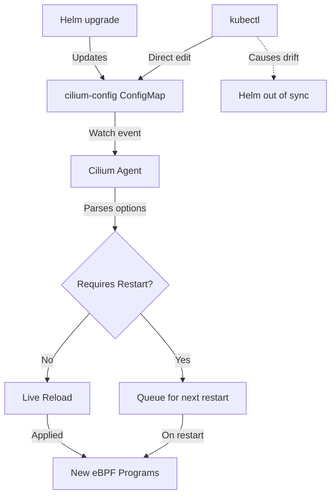

# Cilium ConfigMap Options: Configure, Troubleshoot, Validate, and Monitor

Author: [nawazdhandala](https://github.com/nawazdhandala)

Tags: Cilium, Kubernetes, Networking, EBPF, IPAM

Description: An in-depth reference guide for Cilium's ConfigMap options, explaining each key configuration parameter, how to set them correctly, troubleshoot misconfigurations, and monitor their effects.

---

## Introduction

The `cilium-config` ConfigMap in the `kube-system` namespace is the primary mechanism through which Cilium agents receive their runtime configuration. Every Cilium agent reads this ConfigMap at startup and watches it for changes. While Helm chart values provide the primary interface for setting these options, understanding the underlying ConfigMap keys gives you deeper control and visibility into how Cilium behaves.

The ConfigMap contains dozens of options spanning networking mode, security policy, eBPF program settings, monitoring, IPAM, and performance tuning. Some options have complex interdependencies - for example, enabling kube-proxy replacement requires correctly setting `k8s-api-server` and disabling any existing kube-proxy DaemonSet. Incorrect options can cause silent failures or hard-to-debug networking issues.

This guide provides practical guidance on the most important ConfigMap options, how to set them, diagnose related issues, validate effective values, and monitor for unexpected changes.

## Prerequisites

- Cilium installed and running in Kubernetes
- `kubectl` with cluster admin access
- Helm 3.x (preferred management method for ConfigMap)

## Configure Cilium ConfigMap Options

View and edit the ConfigMap:

```bash
# View the complete ConfigMap
kubectl -n kube-system get configmap cilium-config -o yaml

# Examine specific options
kubectl -n kube-system get configmap cilium-config \
  -o jsonpath='{.data}' | jq '.'

# Edit via Helm (preferred - tracks changes in Helm history)
helm upgrade cilium cilium/cilium \
  --namespace kube-system \
  --reuse-values \
  --set <option>=<value>
```

Key ConfigMap options by category:

```bash
# Networking options
# tunnel: "vxlan" | "geneve" | "disabled"
# enable-bpf-masquerade: "true" | "false"
# native-routing-cidr: "10.0.0.0/8"
# enable-ipv4: "true"
# enable-ipv6: "false"

# Policy options
# policy-enforcement: "default" | "always" | "never"
# allow-localhost: "policy" | "always"
# enable-policy: "default"

# eBPF/Datapath options
# bpf-map-dynamic-size-ratio: "0.0025"
# preallocate-bpf-maps: "true"
# monitor-aggregation: "medium" | "none" | "maximum"
# monitor-aggregation-interval: "5s"
# monitor-aggregation-flags: "all"

# IPAM options
# ipam: "cluster-pool" | "kubernetes" | "aws-eni"
# cluster-pool-ipv4-cidr: "10.244.0.0/16"
# cluster-pool-ipv4-mask-size: "24"
# k8s-require-ipv4-pod-cidr: "false"

# Feature flags
# enable-endpoint-health-checking: "true"
# enable-node-port: "true"
# enable-host-port: "true"
# enable-external-ips: "true"
# enable-session-affinity: "true"
```

Apply multiple options at once:

```bash
# Production-tuned configuration
helm upgrade cilium cilium/cilium \
  --namespace kube-system \
  --reuse-values \
  --set bpf.preallocateMaps=true \
  --set bpf.mapDynamicSizeRatio=0.005 \
  --set monitorAggregation=medium \
  --set monitorAggregationInterval=5s \
  --set bandwidthManager.enabled=true \
  --set endpointRoutes.enabled=true
```

## Troubleshoot ConfigMap Option Issues

Diagnose ConfigMap-related problems:

```bash
# Check if Cilium loaded the ConfigMap successfully
kubectl -n kube-system logs ds/cilium | grep -i "config\|configmap\|option"

# Find options with default values overridden
kubectl -n kube-system exec ds/cilium -- cilium config view | \
  grep -v "^#" | grep "=" | sort

# Check if a specific option is recognized
kubectl -n kube-system exec ds/cilium -- cilium config view | grep monitor-aggregation

# Compare ConfigMap to what agent loaded
CONFIGMAP_VALUE=$(kubectl -n kube-system get configmap cilium-config \
  -o jsonpath='{.data.monitor-aggregation}')
AGENT_VALUE=$(kubectl -n kube-system exec ds/cilium -- \
  cilium config view | grep "^monitor-aggregation" | awk '{print $2}')
echo "ConfigMap: $CONFIGMAP_VALUE, Agent: $AGENT_VALUE"
```

Fix common ConfigMap issues:

```bash
# Issue: Option not taking effect after ConfigMap update
# Check if option requires restart
kubectl -n kube-system rollout restart ds/cilium

# Issue: Invalid option value
kubectl -n kube-system logs ds/cilium | grep -i "invalid\|unrecognized"

# Issue: ConfigMap modified outside Helm (causes Helm drift)
helm diff upgrade cilium cilium/cilium \
  --namespace kube-system \
  --reuse-values
# If diff shows ConfigMap changes, reconcile via helm upgrade

# Issue: Option removed in new version
# Check release notes for deprecated options
helm upgrade cilium cilium/cilium \
  --namespace kube-system \
  --version <new-version> \
  --dry-run
```

## Validate ConfigMap Options

Verify options are correctly applied:

```bash
# Validate critical networking options
kubectl -n kube-system exec ds/cilium -- cilium config view | \
  grep -E "^(tunnel|ipam|policy-enforcement|kube-proxy|encryption)" | \
  while read line; do
    echo "VALIDATED: $line"
  done

# Cross-validate with node behavior
# Validate tunnel mode matches actual packet encapsulation
kubectl -n kube-system exec ds/cilium -- cilium status --verbose | grep -i tunnel

# Validate BPF map sizes are correct for your workload
kubectl -n kube-system exec ds/cilium -- cilium bpf ct list global | wc -l
# Compare to bpf-ct-global-any-max setting

# Full validation test
cilium connectivity test
```

## Monitor ConfigMap Changes



Monitor ConfigMap for unauthorized changes:

```bash
# Watch ConfigMap for changes
kubectl -n kube-system get configmap cilium-config --watch

# Set up audit logging for ConfigMap modifications
# In K8s audit policy:
# - level: Metadata
#   resources:
#   - group: ""
#     resources: ["configmaps"]
#   namespaces: ["kube-system"]
#   resourceNames: ["cilium-config"]

# Check recent ConfigMap change history
kubectl -n kube-system get events | grep "cilium-config"

# Detect drift from Helm-managed state
helm get values cilium -n kube-system 2>/dev/null | diff - <(kubectl -n kube-system get configmap cilium-config -o jsonpath='{.data}' 2>/dev/null | jq -r 'to_entries[] | "\(.key): \(.value)"')
```

## Conclusion

The `cilium-config` ConfigMap is the single source of truth for Cilium's runtime behavior. Managing it exclusively through Helm charts ensures that all changes are tracked, auditable, and reproducible. Understanding the key configuration categories - networking, policy, eBPF, IPAM, and feature flags - allows you to tune Cilium for your specific workload and environment. Regularly audit the effective configuration across all Cilium agents to detect drift and ensure consistent behavior across your cluster nodes.
