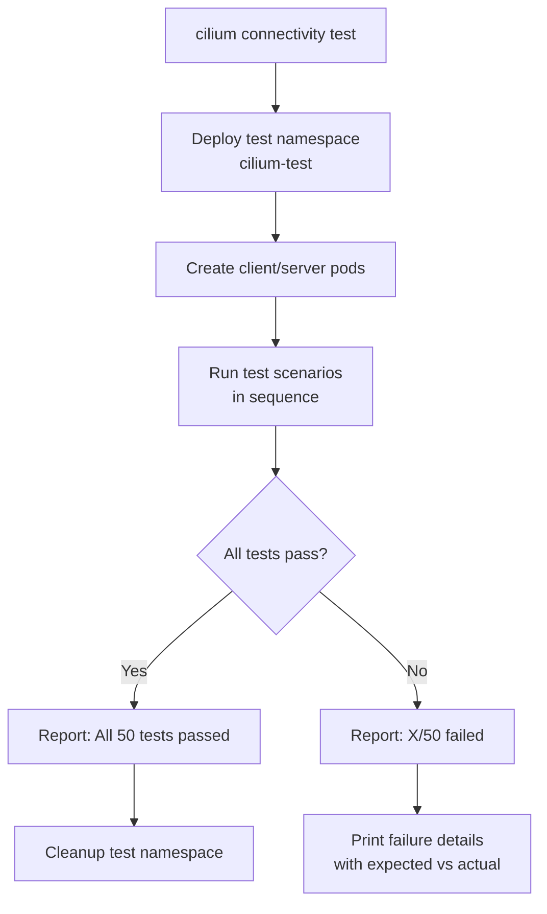

# Cilium Connectivity Test Deep Dive

Author: [nawazdhandala](https://github.com/nawazdhandala)

Tags: Cilium, Kubernetes, Connectivity, Testing, eBPF

Description: Understand the Cilium connectivity test suite in depth, learn what each test validates, how to customize the test run, and how to interpret failures to pinpoint Cilium configuration issues.

---

## Introduction

The `cilium connectivity test` command is the most comprehensive automated validation tool available for a Cilium deployment. It deploys a set of test pods and services in a dedicated namespace, then executes dozens of test scenarios that cover all aspects of Cilium networking: basic pod-to-pod connectivity, service connectivity, L7 policy enforcement, FQDN policy, egress connectivity, cross-namespace traffic, node-to-pod connectivity, and performance benchmarks.

What makes the connectivity test particularly powerful is that it doesn't just test whether traffic flows — it validates that Cilium's specific features are working correctly. Tests for network policy enforcement check that allowed traffic passes and denied traffic is blocked. Tests for load balancing verify that service traffic reaches the correct backends. Tests for kube-proxy replacement confirm that ClusterIP, NodePort, and HostPort services all work without kube-proxy. Running these tests after any significant Cilium change or cluster upgrade gives you confidence that nothing is broken.

This guide explains the connectivity test architecture, how to run targeted tests, how to interpret failures, and how to extend the suite with custom scenarios.

## Prerequisites

- Cilium v1.11+ installed
- `cilium` CLI installed
- `kubectl` with cluster access
- At least 2 worker nodes for node-to-node tests

## Step 1: Run the Full Connectivity Test Suite

```bash
# Full test run (takes 5-15 minutes)
cilium connectivity test

# Run with verbose output to see each test
cilium connectivity test --verbose

# Run and save results to JUnit XML for CI integration
cilium connectivity test \
  --junit-file /tmp/cilium-results.xml \
  --junit-properties "build.number=123"
```

## Step 2: Run Targeted Test Groups

```bash
# Only run tests matching a pattern
cilium connectivity test --test "pod-to-pod"
cilium connectivity test --test "policy"
cilium connectivity test --test "fqdn"
cilium connectivity test --test "nodeport"

# Skip specific tests
cilium connectivity test --skip-test "performance"

# Run tests that require specific features
cilium connectivity test --test "l7-*"
```

## Step 3: Key Test Scenarios Explained

```bash
# pod-to-pod: Basic connectivity between pods on same and different nodes
# pod-to-service: ClusterIP service connectivity
# pod-to-node-port: NodePort service connectivity
# pod-to-world: External internet connectivity (FQDN/CIDR)
# pod-to-host: Pod to node connectivity
# host-to-pod: Node to pod connectivity (needed for health probes)
# l7-ingress/egress: L7 HTTP policy enforcement
# client-egress-l7: Egress L7 policy with HTTP filtering
# pod-to-pod-encryption: mTLS/WireGuard encryption test
```

## Step 4: Interpret Test Failures

```bash
# Run with debug output for failed tests
cilium connectivity test --verbose 2>&1 | grep -A 20 "FAIL"

# Common failure patterns:
# "no route to host" = network connectivity issue or policy dropping traffic
# "connection refused" = pod not ready or service misconfigured
# "i/o timeout" = policy drop without RST (check Hubble)
# "403 Forbidden" = L7 policy blocking the test request

# For each failure, check Hubble
hubble observe --namespace cilium-test --verdict DROPPED --last 20
```

## Step 5: Run Performance Tests

```bash
# Run connectivity test with performance benchmarks
cilium connectivity test --include-perf-tests

# Expected output:
# TEST: network-performance
# Throughput: 9.87 Gbps
# Latency p99: 0.12ms
```

## Step 6: Custom Namespace and Timeout

```bash
# Run in specific namespace
cilium connectivity test --test-namespace my-cilium-test

# Increase timeout for slow environments
cilium connectivity test --request-timeout 60s

# Don't delete test namespace after run (for investigation)
cilium connectivity test --all-flows

# Run with flow collection for later analysis
cilium connectivity test --collect-sysdump-on-failure
```

## Test Execution Flow



## Conclusion

The Cilium connectivity test suite is a complete functional regression test for Cilium networking. Running it after every Cilium upgrade, configuration change, or major deployment is a best practice that catches regressions before they affect production workloads. The targeted test options (`--test "policy"`) let you quickly validate specific subsystems without running the full suite. When tests fail, the verbose output combined with Hubble flow observation gives you the information needed to diagnose the root cause — whether a policy misconfiguration, a missing feature flag, or a data plane issue introduced by a kernel version change.
