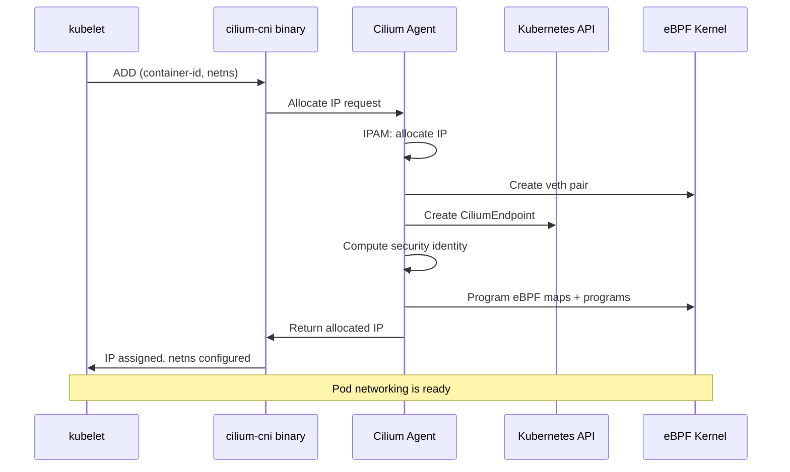

# Cilium Container Networking Control Flow

Author: [nawazdhandala](https://github.com/nawazdhandala)

Tags: Cilium, Kubernetes, Networking, eBPF, IPAM

Description: A detailed walkthrough of how Cilium handles the complete lifecycle of container networking from pod creation to packet delivery, including the eBPF control flow, policy enforcement path, and...

---

## Introduction

Understanding Cilium's container networking control flow - the sequence of events and decisions from pod creation through packet delivery - is fundamental to diagnosing complex networking issues and understanding where things can go wrong. The control flow involves multiple components (kubelet, Cilium CNI, Cilium Agent, eBPF programs in the kernel) acting in a specific sequence, and a failure at any stage produces a distinct error signature.

The control flow begins when Kubernetes schedules a pod on a node. The kubelet invokes the Cilium CNI binary, which communicates with the Cilium Agent to allocate an IP and configure the pod's network namespace. The Agent then creates a Cilium Endpoint object, computes the pod's security identity from its labels, and programs eBPF maps and programs to enforce network policies for that endpoint. Only after all these steps complete can the pod receive and send traffic.

This guide traces the complete control flow, showing how to configure each stage, diagnose failures at each step, validate the control flow is completing correctly, and monitor its performance.

## Prerequisites

- Cilium installed in Kubernetes
- `kubectl` with cluster admin access
- Cilium CLI
- Basic understanding of veth pairs and network namespaces

## Configure the Networking Control Flow

Understand the complete networking control flow sequence:

```bash
# Step 1: CNI binary invoked by kubelet
# /opt/cni/bin/cilium-cni ADD <container-id> <netns> <interface>

# Step 2: CNI communicates with agent via socket
# /var/run/cilium/cilium.sock

# Step 3: Agent allocates IP from IPAM pool
kubectl -n kube-system exec ds/cilium -- cilium ip list

# Step 4: Agent creates veth pair and configures pod namespace
# (View veth pairs on node)
kubectl debug node/<node-name> -it --image=ubuntu -- \
  ip link show | grep "^[0-9]*: lxc"

# Step 5: Agent creates CiliumEndpoint
kubectl get cep -A | tail -5

# Step 6: Agent computes identity from pod labels
kubectl get ciliumidentities | head -10

# Step 7: Agent programs eBPF maps for this endpoint
kubectl -n kube-system exec ds/cilium -- \
  cilium bpf policy get <endpoint-id>

# Configure logging to trace the control flow
kubectl -n kube-system exec ds/cilium -- \
  cilium config set debug-verbose kvstore
```

Configure network control flow optimization:

```bash
# Optimize endpoint regeneration for faster control flow
helm upgrade cilium cilium/cilium \
  --namespace kube-system \
  --reuse-values \
  --set operator.endpointGCInterval=5m

# Configure BPF host routing for faster intra-node packet path
helm upgrade cilium cilium/cilium \
  --namespace kube-system \
  --reuse-values \
  --set bpf.hostLegacyRouting=false
```

## Troubleshoot Control Flow Issues

Diagnose failures at each stage of the control flow:

```bash
# Stage 1 failure: CNI binary not found or not executable
kubectl describe pod <failing-pod> | grep -A 5 Events
# Error: "network plugin is not ready: cni config uninitialized"
ls /opt/cni/bin/cilium-cni

# Stage 2 failure: CNI can't reach agent socket
# Error: "dial unix /var/run/cilium/cilium.sock: connect: no such file or directory"
ls /var/run/cilium/cilium.sock
kubectl -n kube-system get pods -l k8s-app=cilium \
  --field-selector spec.nodeName=<failing-node>

# Stage 3 failure: IPAM pool exhausted
# Error: "failed to allocate IP: insufficient IPs"
kubectl get ciliumnode <node-name> -o json | \
  jq '.status.ipam.available | length'

# Stage 4 failure: Network namespace configuration
kubectl -n kube-system logs ds/cilium | grep -i "netns\|veth\|interface\|error"

# Stage 5 failure: Endpoint creation fails
kubectl -n kube-system logs ds/cilium | grep -i "endpoint\|create\|error"

# Stage 6 failure: Identity computation
kubectl -n kube-system logs ds/cilium | grep -i "identity\|label\|error"

# Stage 7 failure: eBPF programming
kubectl -n kube-system logs ds/cilium | grep -i "bpf\|policy\|regenerate\|error"
```

Trace a specific pod's control flow:

```bash
# Watch all control flow events for a new pod in real-time
kubectl -n kube-system exec ds/cilium -- \
  cilium monitor --type endpoint &

# Create a test pod
kubectl run control-flow-test --image=nginx --restart=Never

# View endpoint creation event
kubectl -n kube-system exec ds/cilium -- cilium endpoint list | grep control-flow-test

# Check endpoint log for control flow details
EP_ID=$(kubectl -n kube-system exec ds/cilium -- cilium endpoint list | \
  grep $(kubectl get pod control-flow-test -o jsonpath='{.status.podIP}') | \
  awk '{print $1}')
kubectl -n kube-system exec ds/cilium -- cilium endpoint get $EP_ID | \
  jq '.status.log[-10:]'
```

## Validate Complete Control Flow

End-to-end control flow validation:

```bash
# Full control flow test
echo "=== Cilium Control Flow Validation ==="

# Create test pod
kubectl run cf-test --image=nginx --restart=Never
kubectl wait pod/cf-test --for=condition=Ready --timeout=60s

POD_IP=$(kubectl get pod cf-test -o jsonpath='{.status.podIP}')
NODE=$(kubectl get pod cf-test -o jsonpath='{.spec.nodeName}')

echo "Pod IP: $POD_IP on node $NODE"

# Validate each stage
echo "Stage 3 - IP allocation:"
kubectl get ciliumnode $NODE -o json | \
  jq ".status.ipam.used[\"$POD_IP\"] // \"NOT FOUND\""

echo "Stage 5 - Endpoint created:"
kubectl -n kube-system exec ds/cilium -- cilium endpoint list | grep $POD_IP

echo "Stage 6 - Identity assigned:"
EP_ID=$(kubectl -n kube-system exec ds/cilium -- cilium endpoint list | \
  grep $POD_IP | awk '{print $1}')
kubectl -n kube-system exec ds/cilium -- cilium endpoint get $EP_ID | \
  jq '.status.identity.id'

echo "Stage 7 - eBPF programmed:"
kubectl -n kube-system exec ds/cilium -- \
  cilium endpoint list | grep $POD_IP | grep "ready"

# Final connectivity test
kubectl exec cf-test -- curl -s -o /dev/null -w "%{http_code}" \
  http://kubernetes.default.svc.cluster.local
kubectl delete pod cf-test
```

## Monitor Control Flow Performance



Monitor control flow metrics:

```bash
# Monitor endpoint creation time (Stage 5-7 duration)
kubectl -n kube-system port-forward ds/cilium 9962:9962 &
curl -s http://localhost:9962/metrics | \
  grep endpoint_regeneration_time_stats_seconds | head

# Watch for control flow failures
kubectl get events -A --watch | grep -E "cilium|cni|endpoint|network"

# Track pod creation-to-ready time
watch -n10 "kubectl get pods -A | grep ContainerCreating"

# PromQL: endpoint regeneration P99 latency
# histogram_quantile(0.99, rate(cilium_endpoint_regeneration_time_stats_seconds_bucket[5m]))
```

## Conclusion

Cilium's container networking control flow is a well-defined sequence from kubelet CNI invocation through eBPF program installation. Each stage has a clear error signature that enables rapid root cause identification. The key insight for troubleshooting is that stages are sequential - if Stage 2 (socket connectivity) fails, Stages 3-7 cannot proceed. The `cilium monitor --type endpoint` command provides real-time visibility into control flow events. Monitoring endpoint regeneration time gives an end-to-end measure of control flow performance, with latency spikes indicating bottlenecks in IPAM allocation, identity computation, or eBPF compilation.
