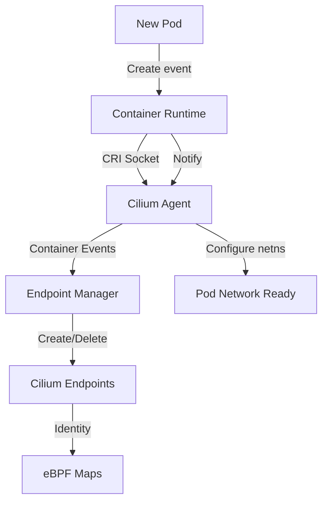

# Cilium Container Runtime Support: Configure, Troubleshoot, Validate, and Monitor

Author: [nawazdhandala](https://github.com/nawazdhandala)

Tags: Cilium, Kubernetes, Networking, EBPF, IPAM

Description: Understand how Cilium integrates with different Kubernetes container runtimes including containerd, CRI-O, and Docker, with configuration guidance, troubleshooting tips, and compatibility validation.

---

## Introduction

Cilium interacts with container runtimes through the Container Runtime Interface (CRI) to obtain information about running containers, their network namespaces, and their metadata including labels. This information feeds directly into Cilium's identity computation and endpoint management. While Cilium works with all major CRI-compliant runtimes, each runtime has specific socket paths and behaviors that Cilium must be configured to work with correctly.

The primary container runtimes in production Kubernetes deployments are containerd (default for most distributions), CRI-O (popular with OpenShift and RHEL-based clusters), and Docker (legacy, removed from Kubernetes 1.24+). Each exposes its CRI socket at a different path, and Cilium must be able to connect to this socket to query container state. An incorrect socket path is a common but easily overlooked configuration issue.

This guide covers how to configure Cilium for each container runtime, troubleshoot runtime connectivity issues, validate Cilium's runtime integration, and monitor for runtime-related networking problems.

## Prerequisites

- Kubernetes cluster with Cilium installed
- Knowledge of which container runtime your cluster uses
- `kubectl` with cluster admin access
- Node-level access for socket inspection

## Configure Cilium for Different Container Runtimes

Identify the container runtime in use:

```bash
# Check container runtime for each node
kubectl get nodes -o wide
# CONTAINER-RUNTIME column shows: containerd://1.7.x or cri-o://1.29.x

# Check socket path on a node
kubectl debug node/<node-name> -it --image=ubuntu -- \
  ls -la /run/containerd/containerd.sock \
    /var/run/crio/crio.sock \
    /run/cri-dockerd.sock 2>/dev/null
```

Configure Cilium for containerd (default):

```bash
# containerd socket: /run/containerd/containerd.sock
helm upgrade cilium cilium/cilium \
  --namespace kube-system \
  --reuse-values \
  --set containerRuntime.integration=containerd \
  --set containerRuntime.socketPath=/run/containerd/containerd.sock
```

Configure Cilium for CRI-O:

```bash
# CRI-O socket: /var/run/crio/crio.sock
helm upgrade cilium cilium/cilium \
  --namespace kube-system \
  --reuse-values \
  --set containerRuntime.integration=crio \
  --set containerRuntime.socketPath=/var/run/crio/crio.sock
```

Configure Cilium for Docker via cri-dockerd (legacy):

```bash
# cri-dockerd socket: /run/cri-dockerd.sock
helm upgrade cilium cilium/cilium \
  --namespace kube-system \
  --reuse-values \
  --set containerRuntime.integration=docker \
  --set containerRuntime.socketPath=/run/cri-dockerd.sock

# Note: Docker Engine direct support removed in Kubernetes 1.24
# Must use cri-dockerd shim for Docker on K8s 1.24+
```

## Troubleshoot Container Runtime Issues

Diagnose runtime integration problems:

```bash
# Check if Cilium can reach the runtime socket
kubectl -n kube-system exec ds/cilium -- \
  ls -la /run/containerd/containerd.sock 2>/dev/null || echo "Socket not accessible"

# Check Cilium logs for runtime errors
kubectl -n kube-system logs ds/cilium | grep -i "container runtime\|cri\|containerd\|crio\|docker"

# Verify socket mount in Cilium DaemonSet
kubectl -n kube-system get ds cilium -o yaml | grep -A 5 "containerd\|crio"

# Test runtime socket connectivity
kubectl -n kube-system exec ds/cilium -- \
  crictl --runtime-endpoint unix:///run/containerd/containerd.sock version
```

Fix common runtime integration issues:

```bash
# Issue: Wrong socket path
kubectl -n kube-system exec ds/cilium -- \
  cilium config view | grep runtime

# Fix by updating Helm values
helm upgrade cilium cilium/cilium \
  --namespace kube-system \
  --reuse-values \
  --set containerRuntime.socketPath=/run/containerd/containerd.sock

# Issue: Socket not mounted into Cilium pod
kubectl -n kube-system get ds cilium -o yaml | grep -A 20 "volumes:"
# Should include containerd or crio socket as hostPath volume

# Issue: Runtime socket permissions
kubectl debug node/<node-name> -it --image=ubuntu -- \
  stat /run/containerd/containerd.sock
# Should be accessible by root or cilium service account
```

## Validate Runtime Integration

Confirm Cilium is correctly reading from the container runtime:

```bash
# Verify Cilium sees all running containers
PODS=$(kubectl get pods -A --no-headers | wc -l)
ENDPOINTS=$(kubectl -n kube-system exec ds/cilium -- \
  cilium endpoint list --no-headers | grep -v "^host" | wc -l)
echo "Pods: $PODS, Cilium Endpoints (non-host): $ENDPOINTS"

# Check container labels are correctly imported from runtime
kubectl -n kube-system exec ds/cilium -- \
  cilium endpoint get <endpoint-id> | jq '.status.identity.labels'

# Verify Kubernetes labels are used for identity (not just CRI labels)
kubectl get pod my-pod --show-labels
kubectl -n kube-system exec ds/cilium -- \
  cilium endpoint list | grep $(kubectl get pod my-pod -o jsonpath='{.status.podIP}')

# Run Cilium runtime checks
cilium status --verbose | grep -i "container runtime"
```

## Monitor Runtime Integration Health



Monitor runtime integration metrics:

```bash
# Check for runtime connection errors
kubectl -n kube-system logs ds/cilium --since=1h | grep -i "runtime\|cri\|socket"

# Monitor endpoint creation rate (reflects runtime event processing)
kubectl -n kube-system port-forward ds/cilium 9962:9962 &
curl -s http://localhost:9962/metrics | grep endpoint_created

# Watch for endpoint creation/deletion events
kubectl -n kube-system exec ds/cilium -- cilium monitor --type endpoint

# Alert on runtime disconnection
watch -n30 "kubectl -n kube-system exec ds/cilium -- \
  cilium status | grep 'Container runtime'"
```

## Conclusion

Correct container runtime integration is essential for Cilium to maintain accurate endpoint state and apply network policies to the right workloads. The socket path configuration is simple but critical: an incorrect path prevents Cilium from receiving container lifecycle events, which can leave endpoints in stale state or cause policy enforcement gaps. Always verify the correct socket path for your runtime and confirm it is mounted into the Cilium DaemonSet pods. The endpoint count comparison to running pods is a simple but effective validation that the runtime integration is functioning correctly.
