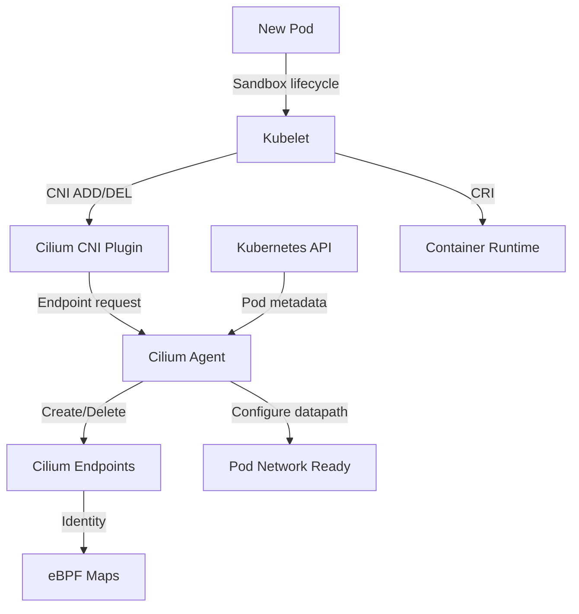

# Cilium Container Runtime Support: Configure, Troubleshoot, Validate, and Monitor

Author: [nawazdhandala](https://github.com/nawazdhandala)

Tags: Cilium, Kubernetes, Networking, eBPF, IPAM

Description: Understand how Cilium integrates with different Kubernetes container runtimes including containerd, CRI-O, and Docker, with configuration guidance, troubleshooting tips, and compatibility validation.

---

## Introduction

Cilium integrates with Kubernetes primarily as a CNI plugin and through the Kubernetes API. The kubelet talks to the node's container runtime through the Container Runtime Interface (CRI), and it calls the configured CNI plugin when creating a pod sandbox. Cilium then manages pod networking and derives endpoint metadata from Kubernetes pod labels, and where available, container labels.

The primary container runtimes in production Kubernetes deployments are containerd (default for most distributions), CRI-O (popular with OpenShift and RHEL-based clusters), and Docker through cri-dockerd (legacy after dockershim was removed from Kubernetes 1.24). Cilium does not require a Helm setting for the runtime socket on current Kubernetes installations. The important integration point is that Cilium's CNI binary and CNI configuration are installed where the kubelet and runtime expect them.

This guide covers how to verify Cilium on nodes using each container runtime, troubleshoot CNI installation issues, validate Cilium endpoint integration, and monitor for runtime-adjacent networking problems.

## Prerequisites

- Kubernetes cluster with Cilium installed
- Knowledge of which container runtime your cluster uses
- `kubectl` with cluster admin access
- Node-level access for CNI inspection and runtime service checks

## Configure Cilium for Different Container Runtimes

Identify the container runtime in use:

```bash
kubectl get nodes -o wide
# CONTAINER-RUNTIME column shows: containerd://1.7.x or cri-o://1.29.x

# Check the host CNI paths on a node
kubectl debug node/<node-name> -it --image=ubuntu -- \
  ls -la /host/etc/cni/net.d /host/opt/cni/bin/cilium-cni 2>/dev/null
```

Configure Cilium for containerd (default):

```bash
# No containerd socket value is required for Cilium on Kubernetes.
# Install or upgrade Cilium normally and let it manage the CNI files.
helm upgrade cilium cilium/cilium \
  --namespace kube-system \
  --reuse-values \
  --set cni.install=true
```

Configure Cilium for CRI-O:

```bash
# CRI-O uses the same Cilium CNI installation path.
helm upgrade cilium cilium/cilium \
  --namespace kube-system \
  --reuse-values \
  --set cni.install=true

# After initial installation, restart CRI-O on each node if it did not
# pick up the newly written CNI configuration automatically.
ssh <node-name> "sudo systemctl restart crio"
```

Configure Cilium for Docker via cri-dockerd (legacy):

```bash
# Cilium does not connect to the cri-dockerd socket directly.
helm upgrade cilium cilium/cilium \
  --namespace kube-system \
  --reuse-values \
  --set cni.install=true

# Note: Kubernetes 1.24 removed dockershim from kubelet.
# Use cri-dockerd if the node still relies on Docker Engine.
```

## Troubleshoot Container Runtime Issues

Diagnose CNI integration problems:

```bash
# Check the Cilium CNI files on a node
kubectl debug node/<node-name> -it --image=ubuntu -- \
  ls -la /host/etc/cni/net.d /host/opt/cni/bin/cilium-cni 2>/dev/null

# Check the Cilium agent status
kubectl -n kube-system exec ds/cilium -- \
  cilium-dbg status --verbose

# Check Cilium logs for CNI and endpoint errors
kubectl -n kube-system logs ds/cilium | grep -i "cni\|endpoint\|datapath\|crio"

# Verify CNI hostPath mounts in the Cilium DaemonSet
kubectl -n kube-system get ds cilium -o yaml | grep -A 20 -i "cni"

# Verify Cilium has local endpoint state
kubectl -n kube-system exec ds/cilium -- \
  cilium-dbg endpoint list --no-headers
```

Fix common CNI integration issues:

```bash
# Issue: Cilium CNI files were not installed
kubectl -n kube-system get configmap cilium-config -o yaml | grep -i "cni"

# Fix by updating Helm values
helm upgrade cilium cilium/cilium \
  --namespace kube-system \
  --reuse-values \
  --set cni.install=true

# Issue: Cilium cannot write to the host CNI directories
kubectl -n kube-system get ds cilium -o yaml | grep -A 20 "volumeMounts:"
# Should include host mounts for /etc/cni/net.d and /opt/cni/bin

# Issue: CRI-O did not reload the new CNI configuration
ssh <node-name> "sudo systemctl restart crio"
```

## Validate Runtime Integration

Confirm Cilium is correctly managing Kubernetes endpoints:

```bash
# Compare running, non-host-network pods with Cilium endpoints
PODS=$(kubectl get pods -A \
  --field-selector=status.phase=Running \
  -o jsonpath='{range .items[?(@.spec.hostNetwork!=true)]}{.metadata.namespace}/{.metadata.name}{"\n"}{end}' | wc -l)
ENDPOINTS=$(kubectl -n kube-system exec ds/cilium -- \
  cilium-dbg endpoint list --no-headers | grep -v "reserved:host" | wc -l)
echo "Running non-host-network pods: $PODS, Cilium endpoints: $ENDPOINTS"

# Check endpoint labels
kubectl -n kube-system exec ds/cilium -- \
  cilium-dbg endpoint get <endpoint-id> -o jsonpath='{.status.identity.labels}'

# Verify Kubernetes labels are used for identity
kubectl get pod my-pod --show-labels
kubectl -n kube-system exec ds/cilium -- \
  cilium-dbg endpoint list | grep "$(kubectl get pod my-pod -o jsonpath='{.status.podIP}')"

# Run Cilium status checks
cilium status --verbose
```

## Monitor Runtime Integration Health


```mermaid
graph TD
    A[Kubelet] -->|CNI ADD/DEL| B[Cilium CNI Plugin]
    B -->|Endpoint request| C[Cilium Agent]
    H[Kubernetes API] -->|Pod metadata| C
    C -->|Create/Delete| D[Cilium Endpoints]
    D -->|Identity| E[eBPF Maps]
    F[New Pod] -->|Sandbox lifecycle| A
    A -->|CRI| G[Container Runtime]
    C -->|Configure datapath| I[Pod Network Ready]
```

Monitor runtime integration metrics:

```bash
# Check for CNI and endpoint errors
kubectl -n kube-system logs ds/cilium --since=1h | grep -i "cni\|endpoint\|datapath"

# Monitor endpoint state metrics
kubectl -n kube-system port-forward ds/cilium 9962:9962 &
curl -s http://localhost:9962/metrics | grep cilium_endpoint

# Watch datapath events related to endpoints
kubectl -n kube-system exec ds/cilium -- \
  cilium-dbg monitor --type trace --type policy-verdict --type drop

# Alert on Cilium agent health
watch -n30 "kubectl -n kube-system exec ds/cilium -- \
  cilium-dbg status --brief"
```

## Conclusion

Correct CNI integration is essential for Cilium to maintain accurate endpoint state and apply network policies to the right workloads. The runtime choice still matters operationally, especially for CRI-O reload behavior and legacy Docker nodes that require cri-dockerd, but current Cilium Kubernetes installations do not need runtime socket Helm settings. Always verify that Cilium installed its CNI binary and configuration on the host, and confirm that new pods become Cilium endpoints. The endpoint count comparison to running, non-host-network pods is a simple but effective validation that the integration is functioning correctly.
