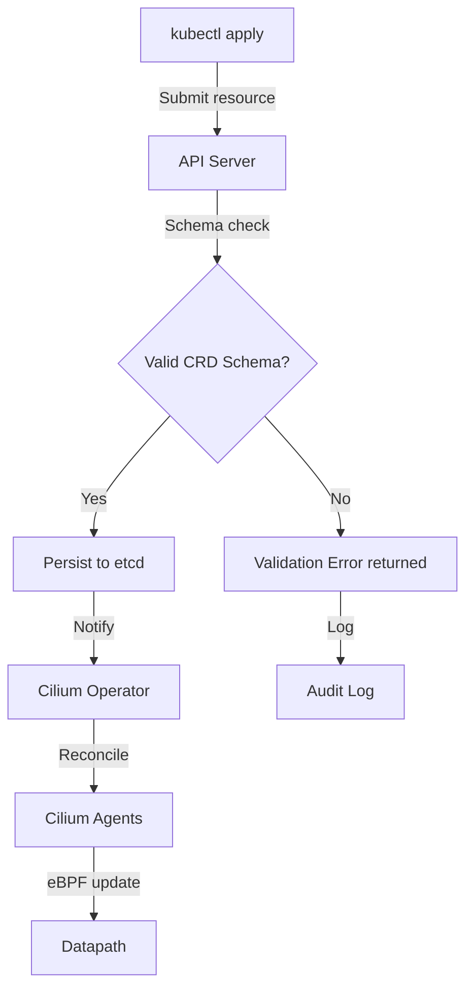

# Cilium CRD Schema Validation: Configure, Troubleshoot, Validate, and Monitor

Author: [nawazdhandala](https://github.com/nawazdhandala)

Tags: Cilium, Kubernetes, Networking, EBPF, IPAM

Description: Learn how to configure, troubleshoot, validate, and monitor Cilium Custom Resource Definition schema validation to ensure your CiliumNetworkPolicies and other Cilium CRDs are always correctly...

---

## Introduction

Cilium extends Kubernetes with numerous Custom Resource Definitions (CRDs) including CiliumNetworkPolicy, CiliumClusterwideNetworkPolicy, CiliumEndpoint, CiliumNode, and CiliumIdentity. Each CRD has a schema defined using OpenAPI v3 that validates resources before they are persisted to etcd. Proper schema validation prevents invalid policy configurations from being applied, which could either silently allow all traffic or drop legitimate connections.

Starting with Cilium 1.12, CRD schema validation is enforced by default. The schemas are maintained in the Cilium source repository and are updated with each release to reflect new fields and deprecate old ones. When upgrading Cilium, CRD schemas must be updated to match the new agent version, otherwise validation errors will prevent new resources from being created or updated.

This guide covers how to configure schema validation, diagnose validation failures, validate CRD schemas, and monitor for schema-related errors in production.

## Prerequisites

- Cilium installed with cluster admin access
- `kubectl` configured for your cluster
- Understanding of Kubernetes CRD structure
- Helm 3.x for configuration management

## Configure CRD Schema Validation

Install and update Cilium CRDs:

```bash
# View installed Cilium CRDs
kubectl get crds | grep cilium.io

# Check schema validation is enabled (default in Cilium 1.12+)
kubectl get crd ciliumnetworkpolicies.cilium.io -o jsonpath='{.spec.versions[0].schema}' | jq '.openAPIV3Schema.type'

# Update CRDs during Cilium upgrade
helm upgrade cilium cilium/cilium \
  --namespace kube-system \
  --reuse-values \
  --version <new-version>
# Helm automatically updates CRDs

# Manually apply CRDs for a specific version
CILIUM_VERSION="1.15.6"
helm pull cilium/cilium --version $CILIUM_VERSION --untar
kubectl apply -f cilium/crds/
```

Configure validation webhook (optional for stricter validation):

```bash
# Check if Cilium webhook is configured
kubectl get validatingwebhookconfigurations | grep cilium
kubectl get mutatingwebhookconfigurations | grep cilium

# Cilium uses server-side validation via CRD schemas by default
# No separate webhook is required for basic schema validation
kubectl get crd ciliumnetworkpolicies.cilium.io -o jsonpath='{.spec.versions[0].schema.openAPIV3Schema}' | jq '.properties.spec' | head -30
```

## Troubleshoot Schema Validation Errors

Diagnose CRD schema validation failures:

```bash
# Attempt to apply an invalid CiliumNetworkPolicy
kubectl apply -f - <<EOF
apiVersion: cilium.io/v2
kind: CiliumNetworkPolicy
metadata:
  name: test-invalid
spec:
  endpointSelector:
    matchLabels:
      app: test
  ingress:
  - invalidField: "this should fail"
EOF
# Error: ValidationError(CiliumNetworkPolicy.spec.ingress[0]): unknown field "invalidField"

# Check full validation error
kubectl apply -f my-policy.yaml 2>&1

# Validate YAML before applying
kubectl apply -f my-policy.yaml --dry-run=server
```

Common schema errors and fixes:

```bash
# Issue: Unknown field error after Cilium downgrade
# Newer fields not recognized by older CRD schema
kubectl get cnp my-policy -o yaml | diff - my-policy.yaml

# Issue: Required field missing
kubectl apply -f - <<EOF
apiVersion: cilium.io/v2
kind: CiliumNetworkPolicy
metadata:
  name: missing-selector
spec:
  # Missing required endpointSelector
  ingress:
  - {}
EOF

# Fix: Always include endpointSelector
kubectl apply -f - <<EOF
apiVersion: cilium.io/v2
kind: CiliumNetworkPolicy
metadata:
  name: valid-policy
spec:
  endpointSelector:
    matchLabels:
      app: myapp
  ingress:
  - fromEndpoints:
    - matchLabels:
        app: frontend
EOF
```

## Validate CRD Schema Integrity

Verify CRDs are correctly installed and schemas match:

```bash
# Check all Cilium CRDs are present
EXPECTED_CRDS=(
  "ciliumnetworkpolicies.cilium.io"
  "ciliumclusterwidenetworkpolicies.cilium.io"
  "ciliumendpoints.cilium.io"
  "ciliumnodes.cilium.io"
  "ciliumidentities.cilium.io"
  "ciliumendpointslices.cilium.io"
)

for crd in "${EXPECTED_CRDS[@]}"; do
  STATUS=$(kubectl get crd $crd -o jsonpath='{.status.conditions[-1].type}' 2>/dev/null)
  echo "$crd: ${STATUS:-MISSING}"
done

# Validate CRD schema is active
kubectl get crd ciliumnetworkpolicies.cilium.io \
  -o jsonpath='{.spec.versions[0].schema.openAPIV3Schema}' | jq '.type'

# Test schema validation with a dry run
kubectl apply --dry-run=server -f - <<EOF
apiVersion: cilium.io/v2
kind: CiliumNetworkPolicy
metadata:
  name: validation-test
  namespace: default
spec:
  endpointSelector:
    matchLabels:
      app: test
  ingress:
  - fromEndpoints:
    - matchLabels:
        app: allowed
EOF
echo "Schema validation: OK"
```

## Monitor Schema Validation



Monitor for schema validation issues in production:

```bash
# Watch Kubernetes audit logs for CRD validation failures
kubectl -n kube-system logs kube-apiserver-<node> | grep -i "validation\|cilium" | tail -50

# Monitor Cilium operator for CRD reconcile errors
kubectl -n kube-system logs -l name=cilium-operator | grep -i "crd\|schema\|validation"

# Check for policies that failed to apply
kubectl get events -A | grep -i "cilium\|networkpolicy\|validation"

# Periodically validate all existing CiliumNetworkPolicies
kubectl get cnp -A -o json | jq '.items[].metadata | {name: .name, namespace: .namespace}'
for ns in $(kubectl get ns -o jsonpath='{.items[*].metadata.name}'); do
  kubectl get cnp -n $ns 2>/dev/null | grep -v "No resources"
done
```

## Conclusion

CRD schema validation in Cilium ensures that only correctly structured networking policies reach the datapath. Keeping CRD schemas synchronized with the Cilium agent version is critical during upgrades. Always use `--dry-run=server` to validate policy YAML before applying in production, and monitor API server audit logs for validation failures that may indicate misconfigured automation pipelines. Proper schema validation is the first line of defense against networking policy misconfigurations.
