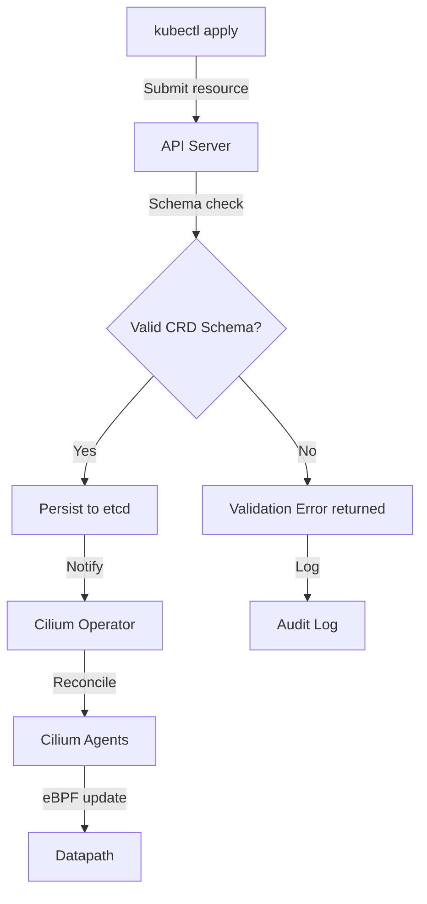

# Cilium CRD Schema Validation: Configure, Troubleshoot, Validate, and Monitor

Author: [nawazdhandala](https://github.com/nawazdhandala)

Tags: Cilium, Kubernetes, Networking, eBPF, IPAM

Description: Learn how to configure, troubleshoot, validate, and monitor Cilium Custom Resource Definition schema validation to ensure your CiliumNetworkPolicies and other Cilium CRDs are always correctly...

---

## Introduction

Cilium extends Kubernetes with numerous Custom Resource Definitions (CRDs) including CiliumNetworkPolicy, CiliumClusterwideNetworkPolicy, CiliumEndpoint, CiliumNode, and CiliumIdentity. Each CRD has a schema defined using OpenAPI v3 that validates resources before they are persisted to etcd. Proper schema validation prevents invalid policy configurations from being applied, which could either silently allow all traffic or drop legitimate connections.

Cilium has shipped CiliumNetworkPolicy CRD validation since the early 1.0 releases, and current Cilium CRDs use Kubernetes OpenAPI v3 schemas. The schemas are maintained in the Cilium source repository and are updated with each release to reflect new fields and deprecate old ones. When upgrading Cilium, CRD schemas must be updated to match the new agent version, otherwise validation errors can prevent new resources from being created or updated.

This guide covers how to configure schema validation, diagnose validation failures, validate CRD schemas, and monitor for schema-related errors in production.

## Prerequisites

- Cilium installed with cluster admin access
- `kubectl` configured for your cluster
- Understanding of Kubernetes CRD structure
- Helm 3.x for configuration management

## Configure CRD Schema Validation

Install and update Cilium CRDs:

```bash
# View installed Cilium CRDs

kubectl get crds | grep cilium.io

# Check the CiliumNetworkPolicy CRD has an OpenAPI v3 schema
kubectl get crd ciliumnetworkpolicies.cilium.io -o jsonpath='{.spec.versions[0].schema}' | jq '.openAPIV3Schema.type'

# Update CRDs during Cilium upgrade
# Avoid --reuse-values when upgrading between Cilium minor versions; keep reviewed values in a file
helm get values cilium --namespace kube-system -o yaml > old-values.yaml
helm upgrade cilium cilium/cilium \
  --namespace kube-system \
  --version <new-version> \
  -f old-values.yaml
# Cilium installs or updates its CRDs as part of the supported installation flow

# Manually apply generated CRD manifests for a specific Cilium source tag
CILIUM_VERSION="v1.15.6"
git clone --depth 1 --branch "$CILIUM_VERSION" https://github.com/cilium/cilium.git cilium-src
kubectl apply -f cilium-src/pkg/k8s/apis/cilium.io/client/crds/v2/
kubectl apply -f cilium-src/pkg/k8s/apis/cilium.io/client/crds/v2alpha1/
```

Check CRD schemas and admission webhooks:

```bash
# Check if Cilium webhook is configured
kubectl get validatingwebhookconfigurations | grep cilium
kubectl get mutatingwebhookconfigurations | grep cilium

# Cilium uses server-side validation via CRD schemas by default
# No separate webhook is required for CiliumNetworkPolicy schema validation
kubectl get crd ciliumnetworkpolicies.cilium.io -o jsonpath='{.spec.versions[0].schema.openAPIV3Schema}' | jq '.properties.spec' | head -30
```

## Troubleshoot Schema Validation Errors

Diagnose CRD schema validation failures:

```bash
# Attempt to apply an invalid CiliumNetworkPolicy
kubectl apply -f - <<EOF
apiVersion: cilium.io/v2
kind: CiliumNetworkPolicy
metadata:
  name: test-invalid
spec:
  endpointSelector:
    matchLabels:
      app: test
  ingress:
  - invalidField: "this should fail"
EOF
# Error: strict decoding error: unknown field "spec.ingress[0].invalidField"

# Check full validation error
kubectl apply -f my-policy.yaml 2>&1

# Validate YAML before applying
kubectl apply -f my-policy.yaml --dry-run=server
```

Common schema errors and fixes:

```bash
# Issue: Unknown field error after Cilium downgrade
# Newer fields not recognized by older CRD schema
kubectl get cnp my-policy -o yaml | diff - my-policy.yaml

# Issue: Required selector missing
kubectl apply -f - <<EOF
apiVersion: cilium.io/v2
kind: CiliumNetworkPolicy
metadata:
  name: missing-selector
spec:
  # Missing required endpointSelector
  ingress:
  - {}
EOF

# Fix: Always include endpointSelector for CiliumNetworkPolicy
kubectl apply -f - <<EOF
apiVersion: cilium.io/v2
kind: CiliumNetworkPolicy
metadata:
  name: valid-policy
spec:
  endpointSelector:
    matchLabels:
      app: myapp
  ingress:
  - fromEndpoints:
    - matchLabels:
        app: frontend
EOF
```

## Validate CRD Schema Integrity

Verify CRDs are correctly installed and schemas match:

```bash
# Check commonly used Cilium CRDs are present and established
EXPECTED_CRDS=(
  "ciliumnetworkpolicies.cilium.io"
  "ciliumclusterwidenetworkpolicies.cilium.io"
  "ciliumegressgatewaypolicies.cilium.io"
  "ciliumendpoints.cilium.io"
  "ciliumnodes.cilium.io"
  "ciliumidentities.cilium.io"
  "ciliumcidrgroups.cilium.io"
  "ciliumendpointslices.cilium.io"
  "ciliumloadbalancerippools.cilium.io"
)

for crd in "${EXPECTED_CRDS[@]}"; do
  if kubectl wait --for=condition=Established "crd/$crd" --timeout=10s >/dev/null 2>&1; then
    echo "$crd: Established"
  else
    echo "$crd: MISSING or not Established"
  fi
done

# Validate CRD schema is active
kubectl get crd ciliumnetworkpolicies.cilium.io \
  -o jsonpath='{.spec.versions[0].schema.openAPIV3Schema}' | jq '.type'

# Test schema validation with a dry run
kubectl apply --dry-run=server -f - <<EOF
apiVersion: cilium.io/v2
kind: CiliumNetworkPolicy
metadata:
  name: validation-test
  namespace: default
spec:
  endpointSelector:
    matchLabels:
      app: test
  ingress:
  - fromEndpoints:
    - matchLabels:
        app: allowed
EOF
echo "Schema validation: OK"
```

## Monitor Schema Validation


```mermaid
graph TD
    A[kubectl apply] -->|Submit resource| B[API Server]
    B -->|Schema check| C{Valid CRD Schema?}
    C -->|No| D[Validation Error returned]
    C -->|Yes| E[Persist to etcd]
    E -->|Notify| F[Cilium Operator]
    F -->|Reconcile| G[Cilium Agents]
    G -->|eBPF update| H[Datapath]
    D -->|Log| I[Audit Log]
```

Monitor for schema validation issues in production:

```bash
# Watch Kubernetes audit logs for CRD validation failures
# On managed Kubernetes, use the provider's control-plane audit log integration instead
kubectl -n kube-system logs kube-apiserver-<node> | grep -i "validation\|cilium" | tail -50

# Monitor Cilium operator for CRD reconcile errors
kubectl -n kube-system logs -l io.cilium/app=operator | grep -i "crd\|schema\|validation"

# Check events for Cilium policy or operator warnings
kubectl get events -A | grep -i "cilium\|networkpolicy\|validation"

# Periodically validate policy manifests before reconciling them
kubectl apply --dry-run=server --validate=strict -f ./policies/
```

## Conclusion

CRD schema validation in Cilium ensures that only correctly structured networking policies reach the datapath. Keeping CRD schemas synchronized with the Cilium agent version is critical during upgrades. Always use `--dry-run=server` to validate policy YAML before applying in production, and monitor API server audit logs for validation failures that may indicate misconfigured automation pipelines. Proper schema validation is the first line of defense against networking policy misconfigurations.
