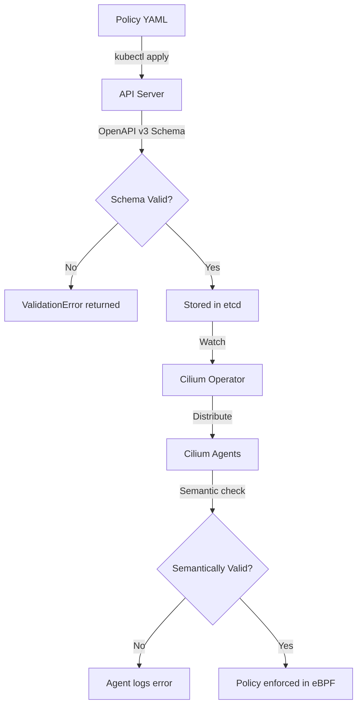

# Cilium CRD Validation: Configure, Troubleshoot, Validate, and Monitor

Author: [nawazdhandala](https://github.com/nawazdhandala)

Tags: Cilium, Kubernetes, CRD, Validation, Networking

Description: A practical guide to validating Cilium Custom Resource Definitions including policy syntax checking, schema enforcement, dry-run testing, and automated validation pipelines for CiliumNetworkPolicies.

---

## Introduction

CRD validation in Cilium is the process of ensuring that CiliumNetworkPolicy and related custom resources conform to their defined schemas before being applied to the cluster. This validation layer prevents malformed policies from being persisted in etcd, where they could cause unexpected networking behavior or agent crashes when processed by Cilium agents.

Kubernetes enforces CRD schema validation at the API server level using OpenAPI v3 schemas embedded in the CRD definitions. Cilium's CRDs include detailed schemas that validate field types, required fields, enum values, and structural constraints. Beyond basic schema validation, Cilium policies have semantic requirements — for example, an ingress rule must reference valid port protocols, and L7 HTTP rules require the port to be TCP.

This guide covers how to configure CRD validation, diagnose validation errors, validate policies before applying them, and integrate validation into your CI/CD pipeline.

## Prerequisites

- Cilium installed in your Kubernetes cluster
- `kubectl` with cluster admin access
- Optional: `helm` for managing CRD updates
- Optional: `cilium-cli` for advanced policy testing

## Configure CRD Validation

Ensure CRD schema validation is active:

```bash
# Verify CRD validation is enabled (default in Cilium 1.12+)
kubectl get crd ciliumnetworkpolicies.cilium.io \
  -o jsonpath='{.spec.versions[0].schema.openAPIV3Schema.type}'
# Should output: object

# Check validation rules are enforced
kubectl get crd ciliumnetworkpolicies.cilium.io \
  -o jsonpath='{.spec.versions[0].served}'
# Should output: true

# View the full CRD schema
kubectl get crd ciliumnetworkpolicies.cilium.io \
  -o jsonpath='{.spec.versions[0].schema.openAPIV3Schema}' | jq '.' | head -50

# Enable structural schema validation (enforced by default)
kubectl get crd ciliumnetworkpolicies.cilium.io \
  -o jsonpath='{.status.conditions}' | jq '.[] | select(.type == "NonStructuralSchema")'
# Should return nothing if schema is structural
```

## Troubleshoot CRD Validation Errors

Diagnose and fix validation failures:

```bash
# Common validation error: unknown field
kubectl apply -f - <<EOF
apiVersion: cilium.io/v2
kind: CiliumNetworkPolicy
metadata:
  name: test
spec:
  endpointSelector:
    matchLabels:
      app: test
  ingress:
  - fromEndpoints:
    - matchLabels:
        app: frontend
    ports:   # WRONG: should be toPorts
    - port: 80
EOF
# Error: ValidationError: unknown field "ports" in io.cilium.v2.CiliumNetworkPolicy.spec.ingress[0]

# Fix: Use correct field names
kubectl apply -f - <<EOF
apiVersion: cilium.io/v2
kind: CiliumNetworkPolicy
metadata:
  name: test
spec:
  endpointSelector:
    matchLabels:
      app: test
  ingress:
  - fromEndpoints:
    - matchLabels:
        app: frontend
    toPorts:   # CORRECT
    - ports:
      - port: "80"
        protocol: TCP
EOF
```

Fix common validation errors:

```bash
# Error: port must be a string (not integer)
# Wrong:
#   port: 80
# Correct:
#   port: "80"

# Error: protocol must be TCP or UDP (case sensitive)
# Wrong: protocol: tcp
# Correct: protocol: TCP

# Error: endpointSelector is required
kubectl apply -f my-policy.yaml 2>&1 | grep ValidationError

# Check policy against CRD schema without applying
kubectl apply -f my-policy.yaml --dry-run=server 2>&1
```

## Validate Policies with Dry Run

Use server-side dry run to validate without applying:

```bash
# Validate a single policy file
kubectl apply -f my-network-policy.yaml --dry-run=server

# Validate multiple files
kubectl apply -f policies/ --dry-run=server

# Validate with output to see what would be created/updated
kubectl apply -f my-policy.yaml --dry-run=server -o yaml

# Test policy intent with Cilium policy trace
kubectl -n kube-system exec ds/cilium -- \
  cilium policy trace \
  --src-label "app=frontend" \
  --dst-label "app=backend" \
  --dport 8080

# Validate existing policies in cluster are syntactically valid
kubectl get cnp -A -o yaml | kubectl apply --dry-run=server -f -
```

Integrate validation into CI/CD:

```bash
# Pre-commit hook for policy validation
cat > .git/hooks/pre-commit <<'EOF'
#!/bin/bash
echo "Validating CiliumNetworkPolicies..."
for file in $(git diff --cached --name-only | grep -E "\.yaml$|\.yml$"); do
  if grep -q "CiliumNetworkPolicy" "$file" 2>/dev/null; then
    kubectl apply -f "$file" --dry-run=server 2>&1
    if [ $? -ne 0 ]; then
      echo "Validation failed for $file"
      exit 1
    fi
  fi
done
EOF
chmod +x .git/hooks/pre-commit
```

## Monitor CRD Validation Health



Monitor for CRD validation issues:

```bash
# Watch Kubernetes API audit logs for validation failures
kubectl -n kube-system logs kube-apiserver-<node> | \
  grep "validation\|ciliumnetworkpolicies" | tail -20

# Monitor Cilium agent for policy processing errors
kubectl -n kube-system logs ds/cilium | grep -i "policy\|cnp\|error"

# Check operator logs for CRD reconcile issues
kubectl -n kube-system logs -l name=cilium-operator | grep -i "cnp\|crd\|error"

# Audit all existing CiliumNetworkPolicies
kubectl get cnp -A -o json | jq -r \
  '.items[] | "\(.metadata.namespace)/\(.metadata.name): \(.metadata.creationTimestamp)"'
```

## Conclusion

CRD validation is your first line of defense against misconfigured Cilium network policies. The server-side dry run capability allows you to test policies against the live cluster schema without any risk of applying them. Integrating schema validation into your CI/CD pipeline catches syntax errors before they reach production. Remember that CRD schema validation covers structural correctness but not semantic policy intent — always combine schema validation with Cilium's policy trace tool to verify that your policies express the intended access control logic.
