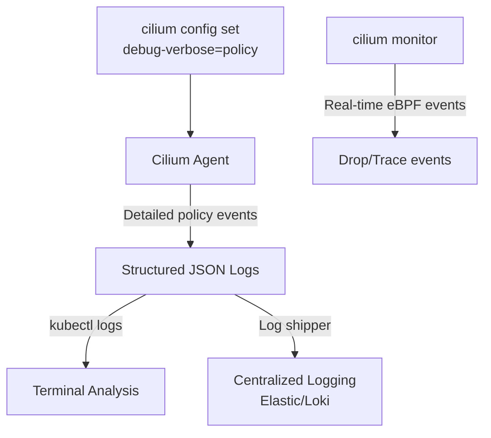

# Cilium Debug Logs

Author: [nawazdhandala](https://github.com/nawazdhandala)

Tags: Cilium, Kubernetes, Troubleshooting, Debugging, eBPF

Description: Enable and analyze Cilium debug logs to investigate data plane issues, policy calculation problems, and control plane errors that are not visible in standard log levels.

---

## Introduction

Cilium's standard log output at the `info` level is optimized for production - it logs significant state changes, errors, and important events without flooding storage systems. But when debugging complex issues like intermittent connectivity failures, subtle policy misconfigurations, or race conditions during endpoint creation, the info-level logs often don't contain enough detail to pinpoint the root cause. Cilium's debug logging fills this gap with detailed subsystem-level output.

Cilium organizes its debug logging into subsystems that can be enabled independently: `datapath` logs eBPF program loading and map operations, `policy` logs the detailed computation of endpoint policies, `kvstore` logs interactions with etcd, `k8s` logs Kubernetes API event processing, and `bgp` logs BGP control plane state changes. You can enable specific subsystems without flooding all channels, focusing the debug output on the area of interest.

This guide covers enabling debug logging, filtering for relevant messages, and interpreting debug output for common Cilium issues.

## Prerequisites

- Cilium installed
- `kubectl` installed
- Sufficient storage for debug log volume (enable only temporarily)

## Step 1: Enable Debug Logging Temporarily

```bash
# Enable debug logging at runtime (no restart required)
kubectl exec -n kube-system cilium-xxxxx -- \
  cilium config set debug true

# Enable specific subsystem verbose logging
kubectl exec -n kube-system cilium-xxxxx -- \
  cilium config set debug-verbose datapath,policy,k8s

# Available subsystems:
# datapath, policy, k8s, kvstore, envoy, bgp, bpf, identity
```

## Step 2: Enable Debug Logging via Helm

For persistent debug logging (not recommended in production):

```bash
helm upgrade cilium cilium/cilium \
  --namespace kube-system \
  --reuse-values \
  --set debug.enabled=true \
  --set debug.verbose=datapath
```

## Step 3: Capture Relevant Debug Output

```bash
# Stream debug logs in real-time
kubectl logs -n kube-system cilium-xxxxx -f | grep -i debug

# Filter for specific subsystem
kubectl logs -n kube-system cilium-xxxxx -f | grep -i "POLICY\|policy"

# Filter for specific pod IP or endpoint
kubectl logs -n kube-system cilium-xxxxx -f | grep "10.1.0.5"

# Save debug logs for later analysis
kubectl logs -n kube-system cilium-xxxxx \
  --since=5m > /tmp/cilium-debug-$(date +%Y%m%d-%H%M).log
```

## Step 4: Debug Policy Calculation

```bash
# Enable policy debug
kubectl exec -n kube-system cilium-xxxxx -- \
  cilium config set debug-verbose policy

# Trigger policy recalculation by touching a pod
kubectl annotate pod my-pod debug-trigger=$(date +%s) --overwrite

# Watch for policy calculation logs
kubectl logs -n kube-system cilium-xxxxx -f | \
  grep -E "regenerat|policy|endpoint" | head -50
```

## Step 5: Debug Datapath Events

```bash
# Enable datapath debug for eBPF program issues
kubectl exec -n kube-system cilium-xxxxx -- \
  cilium config set debug-verbose datapath

# Use cilium monitor for real-time event capture
kubectl exec -n kube-system cilium-xxxxx -- \
  cilium monitor --type drop --type trace

# Monitor events for specific endpoint
kubectl exec -n kube-system cilium-xxxxx -- \
  cilium monitor --from <endpoint-id> --type drop
```

## Step 6: Disable Debug Logging After Investigation

```bash
# Always disable debug logging when done
kubectl exec -n kube-system cilium-xxxxx -- \
  cilium config set debug false

kubectl exec -n kube-system cilium-xxxxx -- \
  cilium config set debug-verbose ""
```

## Debug Log Filtering Reference

```bash
# Policy-related logs
grep -i "policy\|regenerat\|endpoint.*allow\|endpoint.*deny"

# Datapath eBPF logs
grep -i "datapath\|bpf\|program\|map.*error"

# BGP-specific logs
grep -i "bgp\|peer\|session\|gobgp"

# Identity and label logs
grep -i "identity\|label\|selector"

# Kubernetes API watch events
grep -i "k8s\|watch\|namespace\|service"
```

## Debug Architecture



## Conclusion

Cilium debug logging is a powerful diagnostic tool that should be used selectively and disabled promptly after investigation. The subsystem-level verbosity controls (`debug-verbose=policy,datapath`) let you focus on the relevant area without overwhelming your log infrastructure. For real-time eBPF-level event capture, `cilium monitor --type drop` is often more useful than log parsing because it captures events at the eBPF level with zero sampling. Always remember to disable debug logging after your investigation - the volume can be substantial and will impact Cilium agent performance.
