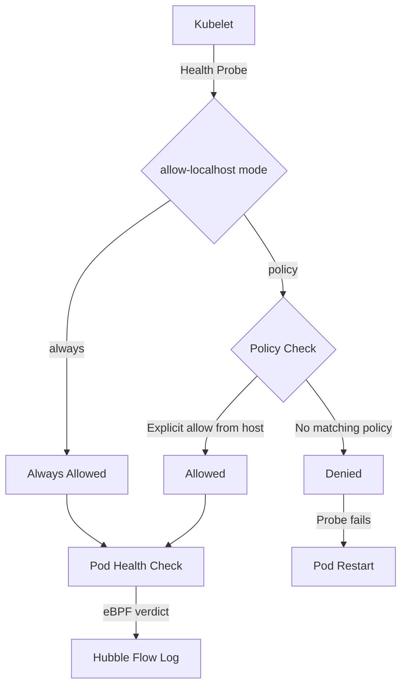

# Cilium Default Ingress Allow from Local Host

Author: [nawazdhandala](https://github.com/nawazdhandala)

Tags: Cilium, Kubernetes, Networking, eBPF, IPAM

Description: Understand Cilium's default behavior of allowing ingress traffic from the local host, how to configure this behavior, troubleshoot unexpected allow/deny decisions, and validate your policy...

---

## Introduction

Cilium has a specific default behavior regarding traffic originating from the local host (the Kubernetes node itself): by default, ingress traffic from the node to any pod is allowed, even when network policies are applied. This behavior exists to ensure that Kubernetes liveness and readiness probes - which originate from the kubelet on the node - always reach pods regardless of network policy configuration. Without this default, misconfigured policies could prevent health checks from working, causing cascading pod restarts.

This default allow rule is applied implicitly and does not appear in your CiliumNetworkPolicies. It can be surprising when debugging policy enforcement because traffic from the node will always be allowed even when you expect it to be blocked. Understanding this behavior is critical for security-sensitive deployments where you want to enforce strict isolation, including from the host.

This guide covers how the default localhost allow works, how to configure it, troubleshoot unexpected traffic patterns, and monitor host-to-pod flows.

## Prerequisites

- Cilium installed in your Kubernetes cluster
- `kubectl` with cluster admin access
- Cilium CLI installed
- Understanding of CiliumNetworkPolicy structure

## Configure Default Localhost Allow Behavior

Understand the current default behavior:

```bash
# Check if allow-localhost behavior is enabled

kubectl -n kube-system get configmap cilium-config -o yaml | grep allow-localhost
# Default: allow-localhost=auto (defaults to always in Kubernetes)
# Options: allow-localhost=auto | always | policy

# View the current policy enforcement mode
kubectl -n kube-system exec ds/cilium -c cilium-agent -- \
  cilium-dbg config --all | grep -E "allow-localhost|enable-policy"
```

Configure different localhost allow modes:

```bash
# Mode 1: always - always allow host traffic (default for backward compatibility)
helm upgrade cilium cilium/cilium \
  --namespace kube-system \
  --reuse-values \
  --set extraConfig.allow-localhost=always \
  --set rollOutCiliumPods=true

# Mode 2: policy - require policy to permit host traffic when policy is enforced
helm upgrade cilium cilium/cilium \
  --namespace kube-system \
  --reuse-values \
  --set extraConfig.allow-localhost=policy \
  --set rollOutCiliumPods=true

# Mode 3: When allow-localhost=policy, create explicit host-allow policy
kubectl apply -f - <<EOF
apiVersion: "cilium.io/v2"
kind: CiliumNetworkPolicy
metadata:
  name: allow-host-ingress
  namespace: default
spec:
  endpointSelector:
    matchLabels:
      app: my-app
  ingress:
  # Allow from host entity (the node itself)
  - fromEntities:
    - host
    toPorts:
    - ports:
      - port: "8080"
        protocol: TCP
EOF
```

## Troubleshoot Localhost Allow Issues

Diagnose unexpected allow/deny behavior from the host:

```bash
# Verify if host traffic is being allowed despite restrictive policy
# Monitor for traffic from the host entity
cilium hubble port-forward &
hubble observe --from-identity host -f

# Check if probes are failing due to policy
kubectl describe pod <pod-name> | grep -A 10 "Liveness\|Readiness"
kubectl get events -n <namespace> | grep -i "probe\|health"

# Check the destination endpoint's policy map for host traffic
kubectl -n kube-system exec ds/cilium -c cilium-agent -- \
  cilium-dbg bpf policy get <pod-endpoint-id>

# Identify the current allow-localhost configuration
kubectl -n kube-system exec ds/cilium -c cilium-agent -- \
  cilium-dbg config --all | grep allow-localhost
```

Fix common localhost policy issues:

```bash
# Issue: Health probes failing after switching to policy mode
# Add explicit allow for kubelet probes
kubectl apply -f - <<EOF
apiVersion: "cilium.io/v2"
kind: CiliumClusterwideNetworkPolicy
metadata:
  name: allow-kubelet-probes
spec:
  endpointSelector: {}
  ingress:
  - fromEntities:
    - host
    # Add toPorts here if you want to restrict this to specific probe ports.
EOF

# Issue: Unexpected traffic from host reaching pods
# Switch to policy mode so host traffic must be explicitly allowed
helm upgrade cilium cilium/cilium \
  --namespace kube-system \
  --reuse-values \
  --set extraConfig.allow-localhost=policy \
  --set rollOutCiliumPods=true
```

## Validate Localhost Policy Behavior

Test and confirm localhost allow/deny behavior:

```bash
# Test: Verify host traffic is allowed in default mode
NODE_IP=$(kubectl get nodes worker-1 -o jsonpath='{.status.addresses[?(@.type=="InternalIP")].address}')
POD_IP=$(kubectl get pod my-app -o jsonpath='{.status.podIP}')

# From the node, attempt connection (should succeed with allow-localhost=always)
kubectl debug node/worker-1 -it --image=curlimages/curl -- \
  curl -v http://$POD_IP:8080

# Verify via Hubble
hubble observe --from-identity host --to-pod default/my-app --last 50

# Check the policy map for the destination endpoint
kubectl -n kube-system exec ds/cilium -c cilium-agent -- \
  cilium-dbg bpf policy get <pod-endpoint-id>
```

## Monitor Host-to-Pod Traffic


```mermaid
graph TD
    A[Kubelet] -->|Health Probe| B{allow-localhost mode}
    B -->|always| C[Always Allowed]
    B -->|policy| D{Policy Check}
    D -->|Explicit allow from host| E[Allowed]
    D -->|No matching policy| F[Denied]
    C --> G[Pod Health Check]
    E --> G
    F -->|Probe fails| H[Pod Restart]
    G -->|eBPF verdict| I[Hubble Flow Log]
```

Monitor host-to-pod flows:

```bash
# Watch all traffic from the host entity
hubble observe --from-identity host --verdict FORWARDED -f

# Monitor dropped host traffic (indicates policy mode is blocking)
hubble observe --from-identity host --verdict DROPPED -f

# Count host flows by destination
hubble observe --from-identity host --last 1000 --json | \
  jq -r '.flow.destination.pod_name' | sort | uniq -c | sort -rn

# Create Prometheus alert for policy drops that may include blocked host probes
kubectl apply -f - <<EOF
apiVersion: monitoring.coreos.com/v1
kind: PrometheusRule
metadata:
  name: cilium-policy-drops
  namespace: kube-system
spec:
  groups:
  - name: cilium-host
    rules:
    - alert: CiliumPolicyDrops
      expr: rate(hubble_drop_total{reason="POLICY_DENIED"}[5m]) > 0
      for: 1m
      labels:
        severity: critical
      annotations:
        summary: "Traffic is being dropped by Cilium policy"
EOF
```

## Conclusion

Cilium's default behavior of allowing host ingress is a pragmatic choice that ensures Kubernetes health probes work without explicit policy configuration. For security-hardened environments, switching to `allow-localhost=policy` mode and creating explicit host-allow policies for required ports provides tighter isolation while maintaining health check functionality. Always test localhost policy changes carefully in staging environments, as blocking kubelet probes will cause cascading pod failures across your cluster.
