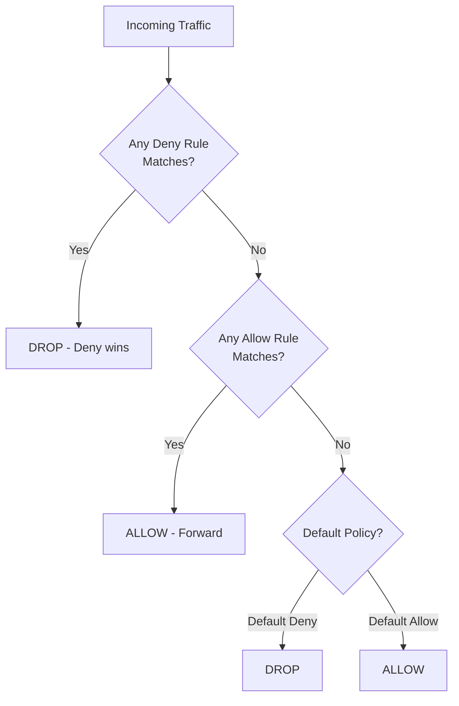

# Deny Policies in Cilium

Author: [nawazdhandala](https://github.com/nawazdhandala)

Tags: Cilium, Kubernetes, Network Policy, Security, EBPF

Description: Use Cilium's explicit deny policies to block specific traffic flows even when other allow rules would otherwise permit them, enabling fine-grained security exceptions in complex policy hierarchies.

---

## Introduction

Standard Kubernetes NetworkPolicy uses a whitelist model - everything is denied unless explicitly allowed. Cilium supports this model and extends it with explicit deny rules that can override allow rules in the same or lower-priority policy tier. This is particularly useful when you have a broad allow rule (like "allow all traffic from the monitoring namespace") but need to carve out specific exceptions ("but never allow access to the database admin port, even from monitoring").

Cilium's deny rules are evaluated after all allow rules in the same policy. A deny rule for a specific combination of source, destination, and port will block traffic even if an allow rule would otherwise permit it. This allows you to compose policies where a broad allow rule handles the common case and targeted deny rules handle exceptions, without having to rewrite the entire allow rule with exclusions.

This guide covers Cilium's deny policy syntax, use cases for explicit denial, the interaction between allow and deny rules, and validation.

## Prerequisites

- Cilium v1.11+ (explicit deny requires this version or later)
- `kubectl` installed
- Existing allow policies to build on

## Step 1: Basic Deny Rule

Deny traffic from a specific source to a sensitive port:

```yaml
apiVersion: cilium.io/v2
kind: CiliumNetworkPolicy
metadata:
  name: deny-admin-access
  namespace: production
spec:
  endpointSelector:
    matchLabels:
      app: database
  ingressDeny:
    - fromEndpoints:
        - matchLabels:
            role: untrusted-client
      toPorts:
        - ports:
            - port: "5432"
              protocol: TCP
  # Separate allow rule for trusted clients
  ingress:
    - fromEndpoints:
        - matchLabels:
            role: trusted-client
      toPorts:
        - ports:
            - port: "5432"
              protocol: TCP
```

## Step 2: Deny Specific Paths with Allow Override

Use deny and allow rules together for exception-based policies:

```yaml
apiVersion: cilium.io/v2
kind: CiliumNetworkPolicy
metadata:
  name: api-deny-admin-paths
  namespace: production
spec:
  endpointSelector:
    matchLabels:
      app: api-server
  # Deny admin paths from non-admin clients
  ingressDeny:
    - fromEndpoints:
        - matchLabels:
            role: regular-user
      toPorts:
        - ports:
            - port: "8080"
              protocol: TCP
          rules:
            http:
              - method: ".*"
                path: "/admin/.*"
  # Allow regular API access
  ingress:
    - fromEndpoints:
        - matchLabels:
            role: regular-user
      toPorts:
        - ports:
            - port: "8080"
              protocol: TCP
          rules:
            http:
              - method: GET
                path: "/api/.*"
```

## Step 3: Cluster-Wide Deny for Sensitive Resources

```yaml
apiVersion: cilium.io/v2
kind: CiliumClusterwideNetworkPolicy
metadata:
  name: deny-metadata-access
spec:
  endpointSelector: {}  # All pods
  egressDeny:
    # Block access to cloud metadata endpoint
    - toCIDR:
        - "169.254.169.254/32"
```

## Step 4: Validate Deny Policy Enforcement

```bash
# Test that deny rule blocks traffic
kubectl exec -n production regular-user-pod -- \
  curl -s -o /dev/null -w "%{http_code}" \
  http://api-server:8080/admin/users
# Expected: 403

# Verify allow rule still works
kubectl exec -n production regular-user-pod -- \
  curl -s -o /dev/null -w "%{http_code}" \
  http://api-server:8080/api/users
# Expected: 200

# Observe deny decisions in Hubble
hubble observe --namespace production \
  --verdict DROPPED \
  --follow
```

## Step 5: Deny Rule Priority

```bash
# Verify deny rule takes precedence over allow rules
# Check the effective policy for an endpoint
kubectl exec -n kube-system cilium-xxxxx -- \
  cilium endpoint list

kubectl exec -n kube-system cilium-xxxxx -- \
  cilium bpf policy get <endpoint-id> | grep -i "deny\|drop"
```

## Allow and Deny Rule Interaction



## Conclusion

Cilium's explicit deny policies add an important capability missing from standard Kubernetes NetworkPolicy: the ability to declare exceptions within a broader allow context. The `ingressDeny` and `egressDeny` fields in `CiliumNetworkPolicy` let you block specific traffic without rewriting entire allow rules. A deny rule always wins over an allow rule - use this predictable precedence to carve out security exceptions in broad policies, block cloud metadata endpoints cluster-wide, and prevent access to sensitive ports from monitoring or utility namespaces.
