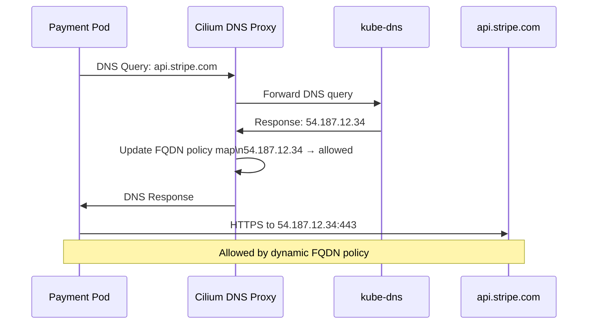

# DNS Policies with Cilium

Author: [nawazdhandala](https://github.com/nawazdhandala)

Tags: Cilium, Kubernetes, Network Policy, DNS, eBPF

Description: Use Cilium FQDN-based DNS policies to control egress traffic based on fully qualified domain names rather than IP addresses, enabling dynamic external access control.

---

## Introduction

IP-based egress policies are brittle for controlling access to external services. Cloud providers rotate IPs, CDNs use hundreds of IP addresses for a single hostname, and SaaS services regularly change their IP ranges without notice. Maintaining CIDR lists for egress rules is a constant operational burden that almost always drifts out of date. Cilium's DNS-aware policy engine solves this by allowing egress rules based on fully qualified domain names (FQDNs) rather than IP addresses.

Cilium's DNS policy works by intercepting DNS responses. When a pod performs a DNS lookup, Cilium records the resolved IP addresses and dynamically updates the egress policy to allow connections to those specific IPs. This means your policy says "allow egress to `api.stripe.com`" and Cilium handles the IP tracking automatically, even as the IPs behind that hostname change.

This guide covers FQDN-based DNS policies, wildcard domain matching, and DNS visibility for observing which external domains your pods are accessing.

## Prerequisites

- Cilium v1.9+ with DNS proxy enabled
- `kubectl` installed
- Workloads with external egress requirements
- `hubble` CLI for DNS observability

## Step 1: Enable DNS Proxy in Cilium

```bash
helm upgrade cilium cilium/cilium \
  --namespace kube-system \
  --reuse-values \
  --set dnsPolicyUnload=false \
  --set dnsProxy.enableTransparentMode=true
```

## Step 2: Basic FQDN Egress Policy

Allow egress to a specific external API:

```yaml
apiVersion: cilium.io/v2
kind: CiliumNetworkPolicy
metadata:
  name: allow-stripe-api
  namespace: production
spec:
  endpointSelector:
    matchLabels:
      app: payment-service
  egress:
    - toFQDNs:
        - matchName: "api.stripe.com"
        - matchName: "stripe.com"
      toPorts:
        - ports:
            - port: "443"
              protocol: TCP
    - toEndpoints:
        - matchLabels:
            "k8s:io.kubernetes.pod.namespace": kube-system
            k8s-app: kube-dns
      toPorts:
        - ports:
            - port: "53"
              protocol: UDP
```

## Step 3: Wildcard Domain Matching

Allow all subdomains of a service:

```yaml
spec:
  endpointSelector:
    matchLabels:
      app: data-service
  egress:
    - toFQDNs:
        - matchPattern: "*.amazonaws.com"
        - matchPattern: "*.s3.amazonaws.com"
      toPorts:
        - ports:
            - port: "443"
              protocol: TCP
    # Always include DNS allow rule
    - toEndpoints:
        - matchLabels:
            k8s-app: kube-dns
      toPorts:
        - ports:
            - port: "53"
              protocol: UDP
```

## Step 4: DNS Policy with IP Fallback

For services with known stable IPs, combine FQDN and CIDR rules:

```yaml
egress:
  - toFQDNs:
      - matchName: "monitoring.internal.example.com"
  - toCIDR:
      - "10.200.0.0/24"   # Fallback for when DNS resolution fails
  - toEndpoints:
      - matchLabels:
          k8s-app: kube-dns
    toPorts:
      - ports:
          - port: "53"
            protocol: UDP
```

## Step 5: Observe DNS Traffic with Hubble

```bash
# Watch DNS requests from a specific pod
hubble observe --namespace production \
  --pod payment-service-xxx \
  --protocol dns \
  --follow

# Check for DNS policy denials
hubble observe --namespace production \
  --verdict DROPPED \
  --type l7 \
  --follow

# See which FQDNs are being resolved
kubectl exec -n kube-system cilium-xxxxx -- \
  cilium fqdn cache list
```

## DNS Policy Flow



## Conclusion

Cilium DNS policies provide a maintainable, reliable approach to egress control for external services. By anchoring policies to domain names instead of IP addresses, you eliminate the operational burden of keeping CIDR lists synchronized with constantly-changing cloud service IPs. Always include explicit DNS allow rules in any egress-restricted policy - without them, pods cannot perform DNS resolution and all domain-based policies will silently fail. Use Hubble DNS observability to audit which external domains your services are accessing.
