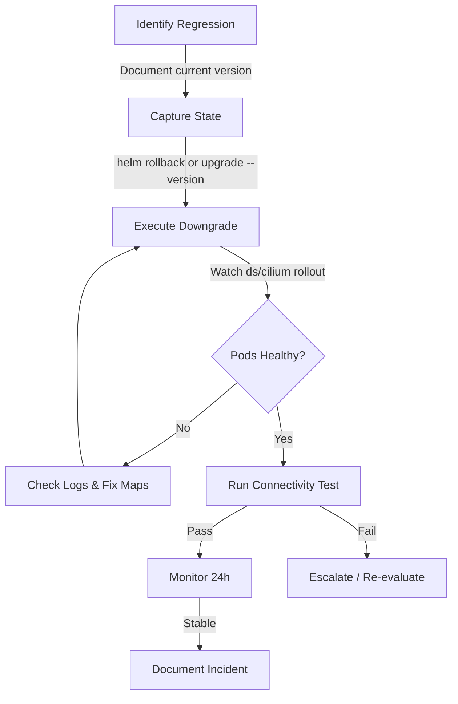

# Cilium Downgrade Procedure: Configure, Troubleshoot, Validate, and Monitor

Author: [nawazdhandala](https://github.com/nawazdhandala)

Tags: Cilium, Kubernetes, Networking, EBPF, IPAM

Description: Learn the safe procedure for downgrading Cilium to a previous version when an upgrade introduces regressions, including rollback steps, troubleshooting guidance, and post-downgrade validation.

---

## Introduction

While Cilium upgrades follow a well-documented path, sometimes a new version introduces regressions, performance degradations, or incompatibilities with your workloads. Having a tested downgrade procedure is as important as having an upgrade procedure. Cilium downgrade carries additional complexity because eBPF programs compiled for a newer version may have different map layouts than older versions expect.

Cilium supports downgrading within the same minor version (patch releases) and, in some cases, to the previous minor version. Downgrading across multiple minor versions is not officially supported and risks data plane inconsistencies. Always consult the Cilium compatibility table before attempting a downgrade.

This guide covers how to configure a safe downgrade path, troubleshoot issues encountered during the process, validate a successful rollback, and monitor your cluster's health afterward.

## Prerequisites

- Current Cilium version documented (run `cilium version` before upgrading)
- Target downgrade version's Helm values backed up
- `kubectl` with cluster admin access
- Helm 3.x with Cilium repository configured
- Cluster etcd backup completed before beginning

## Configure Downgrade Path

Prepare for downgrade by capturing current state:

```bash
# Document current version
cilium version
kubectl -n kube-system get pods -l k8s-app=cilium -o jsonpath='{.items[0].spec.containers[0].image}'

# Export current Helm values
helm get values cilium -n kube-system > cilium-current-values.yaml

# Check available previous versions
helm search repo cilium/cilium --versions | head -20

# Identify compatible downgrade target
# Only downgrade one minor version at a time
# Current: 1.15.x -> Target: 1.14.x (supported)
# Current: 1.15.x -> Target: 1.13.x (NOT supported directly)
```

Perform the downgrade via Helm:

```bash
# Roll back to previous Helm release (if recently upgraded)
helm history cilium -n kube-system
helm rollback cilium <previous-revision> -n kube-system

# Or explicitly downgrade to a specific version
helm upgrade cilium cilium/cilium \
  --version 1.14.6 \
  --namespace kube-system \
  --values cilium-previous-values.yaml \
  --wait \
  --timeout 10m

# Monitor the rollout
kubectl -n kube-system rollout status ds/cilium
kubectl -n kube-system rollout status deploy/cilium-operator
```

Handle CRD downgrade if needed:

```bash
# Check if CRDs need to be downgraded
kubectl get crd | grep cilium | awk '{print $1}' | while read crd; do
  kubectl get crd $crd -o jsonpath='{.metadata.annotations.meta\.helm\.sh/release-name}' 2>/dev/null
  echo ""
done

# Apply previous version CRDs if required
# Download CRDs from target version's release
CILIUM_VERSION="1.14.6"
kubectl apply -f https://raw.githubusercontent.com/cilium/cilium/v${CILIUM_VERSION}/pkg/k8s/apis/cilium.io/client/crds/v2/ciliumnetworkpolicies.yaml
```

## Troubleshoot Downgrade Issues

Diagnose issues during or after downgrade:

```bash
# Check Cilium pods are healthy after downgrade
kubectl -n kube-system get pods -l k8s-app=cilium
kubectl -n kube-system describe pods -l k8s-app=cilium | grep -A 10 "Events:"

# Check for eBPF map compatibility errors
kubectl -n kube-system logs ds/cilium --tail=100 | grep -i "map\|bpf\|error"

# Verify Cilium endpoints are regenerating correctly
kubectl -n kube-system exec ds/cilium -- cilium endpoint list | grep -v ready

# Check for CRD version mismatch
kubectl -n kube-system logs ds/cilium | grep -i "unknown\|schema\|version"
```

Fix common downgrade issues:

```bash
# Issue: eBPF maps from new version incompatible with old agent
# Solution: Delete and recreate Cilium pods to flush maps
kubectl -n kube-system delete pods -l k8s-app=cilium

# Issue: CiliumNetworkPolicy fields not recognized by older version
# Check which fields were added in the newer version
kubectl get cnp -A -o yaml | grep -E "apiVersion|kind" | head -20

# Issue: Cilium Operator failing after downgrade
kubectl -n kube-system logs -l name=cilium-operator --tail=100
kubectl -n kube-system delete pods -l name=cilium-operator

# Issue: Endpoints stuck in regenerating state
kubectl -n kube-system exec ds/cilium -- cilium endpoint regenerate --all
```

## Validate Downgrade Success

Confirm the downgraded version is functioning correctly:

```bash
# Verify version matches target
cilium version
kubectl -n kube-system exec ds/cilium -- cilium version

# Check all Cilium pods are running the correct image
kubectl -n kube-system get pods -l k8s-app=cilium \
  -o jsonpath='{range .items[*]}{.metadata.name}{"\t"}{.spec.containers[0].image}{"\n"}{end}'

# Validate all endpoints are healthy
kubectl -n kube-system exec ds/cilium -- cilium endpoint list | grep -v "ready"
# Should show no endpoints in non-ready state

# Run connectivity test
cilium connectivity test --test-namespace cilium-test
```

Validate workload connectivity:

```bash
# Test pod-to-pod connectivity
kubectl run test-pod --image=nicolaka/netshoot -it --rm -- ping -c 3 <pod-ip>

# Test service discovery
kubectl run test-pod --image=curlimages/curl -it --rm -- \
  curl -s http://kubernetes.default.svc.cluster.local

# Verify network policies still enforced
kubectl get cnp -A
kubectl -n kube-system exec ds/cilium -- cilium policy get
```

## Monitor Post-Downgrade



Monitor cluster health after downgrade:

```bash
# Watch Cilium health for 30 minutes after downgrade
watch -n30 "cilium status --brief && kubectl -n kube-system get pods -l k8s-app=cilium"

# Monitor for increased error rates
kubectl -n kube-system port-forward svc/cilium-operator 9963:9963 &
curl -s http://localhost:9963/metrics | grep -E "error|drop|fail" | grep -v "# "

# Check Hubble for unexpected dropped flows
cilium hubble port-forward &
hubble observe --verdict DROPPED --last 1000

# Monitor node health
kubectl get nodes
kubectl describe nodes | grep -A 5 "Conditions:"
```

## Conclusion

A controlled Cilium downgrade is achievable when staying within one minor version and following a systematic rollback procedure. Always capture your current Helm values and image versions before upgrading so rollback preparation is minimal. Post-downgrade, run the full connectivity test suite and monitor for at least 24 hours before considering the incident closed. Document the regression you encountered and open an issue in the Cilium GitHub repository to help the community prevent it in future releases.
