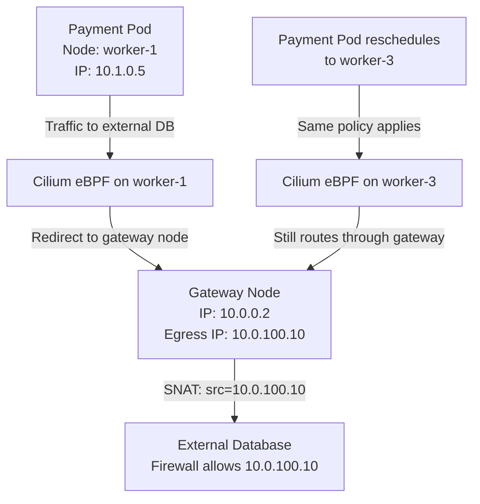

# Cilium Egress Gateway

Author: [nawazdhandala](https://github.com/nawazdhandala)

Tags: Cilium, Kubernetes, Networking, Egress, EBPF

Description: Configure Cilium Egress Gateway to route pod egress traffic through dedicated gateway nodes with stable IP addresses, enabling external firewall rules based on predictable source IPs.

---

## Introduction

One of the most common enterprise requirements for Kubernetes networking is stable, predictable source IP addresses for traffic leaving the cluster. External systems like databases, APIs, and legacy services often use IP allowlisting as a security control, but in a standard Kubernetes setup, pods can run on any node, and each node has a different IP address. As pods reschedule, their effective egress IP changes, constantly invalidating firewall rules.

Cilium Egress Gateway solves this by routing all egress traffic from specific pods through designated gateway nodes that have stable, known IP addresses. The `CiliumEgressGatewayPolicy` resource selects source pods by label, selects gateway nodes by label, and configures SNAT to replace the pod's source IP with the gateway node's IP (or a virtual IP assigned to the gateway). External systems see consistent, predictable IP addresses regardless of which node the pods are actually running on.

This guide covers deploying Cilium Egress Gateway, creating gateway policies, and validating that external traffic exits through the configured gateway nodes.

## Prerequisites

- Cilium v1.10+ with Egress Gateway feature enabled
- Dedicated gateway nodes labeled appropriately
- `kubectl` installed
- External system to test egress IP (e.g., `ifconfig.me`)

## Step 1: Enable Egress Gateway in Cilium

```bash
helm upgrade cilium cilium/cilium \
  --namespace kube-system \
  --reuse-values \
  --set egressGateway.enabled=true \
  --set bpf.masquerade=true
```

## Step 2: Label Gateway Nodes

Designate specific nodes as egress gateways:

```bash
kubectl label node gateway-node-1 role=egress-gateway
kubectl label node gateway-node-2 role=egress-gateway
```

## Step 3: Create CiliumEgressGatewayPolicy

```yaml
apiVersion: cilium.io/v2
kind: CiliumEgressGatewayPolicy
metadata:
  name: payment-egress
spec:
  selectors:
    - podSelector:
        matchLabels:
          app: payment-service
          namespace: production
  destinationCIDRs:
    - "0.0.0.0/0"
  egressGateway:
    nodeSelector:
      matchLabels:
        role: egress-gateway
    egressIP: "10.0.100.10"  # Stable virtual IP assigned to gateway
```

## Step 4: Assign Egress IP to Gateway Node

```bash
# Add the egress IP as a secondary IP on the gateway node's interface
ip addr add 10.0.100.10/32 dev eth0

# Or configure it via node annotations for Cilium to manage
kubectl annotate node gateway-node-1 \
  "cilium.io/egress-ip"="10.0.100.10"
```

## Step 5: Validate Egress Gateway Routing

```bash
# Test egress IP from a payment-service pod
kubectl exec -n production payment-service-xxx -- \
  curl -s https://ifconfig.me
# Expected: 10.0.100.10 (gateway node IP)

# Test from a non-selected pod
kubectl exec -n production other-service-xxx -- \
  curl -s https://ifconfig.me
# Expected: Node IP (not gateway IP)

# Check egress gateway policy status
kubectl get ciliumbgppeeringpolicy
kubectl get ciliumegressgatewaypolicy payment-egress -o yaml
```

## Step 6: Monitor Egress Gateway Activity

```bash
# Watch egress gateway flows in Hubble
hubble observe --namespace production \
  --pod payment-service-xxx \
  --follow

# Check BPF egress map
kubectl exec -n kube-system cilium-xxxxx -- \
  cilium bpf egress list

# Check NAT table for egress mappings
kubectl exec -n kube-system cilium-xxxxx -- \
  cilium bpf nat list | grep 10.0.100.10
```

## Egress Gateway Architecture



## Conclusion

Cilium Egress Gateway provides the stable, predictable egress IP addresses that enterprise network security requirements demand. By routing traffic through dedicated gateway nodes and applying SNAT to a virtual egress IP, pods can reschedule freely without invalidating external firewall rules. This is a critical feature for applications that communicate with on-premises systems, external databases, or any service that uses IP allowlisting as a security control. The `CiliumEgressGatewayPolicy` CRD gives you declarative, GitOps-compatible control over egress routing that ties into the same Kubernetes label-based selection system as all other Cilium policies.
