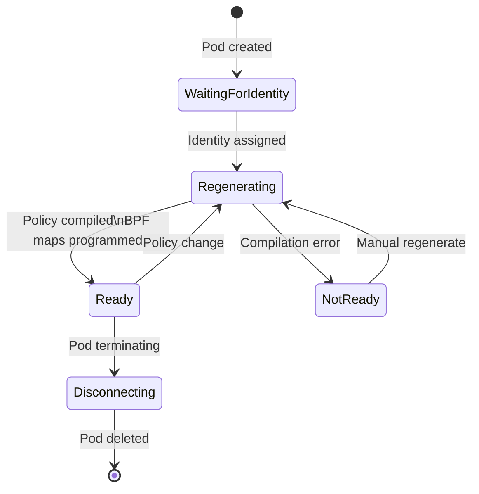

# Cilium Endpoint Health

Author: [nawazdhandala](https://github.com/nawazdhandala)

Tags: Cilium, Kubernetes, Endpoint Health, Observability, eBPF

Description: Monitor and troubleshoot Cilium endpoint health states to ensure pod network configurations are correctly applied and diagnose endpoints stuck in non-ready states.

---

## Introduction

In Cilium, an "endpoint" is the internal representation of a Kubernetes pod's network configuration. Each endpoint has a lifecycle that mirrors the pod lifecycle, but with additional Cilium-specific states: identity assignment, policy compilation, BPF map programming, and datapath regeneration. When an endpoint is in a `ready` state, all of this has been completed successfully. When it's not, understanding exactly which step failed is critical for diagnosing pod networking issues.

Endpoint health monitoring matters because non-ready endpoints mean pods whose network configuration is incomplete or incorrect. A pod might be Running from Kubernetes' perspective (container started, probes passing) but have a Cilium endpoint in a non-ready state, meaning its network policy isn't applied correctly, its identity is wrong, or its BPF maps haven't been programmed. In production clusters, monitoring the ratio of ready to total endpoints is a key health indicator.

This guide covers the endpoint lifecycle, how to monitor endpoint health, how to diagnose non-ready endpoints, and how to remediate common endpoint health issues.

## Prerequisites

- Cilium installed
- `kubectl` installed
- `cilium` CLI installed

## Step 1: Check Endpoint Health Overview

```bash
# List all endpoints and their states
cilium endpoint list

# Count endpoints by state
cilium endpoint list | awk '{print $6}' | sort | uniq -c

# Expected healthy output:
# 45 ready
# 0 regenerating
# 0 waiting-for-identity
# 0 not-ready
```

## Step 2: Endpoint State Reference

| State | Meaning | Action |
|-------|---------|--------|
| `ready` | Fully configured | None needed |
| `regenerating` | Policy being compiled | Normal, wait |
| `waiting-for-identity` | Identity from kvstore pending | Check kvstore connectivity |
| `not-ready` | Configuration failed | Inspect with `endpoint get` |
| `disconnecting` | Pod terminating | Normal |

## Step 3: Inspect a Non-Ready Endpoint

```bash
# Get detailed endpoint information
ENDPOINT_ID=$(cilium endpoint list | grep my-pod-name | awk '{print $1}')
cilium endpoint get ${ENDPOINT_ID}

# Check endpoint log for errors
cilium endpoint log ${ENDPOINT_ID}

# Sample error output:
# [ERROR] Failed to regenerate endpoint: policy import error
# [ERROR] Failed to download identity from kvstore
```

## Step 4: Monitor Endpoint Regeneration

```bash
# Watch endpoint state changes in real-time
watch -n 2 "cilium endpoint list | grep -v ready"

# Check regeneration time (slow = policy complexity issue)
cilium endpoint list --output json | \
  jq '.[] | {id: .id, state: .status.state, regeneration_time: .status["external-identifiers"]}'

# Monitor Cilium metrics for endpoint health
kubectl port-forward -n kube-system ds/cilium 9962:9962
curl -s http://localhost:9962/metrics | grep "cilium_endpoint_state"
```

## Step 5: Force Endpoint Regeneration

If an endpoint is stuck, force regeneration:

```bash
# Force endpoint policy regeneration
kubectl exec -n kube-system cilium-xxxxx -- \
  cilium endpoint regenerate ${ENDPOINT_ID}

# If regeneration fails consistently, debug at higher verbosity
kubectl exec -n kube-system cilium-xxxxx -- \
  cilium config set debug-verbose policy

kubectl exec -n kube-system cilium-xxxxx -- \
  cilium endpoint regenerate ${ENDPOINT_ID}

kubectl logs -n kube-system cilium-xxxxx | grep -i "regenerat" | tail -20
```

## Step 6: Alert on Endpoint Health

```yaml
apiVersion: monitoring.coreos.com/v1
kind: PrometheusRule
metadata:
  name: cilium-endpoint-health
  namespace: monitoring
spec:
  groups:
    - name: cilium-endpoints
      rules:
        - alert: CiliumEndpointNotReady
          expr: |
            cilium_endpoint_state{state!="ready"} > 0
          for: 5m
          labels:
            severity: warning
          annotations:
            summary: "Endpoint not ready on {{ $labels.instance }}"

        - alert: CiliumEndpointRegenerationSlow
          expr: |
            histogram_quantile(0.99,
              rate(cilium_endpoint_regeneration_time_seconds_bucket[5m])
            ) > 30
          for: 5m
          labels:
            severity: warning
```

## Endpoint Lifecycle



## Conclusion

Cilium endpoint health is the ground-truth indicator of whether pod networking is correctly configured. The endpoint state machine — waiting-for-identity → regenerating → ready — must complete successfully for every pod. Monitor the ratio of ready endpoints to total endpoints via Prometheus alerts, and investigate any endpoint stuck in `not-ready` or `waiting-for-identity` states immediately. The `cilium endpoint log` command gives you the detailed error history for any endpoint, which almost always points directly to the root cause, whether a kvstore connectivity issue, a policy compilation error, or a BPF map programming failure.
