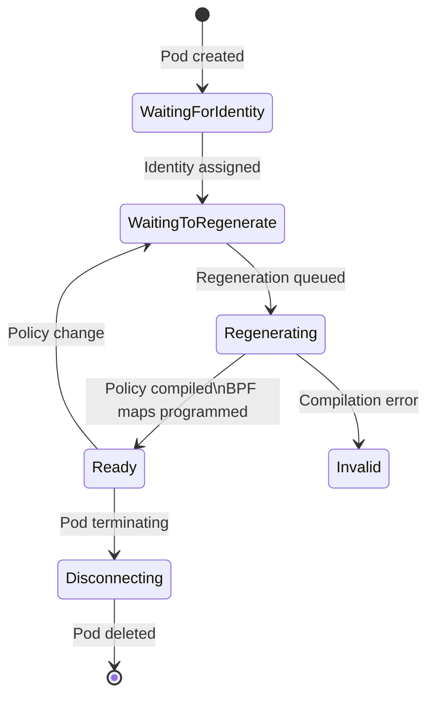

# Cilium Endpoint Health

Author: [nawazdhandala](https://github.com/nawazdhandala)

Tags: Cilium, Kubernetes, Endpoint Health, Observability, eBPF

Description: Monitor and troubleshoot Cilium endpoint health states to ensure pod network configurations are correctly applied and diagnose endpoints stuck in non-ready states.

---

## Introduction

In Cilium, an "endpoint" is the internal representation of a Kubernetes pod's network configuration. Each endpoint has a lifecycle that mirrors the pod lifecycle, but with additional Cilium-specific states: identity assignment, policy compilation, BPF map programming, and datapath regeneration. When an endpoint is in a `ready` state, all of this has been completed successfully. When it's not, understanding exactly which step failed is critical for diagnosing pod networking issues.

Endpoint health monitoring matters because non-ready endpoints mean pods whose network configuration is incomplete or incorrect. A pod might be Running from Kubernetes' perspective (container started, probes passing) but have a Cilium endpoint in a non-ready state, meaning its network policy isn't applied correctly, its identity is wrong, or its BPF maps haven't been programmed. In production clusters, monitoring the ratio of ready to total endpoints is a key health indicator.

This guide covers the endpoint lifecycle, how to monitor endpoint health, how to diagnose non-ready endpoints, and how to remediate common endpoint health issues.

## Prerequisites

- Cilium installed
- `kubectl` installed
- `cilium` CLI installed
- Access to a Cilium agent pod with `cilium-dbg` available
- `jq` installed for JSON parsing

## Step 1: Check Endpoint Health Overview

```bash
# Select a Cilium agent pod to inspect
CILIUM_POD=$(kubectl -n kube-system get pods -l k8s-app=cilium \
  -o jsonpath='{.items[0].metadata.name}')

# List all endpoints and their states
kubectl exec -n kube-system "${CILIUM_POD}" -c cilium-agent -- \
  cilium-dbg endpoint list

# Count endpoints by state
kubectl exec -n kube-system "${CILIUM_POD}" -c cilium-agent -- \
  cilium-dbg endpoint list -o json | \
  jq -r '.[].status.state' | sort | uniq -c

# Expected healthy output:
# 45 ready
```

## Step 2: Endpoint State Reference

| State | Meaning | Action |
|-------|---------|--------|
| `restoring` | Cilium is restoring endpoint state after agent restart | Normal during startup; inspect logs if it persists |
| `waiting-for-identity` | Cilium is allocating an identity | Check Kubernetes API or kvstore connectivity if it persists |
| `waiting-to-regenerate` | Identity is assigned and regeneration is queued | Normal, wait |
| `regenerating` | Network configuration and eBPF datapath are being regenerated | Normal, wait |
| `ready` | Fully configured | None needed |
| `invalid` | Endpoint creation or regeneration failed | Inspect with `endpoint get` and endpoint logs |
| `disconnecting` | Pod terminating | Normal |
| `disconnected` | Endpoint deleted | Normal after deletion |

## Step 3: Inspect a Non-Ready Endpoint

```bash
# Get detailed endpoint information
ENDPOINT_ID=$(kubectl exec -n kube-system "${CILIUM_POD}" -c cilium-agent -- \
  cilium-dbg endpoint list | grep my-pod-name | awk '{print $1}')

kubectl exec -n kube-system "${CILIUM_POD}" -c cilium-agent -- \
  cilium-dbg endpoint get ${ENDPOINT_ID}

# Check endpoint log for errors
kubectl exec -n kube-system "${CILIUM_POD}" -c cilium-agent -- \
  cilium-dbg endpoint log ${ENDPOINT_ID}

# Sample error output:
# [ERROR] Failed to regenerate endpoint: policy import error
# [ERROR] Failed to download identity from kvstore
```

## Step 4: Monitor Endpoint Regeneration

```bash
# Watch endpoint state changes in real-time
watch -n 2 "kubectl exec -n kube-system ${CILIUM_POD} -c cilium-agent -- \
  cilium-dbg endpoint list -o json | jq -r '.[] | select(.status.state != \"ready\") | [.id, .status.state] | @tsv'"

# Check detailed endpoint status
kubectl exec -n kube-system "${CILIUM_POD}" -c cilium-agent -- \
  cilium-dbg endpoint get ${ENDPOINT_ID} -o json | \
  jq '{id: .id, state: .status.state, health: .status.health, policy: .status.policy}'

# Monitor Cilium metrics for endpoint health
kubectl port-forward -n kube-system "pod/${CILIUM_POD}" 9962:9962
curl -s http://localhost:9962/metrics | grep -E "cilium_endpoint_state|cilium_endpoint_regeneration_time_stats_seconds"
```

## Step 5: Troubleshoot Failed Regeneration

If an endpoint is stuck, inspect the regeneration failure and fix the underlying policy, identity, or datapath error:

```bash
# If regeneration fails consistently, debug at higher verbosity
kubectl -n kube-system get configmap cilium-config -o jsonpath='{.data.debug-verbose}'

# Enable policy debug logging with the Cilium CLI, then restart Cilium agents
cilium config set debug-verbose policy --restart=true

# Watch regeneration-related logs on the affected agent
kubectl logs -n kube-system "${CILIUM_POD}" -c cilium-agent | \
  grep -i "regenerat" | tail -20

# After correcting the root cause, restart the affected workload if the endpoint does not recover
kubectl delete pod -n <workload-namespace> <pod-name>
```

## Step 6: Alert on Endpoint Health

```yaml
apiVersion: monitoring.coreos.com/v1
kind: PrometheusRule
metadata:
  name: cilium-endpoint-health
  namespace: monitoring
spec:
  groups:
    - name: cilium-endpoints
      rules:
        - alert: CiliumEndpointNotReady
          expr: |
            cilium_endpoint_state{endpoint_state!="ready"} > 0
          for: 5m
          labels:
            severity: warning
          annotations:
            summary: "Endpoint not ready on {{ $labels.instance }}"

        - alert: CiliumEndpointRegenerationSlow
          expr: |
            histogram_quantile(0.99,
              rate(cilium_endpoint_regeneration_time_stats_seconds_bucket[5m])
            ) > 30
          for: 5m
          labels:
            severity: warning
```

## Endpoint Lifecycle


```mermaid
stateDiagram-v2
    [*] --> WaitingForIdentity: Pod created
    WaitingForIdentity --> WaitingToRegenerate: Identity assigned
    WaitingToRegenerate --> Regenerating: Regeneration queued
    Regenerating --> Ready: Policy compiled\nBPF maps programmed
    Ready --> WaitingToRegenerate: Policy change
    Regenerating --> Invalid: Compilation error
    Ready --> Disconnecting: Pod terminating
    Disconnecting --> [*]: Pod deleted
```

## Conclusion

Cilium endpoint health is the ground-truth indicator of whether pod networking is correctly configured. The endpoint state machine - waiting-for-identity → waiting-to-regenerate → regenerating → ready - must complete successfully for every pod. Monitor the ratio of ready endpoints to total endpoints via Prometheus alerts, and investigate any endpoint stuck in `invalid` or `waiting-for-identity` states immediately. The `cilium-dbg endpoint log` command gives you the detailed error history for any endpoint, which almost always points directly to the root cause, whether a kvstore connectivity issue, a policy compilation error, or a BPF map programming failure.
