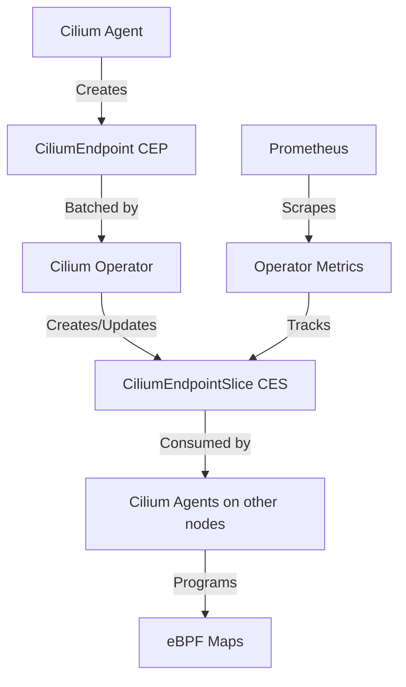

# Cilium EndpointSlice (CES): Configure, Troubleshoot, Validate, and Monitor

Author: [nawazdhandala](https://github.com/nawazdhandala)

Tags: Cilium, Kubernetes, Networking, EBPF, EndpointSlice

Description: Learn how to configure, troubleshoot, validate, and monitor Cilium EndpointSlice (CES) for scalable Kubernetes service discovery and load balancing.

---

## Introduction

Cilium EndpointSlice (CES) is a Cilium-native grouping mechanism that batches multiple Cilium Endpoints (CEPs) into a single Kubernetes custom resource. As clusters grow to thousands of pods, the per-endpoint reconciliation overhead becomes a bottleneck. CES addresses this by allowing the Cilium Operator to manage endpoints in configurable batches, dramatically reducing API server load and improving scalability.

CES complements the standard Kubernetes EndpointSlice API by providing a Cilium-specific view of endpoints with enriched metadata such as security identity, encryption state, and eBPF datapath information. Understanding how CES works is essential for operating large-scale Cilium clusters efficiently.

This guide walks through configuring CES, diagnosing common issues, validating correct operation, and setting up monitoring to ensure your endpoint management layer remains healthy.

## Prerequisites

- Cilium 1.13 or later installed in your Kubernetes cluster
- `kubectl` configured with cluster admin access
- Cilium CLI installed (`cilium` command available)
- Helm 3.x for configuration changes
- Basic familiarity with Cilium Endpoints and the Cilium Operator

## Configure Cilium EndpointSlice

Enable and configure CES via Helm values:

```bash
# Enable CES with default batch size
helm upgrade cilium cilium/cilium \
  --namespace kube-system \
  --reuse-values \
  --set enableCiliumEndpointSlice=true

# Configure batch size (default: 100 endpoints per CES)
helm upgrade cilium cilium/cilium \
  --namespace kube-system \
  --reuse-values \
  --set enableCiliumEndpointSlice=true \
  --set operator.endpointGCInterval=5m
```

Inspect the current CiliumEndpointSlice resources:

```bash
# List all CES objects
kubectl get ciliumendpointslices -A

# Describe a specific CES
kubectl describe ciliumendpointslice <ces-name>
```

Example CES YAML:

```yaml
apiVersion: cilium.io/v2alpha1
kind: CiliumEndpointSlice
metadata:
  name: ces-default-abc123
namespace: default
spec:
  endpoints:
    - id: 1234
      identity:
        id: 56789
      networking:
        addressing:
          - ipv4: 10.244.1.5
      named-ports:
        - name: http
          port: 8080
          protocol: TCP
```

## Troubleshoot Cilium EndpointSlice

Diagnose CES reconciliation issues:

```bash
# Check Cilium Operator logs for CES errors
kubectl -n kube-system logs -l name=cilium-operator --tail=100 | grep -i "endpointslice\|CES"

# Check for stale CES objects
kubectl get ciliumendpointslices -A | grep -v Running

# Verify CES controller is active
kubectl -n kube-system exec ds/cilium -- cilium status | grep -i endpoint

# Inspect endpoint synchronization
kubectl -n kube-system exec ds/cilium -- cilium endpoint list
```

Common issues and fixes:

```bash
# Issue: CES not being created
# Fix: Ensure feature gate is enabled
kubectl -n kube-system get configmap cilium-config -o yaml | grep enableCiliumEndpointSlice

# Issue: Endpoints stuck in pending state
kubectl get cep -A | grep -v Running
kubectl describe cep <endpoint-name> -n <namespace>

# Force endpoint regeneration
kubectl -n kube-system exec ds/cilium -- cilium endpoint regenerate <endpoint-id>
```

## Validate Cilium EndpointSlice

Confirm CES is functioning correctly:

```bash
# Verify CES CRD is installed
kubectl get crd ciliumendpointslices.cilium.io

# Check that CEPs are grouped into CES objects
kubectl get cep -A --no-headers | wc -l
kubectl get ciliumendpointslices --no-headers | wc -l

# Validate endpoint count matches
CEP_COUNT=$(kubectl get cep -A --no-headers | wc -l)
CES_ENDPOINT_COUNT=$(kubectl get ciliumendpointslices -o json | jq '[.items[].spec.endpoints | length] | add')
echo "CEPs: $CEP_COUNT, CES Endpoints: $CES_ENDPOINT_COUNT"

# Run Cilium connectivity test
cilium connectivity test --test-namespace cilium-test
```

Verify the Cilium Operator is reconciling CES objects:

```bash
# Check operator metrics for CES
kubectl -n kube-system port-forward svc/cilium-operator 9963:9963 &
curl -s http://localhost:9963/metrics | grep ces
```

## Monitor Cilium EndpointSlice



Set up monitoring with Prometheus:

```bash
# Key metrics to monitor
# cilium_operator_ces_sync_total - total CES sync operations
# cilium_operator_ces_queueing_delay_seconds - CES queue latency
# cilium_endpoint_count - total endpoints managed

# PromQL queries
# CES sync rate
rate(cilium_operator_ces_sync_total[5m])

# Average CES batch fullness
cilium_operator_ces_endpoint_count / cilium_operator_ces_count

# Endpoint to CES ratio
sum(cilium_endpoint_count) / count(kube_customresource_info{resource="ciliumendpointslices"})
```

Alert on CES reconciliation failures:

```yaml
# ces-alert.yaml
groups:
  - name: cilium-ces
    rules:
      - alert: CiliumCESReconcileErrors
        expr: rate(cilium_operator_ces_sync_total{outcome="failure"}[5m]) > 0
        for: 5m
        labels:
          severity: warning
        annotations:
          summary: "CiliumEndpointSlice reconciliation errors detected"
```

## Conclusion

Cilium EndpointSlice (CES) provides a scalable solution for managing large numbers of Cilium Endpoints in production clusters. By batching endpoints into grouped resources, CES reduces API server load, improves operator efficiency, and enables clusters to scale to tens of thousands of endpoints. Regular monitoring of CES sync rates and batch utilization ensures your networking layer remains responsive as workloads grow.
