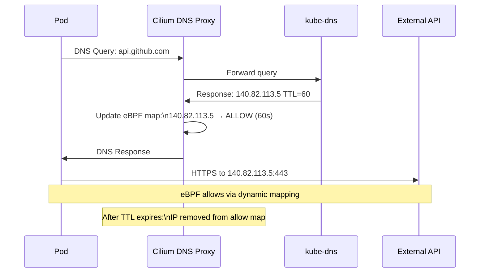

# Cilium FQDN Policies

Author: [nawazdhandala](https://github.com/nawazdhandala)

Tags: Cilium, Kubernetes, Network Policy, FQDN, DNS

Description: Control pod egress traffic to external services by domain name using Cilium FQDN policies, enabling dynamic IP tracking without maintaining static CIDR allowlists.

---

## Introduction

Controlling outbound traffic from Kubernetes pods to external services is a common security requirement, but IP-based CIDR policies are notoriously difficult to maintain. AWS S3 alone has thousands of IP addresses across multiple CIDR ranges, and any cloud service that uses a CDN or load balancer can have its IP addresses change without notice. FQDN-based policies solve this by letting you write rules like "allow traffic to `*.s3.amazonaws.com` on port 443" and letting Cilium handle the IP tracking.

Cilium FQDN policies intercept DNS responses at the Cilium DNS proxy and dynamically update eBPF maps with the resolved IP addresses. When a pod queries `api.example.com` and gets back an IP, that IP is automatically added to an allow list that expires when the DNS TTL passes. This means your policy stays synchronized with the actual IPs behind any domain name, automatically, without any manual intervention.

This guide covers FQDN policy design patterns, configuration, DNS TTL considerations, and troubleshooting FQDN policy issues.

## Prerequisites

- Cilium v1.9+ with DNS proxy enabled
- `kubectl` installed
- `cilium` CLI installed
- `hubble` CLI for DNS observability

## Step 1: Basic FQDN Policy Design Pattern

Every FQDN policy requires a DNS allow rule — without it, pods cannot resolve names:

```yaml
apiVersion: cilium.io/v2
kind: CiliumNetworkPolicy
metadata:
  name: egress-external-apis
  namespace: production
spec:
  endpointSelector:
    matchLabels:
      app: api-consumer
  egress:
    # REQUIRED: Allow DNS resolution first
    - toEndpoints:
        - matchLabels:
            "k8s:io.kubernetes.pod.namespace": kube-system
            k8s-app: kube-dns
      toPorts:
        - ports:
            - port: "53"
              protocol: UDP
            - port: "53"
              protocol: TCP
    # Allow HTTPS to specific domains
    - toFQDNs:
        - matchName: "api.github.com"
        - matchName: "github.com"
      toPorts:
        - ports:
            - port: "443"
              protocol: TCP
```

## Step 2: Wildcard FQDN Patterns

```yaml
egress:
  # All AWS services
  - toFQDNs:
      - matchPattern: "*.amazonaws.com"
    toPorts:
      - ports:
          - port: "443"
            protocol: TCP
  # Internal service discovery
  - toFQDNs:
      - matchPattern: "*.internal.company.com"
    toPorts:
      - ports:
          - port: "443"
            protocol: TCP
          - port: "8080"
            protocol: TCP
```

## Step 3: Inspect FQDN Cache

```bash
# Show cached FQDN-to-IP mappings
kubectl exec -n kube-system cilium-xxxxx -- \
  cilium fqdn cache list

# Sample output:
# FQDN                    SOURCE     IPS
# api.github.com          lookup     140.82.113.5,140.82.113.6
# *.amazonaws.com         pattern    52.216.0.0/14,...

# Clear stale cache entries if needed
kubectl exec -n kube-system cilium-xxxxx -- \
  cilium fqdn cache clean
```

## Step 4: DNS TTL Considerations

Short TTLs can cause gaps in policy enforcement — if a DNS response has TTL=30 but the TCP connection takes 60 seconds to complete, the IP may be removed from the allow list:

```bash
# Check DNS TTL for a domain
dig +noall +answer api.example.com | awk '{print $2, $5}'

# Configure minimum DNS TTL in Cilium to prevent gaps
helm upgrade cilium cilium/cilium \
  --namespace kube-system \
  --reuse-values \
  --set dnsProxy.minTtl=300
```

## Step 5: Troubleshoot FQDN Policy Issues

```bash
# Check if DNS resolution is allowed
kubectl exec -n production app-pod -- nslookup api.github.com

# Check if IP is in FQDN cache
kubectl exec -n kube-system cilium-xxxxx -- \
  cilium fqdn cache list | grep github

# If connection fails after DNS succeeds:
# Check if IP is in the eBPF policy map
kubectl exec -n kube-system cilium-xxxxx -- \
  cilium bpf policy get <endpoint-id>

# Watch DNS queries in real-time
hubble observe --namespace production \
  --pod app-pod-xxx \
  --protocol dns \
  --follow
```

## FQDN Policy Flow



## Conclusion

FQDN policies are the right approach for any Kubernetes cluster that needs to control external egress without the operational burden of maintaining CIDR allowlists. The DNS proxy intercepts and tracks IP resolution automatically, keeping your policies synchronized with the real IPs behind any domain name. The two most common pitfalls are forgetting to include a DNS allow rule (which breaks resolution entirely) and not accounting for very short TTLs (configure `dnsProxy.minTtl` to protect against gaps). Use `cilium fqdn cache list` as your primary debugging tool when FQDN policies are not working as expected.
