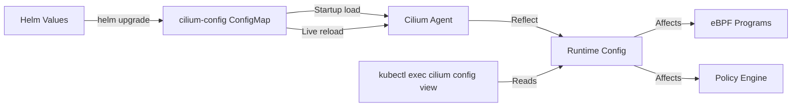

# Cilium General Configuration: Configure, Troubleshoot, Validate, and Monitor

Author: [nawazdhandala](https://github.com/nawazdhandala)

Tags: Cilium, Kubernetes, Configuration, eBPF, Networking

Description: A comprehensive guide to Cilium's general configuration options covering Helm values, runtime configuration, environment-specific tuning, and operational best practices.

---

## Introduction

Cilium's configuration is managed through multiple layers: Helm chart values set at installation time, the `cilium-config` ConfigMap which the agent reads at startup, and runtime configuration that can be modified without restarting the agent. Understanding which configuration options exist at which layer is essential for making targeted adjustments without full redeployments.

The `cilium-config` ConfigMap in the `kube-system` namespace is the authoritative runtime configuration for Cilium agents. Changes to this ConfigMap are picked up by Cilium agents within a few seconds for options that support live reload, while other options require agent restart to take effect. Helm is the preferred method for managing this ConfigMap to ensure configuration is tracked as code and survives cluster upgrades.

This guide covers the most important general configuration options, how to apply them safely, diagnose configuration-related issues, validate effective configuration, and monitor for configuration drift.

## Prerequisites

- Cilium installed via Helm in your Kubernetes cluster
- `kubectl` with cluster admin access
- Helm 3.x with `cilium/cilium` repository
- Familiarity with Cilium's architecture

## Configure Cilium General Options

Core configuration through Helm:

```bash
# View all current configmap values
kubectl -n kube-system get configmap cilium-config -o yaml

# Common general configuration options
helm upgrade cilium cilium/cilium \
  --namespace kube-system \
  --reuse-values \
  --set debug.enabled=false \
  --set rolloutCiliumPods=true \
  --set annotateK8sNode=true

# Configure logging
helm upgrade cilium cilium/cilium \
  --namespace kube-system \
  --reuse-values \
  --set logSystemLoad=true \
  --set debug.verbose=flow

# Configure health checking
helm upgrade cilium cilium/cilium \
  --namespace kube-system \
  --reuse-values \
  --set healthChecking=true \
  --set healthPort=9879

# Configure endpoint GC interval
helm upgrade cilium cilium/cilium \
  --namespace kube-system \
  --reuse-values \
  --set endpointGCInterval=5m \
  --set operatorPrometheusPort=9963
```

Key configuration parameters:

```yaml
# cilium-config key settings
# agent-not-ready-taint-key: taint applied to nodes where Cilium is not ready
# auto-create-cilium-node-resource: auto-create CiliumNode CRD objects
# enable-endpoint-routes: create per-endpoint routes in the routing table
# endpoint-status: which status fields to populate on CiliumEndpoint
# identity-allocation-mode: crd (default) or kvstore
# ipam: IPAM mode (cluster-pool, kubernetes, aws-eni, azure, gke)
# k8s-require-ipv4-pod-cidr: require PodCIDR on nodes
# labels: which label prefixes to use for identity computation
# masquerade: enable/disable IP masquerading
# monitor-aggregation: level of BPF monitor event aggregation
# preallocate-bpf-maps: pre-allocate eBPF maps to avoid allocation failures
```

## Troubleshoot Configuration Issues

Diagnose configuration-related problems:

```bash
# View effective running configuration
kubectl -n kube-system exec ds/cilium -- cilium config view

# Check for configuration parsing errors
kubectl -n kube-system logs ds/cilium | grep -i "config\|invalid\|unknown option"

# Identify which options need restart vs live reload
# Live reload options: debug, monitor-aggregation, log-* options
# Restart required: tunnel, ipam, encryption, kube-proxy replacement

# Check if ConfigMap changes were picked up
kubectl -n kube-system exec ds/cilium -- cilium config view | \
  diff - <(kubectl -n kube-system get configmap cilium-config -o jsonpath='{.data}')
```

Fix common configuration problems:

```bash
# Issue: Configuration not taking effect
# Check if a restart is required
kubectl -n kube-system rollout restart ds/cilium
kubectl -n kube-system rollout status ds/cilium

# Issue: Conflicting configuration options
# Example: kubeProxyReplacement with incorrect API server address
kubectl -n kube-system exec ds/cilium -- cilium config view | grep k8s-api

# Issue: Configuration override from environment variables
kubectl -n kube-system get pods ds/cilium -o yaml | grep env

# Issue: Helm values vs ConfigMap drift
helm get values cilium -n kube-system
kubectl -n kube-system get configmap cilium-config -o yaml
```

## Validate Configuration

Verify configuration is applied correctly:

```bash
# Dump complete configuration for auditing
kubectl -n kube-system exec ds/cilium -- cilium config view > cilium-config-audit.txt

# Verify critical settings
kubectl -n kube-system exec ds/cilium -- cilium config view | \
  grep -E "tunnel|ipam|policy-enforcement|kube-proxy|encryption"

# Check configuration consistency across all nodes
kubectl -n kube-system get pods -l k8s-app=cilium -o jsonpath='{.items[*].metadata.name}' | \
  tr ' ' '\n' | while read pod; do
    echo "=== $pod ==="
    kubectl -n kube-system exec $pod -- cilium config view | \
      grep -E "tunnel|ipam|policy" | sort
  done

# Run post-configuration connectivity test
cilium connectivity test
```

## Monitor Configuration Health



Monitor for configuration drift:

```bash
# Compare Helm values to running configuration periodically
helm get values cilium -n kube-system -o json > helm-values.json
kubectl -n kube-system get configmap cilium-config -o json | \
  jq '.data' > configmap-values.json

# Monitor for unexpected configuration changes
kubectl -n kube-system get configmap cilium-config --watch

# Set up GitOps configuration drift detection
# Store helm values in git and compare in CI/CD pipeline
git diff HEAD cilium-values.yaml

# Audit log for ConfigMap changes
kubectl -n kube-system get events | grep "cilium-config"
```

## Conclusion

Cilium's general configuration is the foundation for all its networking behaviors. Managing it through Helm ensures configurations are version-controlled and reproducible. Understanding which options require agent restarts versus support live reload prevents unnecessary disruptions. Regular audits comparing Helm values to running configuration catch configuration drift before it causes operational issues. Always test configuration changes in a staging environment using the connectivity test suite before applying to production.
