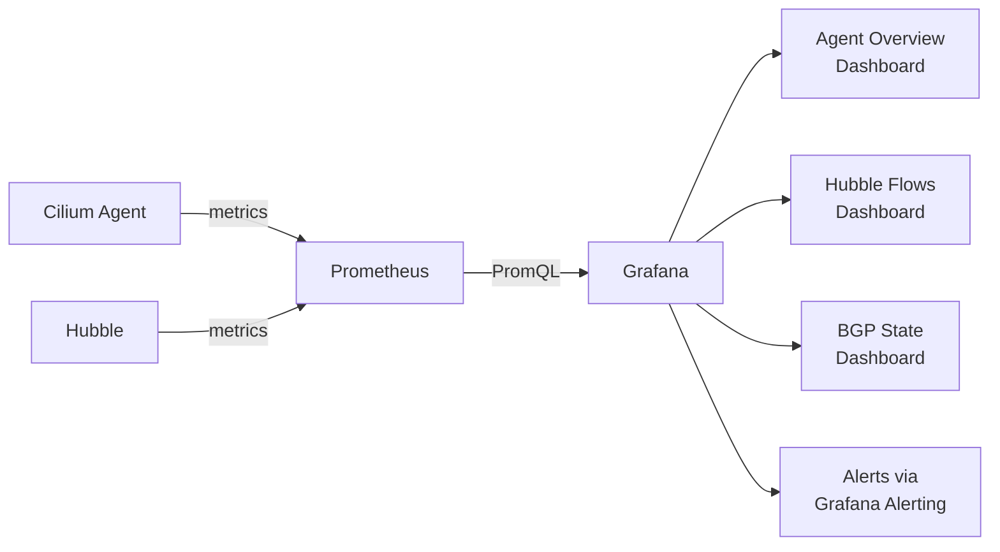

# Cilium Grafana Dashboards

Author: [nawazdhandala](https://github.com/nawazdhandala)

Tags: Cilium, Kubernetes, Grafana, Observability, Metrics

Description: Deploy and customize Grafana dashboards for Cilium and Hubble metrics to visualize cluster network health, policy verdicts, and data plane performance.

---

## Introduction

Cilium provides official Grafana dashboard definitions that visualize the full range of Cilium and Hubble metrics. These dashboards cover data plane performance (throughput, drop rates, conntrack utilization), control plane health (endpoint count, policy calculation latency), BGP session state, and Hubble flow statistics. Having these visualizations available in Grafana means your operations team can see network health at a glance alongside application-level dashboards.

The official Cilium Grafana dashboards are available on Grafana.com as dashboard IDs and also in the Cilium source repository. They are designed to work with the metrics exported by Cilium's Prometheus endpoint, and can be deployed to any Grafana instance that has Prometheus as a data source. For teams using the Grafana Operator or Helm-managed Grafana, the dashboards can be provisioned declaratively.

This guide covers importing the official Cilium dashboards, customizing them for your environment, and creating additional panels for metrics not covered by the official dashboards.

## Prerequisites

- Cilium with Prometheus metrics enabled
- Prometheus scraping Cilium metrics
- Grafana v8+ with Prometheus data source configured
- `kubectl` installed

## Step 1: Import Official Cilium Dashboards

The official dashboard IDs on grafana.com:

| Dashboard | ID |
|-----------|-----|
| Cilium Agent Overview | 15513 |
| Cilium Operator Overview | 15514 |
| Hubble Overview | 16611 |
| Hubble DNS | 16612 |
| Hubble L7 HTTP | 16613 |

In Grafana UI:
1. Navigate to Dashboards → Import
2. Enter the dashboard ID
3. Select your Prometheus data source
4. Click Import

## Step 2: Deploy Dashboards via ConfigMap

For GitOps-managed Grafana:

```yaml
apiVersion: v1
kind: ConfigMap
metadata:
  name: cilium-dashboards
  namespace: monitoring
  labels:
    grafana_dashboard: "1"
data:
  cilium-agent.json: |
    {
      "title": "Cilium Agent Metrics",
      "uid": "cilium-agent",
      "panels": [
        {
          "title": "Drop Rate",
          "type": "timeseries",
          "targets": [
            {
              "expr": "sum(rate(cilium_drop_count_total[5m])) by (reason)",
              "legendFormat": "{{ reason }}"
            }
          ]
        },
        {
          "title": "Active Endpoints",
          "type": "stat",
          "targets": [
            {
              "expr": "sum(cilium_endpoint_state{state='ready'})",
              "legendFormat": "Ready Endpoints"
            }
          ]
        }
      ]
    }
```

## Step 3: Key Dashboard Panels

Create panels for the most important Cilium metrics:

```promql
# Panel 1: Policy drop rate by reason
sum(rate(cilium_drop_count_total[5m])) by (reason)

# Panel 2: Endpoint regeneration duration (p99)
histogram_quantile(0.99, rate(cilium_endpoint_regenerations_total[5m]))

# Panel 3: Hubble flows processed per second
sum(rate(hubble_flows_processed_total[1m])) by (protocol)

# Panel 4: BGP session state
cilium_bgp_session_state

# Panel 5: BPF map operations
rate(cilium_bpf_map_ops_total[5m])

# Panel 6: Conntrack GC runs
rate(cilium_datapath_conntrack_gc_runs_total[5m])
```

## Step 4: Set Up Dashboard Alerts in Grafana

Within a Grafana panel, add an alert:

```yaml
# In Grafana alert UI for the Drop Rate panel:
# Condition: avg() OF query(A, 5m, now) IS ABOVE 100
# Evaluate every: 1m
# For: 5m
# Notify: PagerDuty / Slack channel
```

## Step 5: Customize with Template Variables

Add namespace or node selector variables to filter dashboard views:

```promql
# Variable: namespace
# Query: label_values(hubble_flows_processed_total, source_namespace)

# Use in panels:
sum(rate(hubble_flows_processed_total{source_namespace=~"$namespace"}[1m])) by (protocol)
```

## Dashboard Architecture



## Conclusion

Cilium's official Grafana dashboards provide immediate visibility into network health without requiring you to build panels from scratch. The combination of the agent overview dashboard (for data plane health), the Hubble overview dashboard (for flow statistics), and custom alert panels covering drop rates and endpoint state gives your team a complete picture of network health. Import the official dashboards first to get baseline coverage, then add custom panels for BGP state and application-specific flow patterns that matter for your specific environment.
