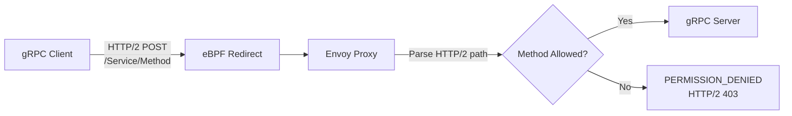

# gRPC Policies with Cilium

Author: [nawazdhandala](https://github.com/nawazdhandala)

Tags: Cilium, Kubernetes, Network Policy, gRPC, eBPF

Description: Secure gRPC services with Cilium network policies that enforce access control at the service and method level, controlling which callers can invoke specific gRPC procedures.

---

## Introduction

gRPC is the dominant RPC framework in cloud-native Kubernetes environments, used for service-to-service communication in microservices architectures. Standard Kubernetes NetworkPolicy can only allow or deny traffic on the gRPC port (typically 50051) — it has no understanding of gRPC service names or method paths. This means once port 50051 is open, any caller can invoke any gRPC method including dangerous operations like admin RPCs, delete operations, or internal maintenance procedures.

Cilium addresses this by parsing gRPC as HTTP/2 traffic. Since gRPC uses HTTP/2 as its transport and encodes service and method names in the HTTP/2 path (format: `/package.Service/Method`), Cilium's HTTP L7 policy engine can match and filter gRPC calls using path regex. This gives you method-level access control for gRPC services without any changes to the application code or protocol.

This guide demonstrates how to write Cilium policies that enforce gRPC method-level access control, and how to validate and observe enforcement.

## Prerequisites

- Cilium v1.12+ with Envoy enabled
- gRPC services deployed in Kubernetes
- `grpcurl` or a gRPC client for testing
- `hubble` CLI for observability

## Step 1: Understand gRPC Path Format

gRPC methods are encoded as HTTP/2 paths:
- Service: `package.ServiceName`
- Method: `MethodName`
- Full path: `/package.ServiceName/MethodName`

Example paths:
```
/com.example.UserService/GetUser
/com.example.UserService/CreateUser
/com.example.UserService/DeleteUser
/grpc.health.v1.Health/Check
```

## Step 2: Allow Specific gRPC Methods Only

```yaml
apiVersion: cilium.io/v2
kind: CiliumNetworkPolicy
metadata:
  name: grpc-user-service-policy
  namespace: production
spec:
  endpointSelector:
    matchLabels:
      app: user-service
  ingress:
    - fromEndpoints:
        - matchLabels:
            role: api-gateway
      toPorts:
        - ports:
            - port: "50051"
              protocol: TCP
          rules:
            http:
              # Allow read operations
              - method: POST
                path: "/com.example.UserService/GetUser"
              - method: POST
                path: "/com.example.UserService/ListUsers"
              # Allow health checks
              - method: POST
                path: "/grpc.health.v1.Health/Check"
              # Deny: CreateUser, DeleteUser, UpdateUser
```

## Step 3: Allow Full Service but Deny Dangerous Methods

To allow all methods except specific ones, use Cilium's deny policy:

```yaml
apiVersion: cilium.io/v2
kind: CiliumNetworkPolicy
metadata:
  name: grpc-deny-admin
  namespace: production
spec:
  endpointSelector:
    matchLabels:
      app: user-service
  ingress:
    - fromEndpoints:
        - matchLabels:
            role: regular-client
      toPorts:
        - ports:
            - port: "50051"
              protocol: TCP
          rules:
            http:
              - method: POST
                path: "/com.example.UserService/(?!Admin|Delete|Purge).*"
```

## Step 4: Service-Level Isolation

Restrict entire gRPC services to specific callers:

```yaml
spec:
  endpointSelector:
    matchLabels:
      app: internal-service
  ingress:
    - fromEndpoints:
        - matchLabels:
            role: internal-client
      toPorts:
        - ports:
            - port: "50051"
              protocol: TCP
          rules:
            http:
              - method: POST
                path: "/com.example.InternalService/.*"
    - fromEndpoints:
        - matchLabels:
            role: public-client
      toPorts:
        - ports:
            - port: "50051"
              protocol: TCP
          rules:
            http:
              - method: POST
                path: "/com.example.PublicService/.*"
```

## Step 5: Test gRPC Policy Enforcement

```bash
# Test allowed method
kubectl exec -n production client-pod -- \
  grpcurl -plaintext user-service:50051 \
  com.example.UserService/GetUser

# Test denied method (admin operation)
kubectl exec -n production client-pod -- \
  grpcurl -plaintext user-service:50051 \
  com.example.UserService/DeleteUser
# Expected: HTTP/2 error - PERMISSION_DENIED

# Observe gRPC policy in Hubble
hubble observe --namespace production --protocol grpc --follow
```

## gRPC Policy Enforcement Architecture



## Conclusion

Cilium's treatment of gRPC as HTTP/2 means you can apply HTTP path regex policies to enforce gRPC method-level access control. This fills a critical security gap — without L7 gRPC policies, any caller with port access can invoke any method. Write policies that explicitly list allowed methods rather than trying to deny specific ones, following the principle of least privilege. Use Hubble to monitor gRPC traffic and quickly identify which methods are being blocked or allowed.
