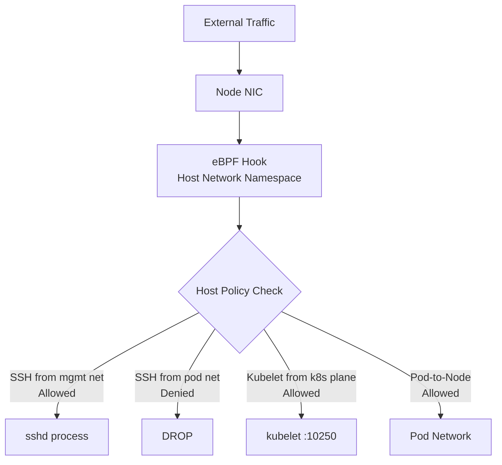

# Cilium Host Policies

Author: [nawazdhandala](https://github.com/nawazdhandala)

Tags: Cilium, Kubernetes, Network Policy, Host Networking, eBPF

Description: Secure Kubernetes node networking with Cilium Host Policies that control traffic to and from node processes, including kubelet, SSH, and system services outside of pod namespaces.

---

## Introduction

Standard Kubernetes NetworkPolicy and even `CiliumNetworkPolicy` operate on pod networking — they control traffic between pods but have no effect on traffic that reaches the node's primary network interface outside of any pod network namespace. This leaves node services like SSH, the kubelet API (port 10250), kube-scheduler, and etcd accessible to any pod that can reach the node IP, which is a significant security gap in a zero-trust cluster design.

Cilium Host Policies extend enforcement to the node level using the `nodeSelector` field in `CiliumClusterwideNetworkPolicy`. With host policies enabled, Cilium's eBPF programs hook into the node's host network namespace and enforce policies on traffic to and from node processes. This allows you to restrict SSH access to specific CIDR ranges, limit kubelet access to the Kubernetes control plane only, and deny unauthorized access to node monitoring endpoints.

This guide covers configuring Cilium Host Policies, enabling host network enforcement, and validating that node-level traffic is properly controlled.

## Prerequisites

- Cilium v1.12+ with host policy support
- `hostFirewall.enabled=true` in Cilium Helm values
- `kubectl` with cluster-admin permissions
- Careful understanding of your cluster's required node traffic

## Step 1: Enable Host Firewall

```bash
helm upgrade cilium cilium/cilium \
  --namespace kube-system \
  --reuse-values \
  --set hostFirewall.enabled=true
```

Verify host firewall is active:

```bash
cilium status | grep -i "host firewall\|host policy"
```

## Step 2: Create a Host Policy for Node Access Control

```yaml
apiVersion: cilium.io/v2
kind: CiliumClusterwideNetworkPolicy
metadata:
  name: host-policy-nodes
spec:
  nodeSelector:
    matchLabels:
      kubernetes.io/os: linux
  ingress:
    # Allow SSH from management network only
    - fromCIDR:
        - "10.100.0.0/24"
      toPorts:
        - ports:
            - port: "22"
              protocol: TCP
    # Allow kubelet API from control plane
    - fromCIDR:
        - "10.0.0.0/24"   # Control plane subnet
      toPorts:
        - ports:
            - port: "10250"
              protocol: TCP
    # Allow intra-cluster node communication
    - fromEntities:
        - "cluster"
    # Allow health checks
    - fromEntities:
        - "kube-apiserver"
  egress:
    - toEntities:
        - "cluster"
    - toEntities:
        - "world"
      toPorts:
        - ports:
            - port: "443"
              protocol: TCP
            - port: "80"
              protocol: TCP
```

## Step 3: Validate Host Policy Enforcement

```bash
# Verify policy is applied to nodes
kubectl describe ciliumclusterwidenetworkpolicy host-policy-nodes

# Check host endpoint state in Cilium
kubectl exec -n kube-system cilium-xxxxx -- \
  cilium endpoint list | grep -i host

# Test SSH access from allowed network
ssh -i key.pem user@node-ip  # Should succeed from 10.100.0.0/24

# Test from unauthorized IP
# Should be rejected at the eBPF level
```

## Step 4: Monitor Host Policy Activity

```bash
# Watch for host policy drops
hubble observe --type drop --follow | grep -i host

# Check node-level traffic in Hubble
hubble observe --node worker-0 --follow

# Check Cilium metrics for host policy drops
kubectl port-forward -n kube-system svc/cilium-agent 9962:9962
curl -s http://localhost:9962/metrics | grep host_policy
```

## Step 5: Allow Kubernetes System Traffic

Critical system traffic that must be allowed:

```yaml
spec:
  nodeSelector: {}  # All nodes
  ingress:
    # NodePort services
    - fromEntities:
        - "world"
      toPorts:
        - ports:
            - port: "30000"
              endPort: 32767
              protocol: TCP
    # ICMP for network diagnostics
    - icmps:
        - fields:
            - type: 0
              family: IPv4
```

## Host Policy Architecture



## Conclusion

Cilium Host Policies close the security gap between pod networking and node networking, extending zero-trust enforcement to the node operating system itself. Enabling `hostFirewall.enabled=true` is the key configuration change — after that, `CiliumClusterwideNetworkPolicy` with `nodeSelector` gives you full declarative control over node-level traffic. Always test host policies in staging first and ensure all required system traffic (kubelet, NodePort, ICMP) is explicitly allowed before enforcing restrictive policies in production.
