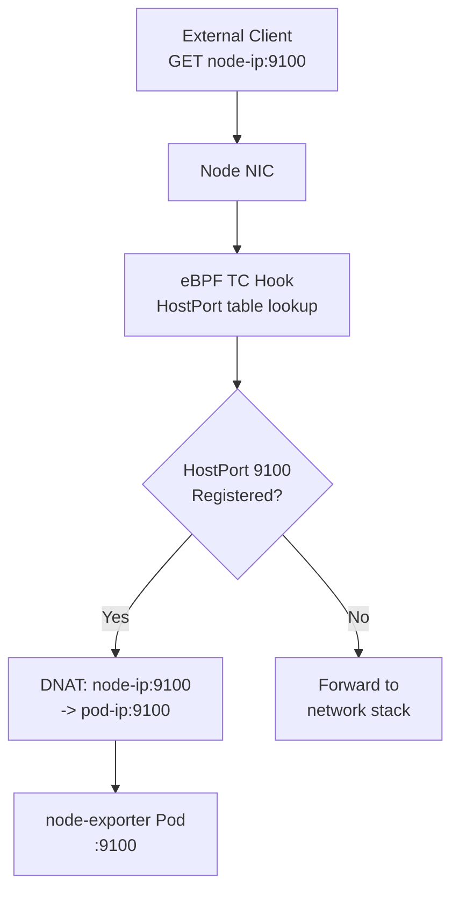

# Cilium HostPort Support

Author: [nawazdhandala](https://github.com/nawazdhandala)

Tags: Cilium, Kubernetes, HostPort, eBPF, Networking

Description: Configure and validate Cilium's eBPF-based HostPort implementation that maps container ports to node ports without kube-proxy or iptables rules.

---

## Introduction

Kubernetes HostPort allows a pod to bind directly to a port on the node's host network interface, making it accessible as if it were a process running directly on the node. This is commonly used for DaemonSet-based workloads like log collectors, monitoring agents, and ingress controllers that need to expose a consistent port on every node. In standard Kubernetes, HostPort is implemented by kube-proxy or the CNI plugin using iptables DNAT rules.

Cilium implements HostPort natively using eBPF without any iptables rules. The eBPF program intercepts packets destined for the host port and forwards them directly to the pod using the same efficient hash-map lookup used for ClusterIP services. This means HostPort in Cilium has O(1) lookup time, no connection tracking overhead from iptables, and is fully consistent with Cilium's kube-proxy replacement when kube-proxy is removed from the cluster.

This guide covers enabling Cilium HostPort support, deploying pods with HostPort, and validating that connectivity works correctly.

## Prerequisites

- Cilium v1.10+
- `kubeProxyReplacement=true` or `hostPort.enabled=true`
- `kubectl` installed
- Nodes with available ports to bind

## Step 1: Enable HostPort in Cilium

If using kube-proxy replacement (HostPort is included automatically):

```bash
helm upgrade cilium cilium/cilium \
  --namespace kube-system \
  --reuse-values \
  --set kubeProxyReplacement=true \
  --set k8sServiceHost=<API_SERVER_IP> \
  --set k8sServicePort=6443
```

For standalone HostPort support without full kube-proxy replacement:

```bash
helm upgrade cilium cilium/cilium \
  --namespace kube-system \
  --reuse-values \
  --set hostPort.enabled=true
```

## Step 2: Deploy a Pod with HostPort

```yaml
apiVersion: apps/v1
kind: DaemonSet
metadata:
  name: node-exporter
  namespace: monitoring
spec:
  selector:
    matchLabels:
      app: node-exporter
  template:
    metadata:
      labels:
        app: node-exporter
    spec:
      containers:
        - name: node-exporter
          image: prom/node-exporter:latest
          ports:
            - containerPort: 9100
              hostPort: 9100    # Binds port 9100 on each node
              protocol: TCP
      hostNetwork: false
```

## Step 3: Verify HostPort is Active

```bash
# Verify the DaemonSet is running on all nodes
kubectl get pods -n monitoring -o wide

# Confirm HostPort is registered in Cilium's service list
cilium service list | grep "HostPort\|9100"

# Check eBPF map entry for HostPort
kubectl exec -n kube-system cilium-xxxxx -- \
  cilium bpf lb list | grep 9100
```

## Step 4: Test HostPort Connectivity

```bash
# Get a node IP
NODE_IP=$(kubectl get node worker-0 -o jsonpath='{.status.addresses[0].address}')

# Test HostPort from outside the cluster
curl http://${NODE_IP}:9100/metrics | head -5

# Test from within the cluster (from another pod)
kubectl exec -n default test-pod -- curl http://${NODE_IP}:9100/metrics | head -5
```

## Step 5: Validate eBPF vs iptables Implementation

```bash
# Confirm no iptables rules were created for HostPort
kubectl exec -n kube-system cilium-xxxxx -- \
  iptables -t nat -L | grep -i hostport
# Expected: No output (Cilium uses eBPF, not iptables)

# Confirm eBPF handles the connection
kubectl exec -n kube-system cilium-xxxxx -- \
  cilium monitor --type drop --type trace 2>&1 | head -20
```

## HostPort Traffic Flow



## Conclusion

Cilium's eBPF-based HostPort implementation provides the same port-on-every-node behavior as iptables HostPort but with better performance and integration with Cilium's unified eBPF data plane. DaemonSet workloads like monitoring agents and log collectors are the primary use case, as they need a consistent port accessible on every node. When combined with kube-proxy replacement, Cilium eliminates all iptables-based service handling, giving you a fully eBPF-native networking stack from HostPort through ClusterIP to NodePort and LoadBalancer services.
