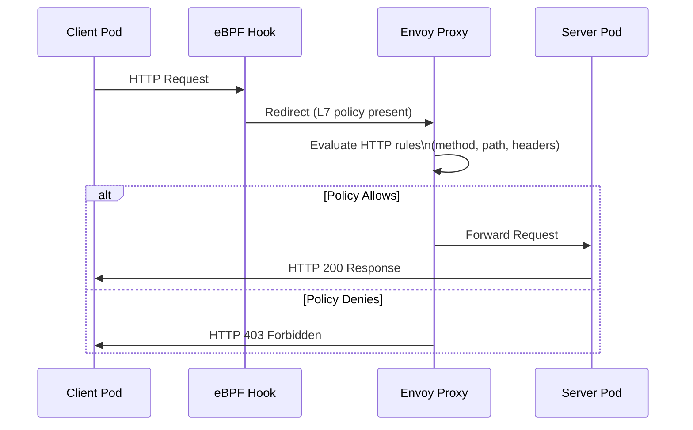

# HTTP Policies with Cilium

Author: [nawazdhandala](https://github.com/nawazdhandala)

Tags: Cilium, Kubernetes, Network Policy, HTTP, eBPF

Description: Enforce HTTP-aware network policies with Cilium that filter traffic based on request methods, URL paths, and headers to secure REST APIs at the network layer.

---

## Introduction

HTTP network policies in Cilium enable security enforcement at the REST API level, going beyond port-based access control to understand the semantics of HTTP requests. This means you can allow GET requests to `/api/v1/users` while blocking DELETE requests to the same path, enforce that all requests include a required header, or restrict access to admin endpoints to specific callers. All of this happens transparently in the data plane without application changes.

Cilium implements HTTP policy enforcement by transparently redirecting HTTP traffic through a local Envoy proxy when L7 rules are present. The Envoy proxy evaluates rules based on HTTP method, path regex, and header matches, then either forwards the request or returns a 403 response. The original application sees normal HTTP traffic - it has no visibility into the policy enforcement happening underneath.

This guide covers configuring HTTP policies for common REST API security patterns, testing policy enforcement, and observing policy decisions through Hubble.

## Prerequisites

- Cilium v1.12+ with Envoy enabled
- HTTP workloads deployed in Kubernetes
- `hubble` CLI for observability
- `kubectl` installed

## Step 1: Read-Only API Access Policy

Allow GET requests only to prevent unintended mutations:

```yaml
apiVersion: cilium.io/v2
kind: CiliumNetworkPolicy
metadata:
  name: api-read-only
  namespace: production
spec:
  endpointSelector:
    matchLabels:
      app: user-service
  ingress:
    - fromEndpoints:
        - matchLabels:
            role: read-client
      toPorts:
        - ports:
            - port: "8080"
              protocol: TCP
          rules:
            http:
              - method: "GET"
              - method: "HEAD"
              - method: "OPTIONS"
```

## Step 2: Path-Based Access Control

Separate access to public and admin API paths:

```yaml
apiVersion: cilium.io/v2
kind: CiliumNetworkPolicy
metadata:
  name: api-path-policy
  namespace: production
spec:
  endpointSelector:
    matchLabels:
      app: api-server
  ingress:
    - fromEndpoints:
        - matchLabels:
            role: public-client
      toPorts:
        - ports:
            - port: "8080"
              protocol: TCP
          rules:
            http:
              - method: "GET"
                path: "/api/v1/public/.*"
              - method: "POST"
                path: "/api/v1/public/.*"
    - fromEndpoints:
        - matchLabels:
            role: admin-client
      toPorts:
        - ports:
            - port: "8080"
              protocol: TCP
          rules:
            http:
              - method: ".*"
                path: "/api/.*"
```

## Step 3: Header-Based Policy

Require an API key header:

```yaml
toPorts:
  - ports:
      - port: "8080"
        protocol: TCP
    rules:
      http:
        - method: "GET"
          path: "/api/.*"
          headers:
            - "X-API-Key: [a-zA-Z0-9]+"
```

## Step 4: Test HTTP Policy Enforcement

```bash
# Test allowed request
kubectl exec -n production client-pod -- \
  curl -s -o /dev/null -w "%{http_code}" http://user-service:8080/api/v1/users
# Expected: 200

# Test blocked method
kubectl exec -n production client-pod -- \
  curl -s -o /dev/null -w "%{http_code}" -X DELETE http://user-service:8080/api/v1/users/1
# Expected: 403

# Test blocked path
kubectl exec -n production client-pod -- \
  curl -s -o /dev/null -w "%{http_code}" http://user-service:8080/api/v1/admin
# Expected: 403
```

## Step 5: Observe HTTP Policy Drops with Hubble

```bash
# Watch for L7 policy drops
hubble observe --namespace production \
  --verdict DROPPED \
  --type l7 \
  --follow

# Look for specific HTTP 403 responses
hubble observe --namespace production \
  --protocol http \
  --http-status 403
```

## HTTP Policy Enforcement Flow



## Conclusion

HTTP network policies in Cilium provide REST API-level security enforcement with zero application changes. The combination of method filtering, path regex matching, and header requirements covers the most common API access control needs. Use Hubble to observe policy decisions in real-time during development and testing, and set up alerts on 403 rates in production to detect policy misconfigurations before they affect legitimate traffic.
