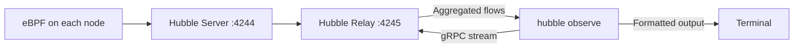

# Hubble CLI for Cilium

Author: [nawazdhandala](https://github.com/nawazdhandala)

Tags: Cilium, Kubernetes, Hubble, CLI, Observability

Description: Master the Hubble CLI to observe real-time network flows, filter by pod, namespace, protocol, and verdict, and extract actionable network intelligence from Cilium's eBPF data plane.

---

## Introduction

The Hubble CLI (`hubble`) is the command-line interface to Cilium's observability platform, providing direct access to the real-time flow stream that Hubble captures from eBPF. Unlike `kubectl logs` which only shows application-level output, or `tcpdump` which requires node access and captures raw bytes, `hubble observe` gives you structured, Kubernetes-aware network flow records that include pod names, namespaces, labels, protocol details, and policy verdicts.

The CLI is the most powerful tool in the Cilium operator's toolkit for network troubleshooting. You can watch flows in real-time as you reproduce a bug, filter down to the exact pod pair experiencing connectivity issues, filter by HTTP status code to find failing requests, or see policy drop reasons with full context about which policy rule triggered the denial. All of this works without any changes to pods or applications.

This guide covers installing the Hubble CLI, establishing connectivity to the Hubble relay, and mastering the key filtering and output options.

## Prerequisites

- Cilium with Hubble relay enabled
- `kubectl` installed
- Network access to the Kubernetes cluster

## Step 1: Install Hubble CLI

```bash
HUBBLE_VERSION=$(curl -s https://raw.githubusercontent.com/cilium/hubble/master/stable.txt)

# Linux AMD64
curl -L --remote-name-all \
  "https://github.com/cilium/hubble/releases/download/${HUBBLE_VERSION}/hubble-linux-amd64.tar.gz"
tar xzvf hubble-linux-amd64.tar.gz
sudo mv hubble /usr/local/bin/hubble

# macOS (Homebrew)
brew install hubble

# Verify installation
hubble version
```

## Step 2: Configure Hubble CLI Connection

```bash
# Port-forward to Hubble relay
kubectl port-forward -n kube-system svc/hubble-relay 4245:80 &

# Set server address
export HUBBLE_SERVER=localhost:4245

# Or use cilium CLI shortcut
cilium hubble port-forward &
```

## Step 3: Basic Flow Observation

```bash
# Watch all flows in real-time
hubble observe --follow

# Last N flows
hubble observe --last 50

# Flows from specific time range
hubble observe --since 5m --until 1m
```

## Step 4: Filtering Flows

```bash
# By namespace
hubble observe --namespace production --follow

# By specific pod
hubble observe --from-pod production/frontend-xxx --follow
hubble observe --to-pod production/backend-xxx --follow

# By verdict
hubble observe --verdict DROPPED --follow
hubble observe --verdict FORWARDED --follow

# By protocol
hubble observe --protocol http --follow
hubble observe --protocol dns --follow
hubble observe --protocol tcp --follow

# By port
hubble observe --to-port 443 --follow

# Combine filters
hubble observe \
  --namespace production \
  --verdict DROPPED \
  --protocol http \
  --follow
```

## Step 5: Output Formats

```bash
# Default human-readable format
hubble observe --last 10

# JSON for machine processing
hubble observe --last 10 --output json

# Compact format
hubble observe --last 10 --output compact

# Parse JSON with jq for specific fields
hubble observe --last 10 --output json | \
  jq '.flow | {src: .source.labels, dst: .destination.labels, verdict: .verdict}'
```

## Step 6: HTTP Flow Inspection

```bash
# HTTP flows with status codes
hubble observe \
  --namespace production \
  --protocol http \
  --last 20

# HTTP 5xx errors
hubble observe \
  --namespace production \
  --http-status 500 \
  --follow

# HTTP flows to specific URL path
hubble observe \
  --namespace production \
  --http-path "/api/.*" \
  --follow
```

## Hubble CLI Architecture



## Conclusion

The Hubble CLI transforms Cilium from a black-box networking layer into a fully transparent, observable system. The combination of real-time streaming with rich filtering options - namespace, pod, protocol, verdict, HTTP status - makes it possible to isolate network issues in seconds rather than hours. For production operations, build Hubble CLI queries into your runbooks for common network troubleshooting scenarios, and use `--output json` combined with jq for integration with alerting and incident response workflows.
