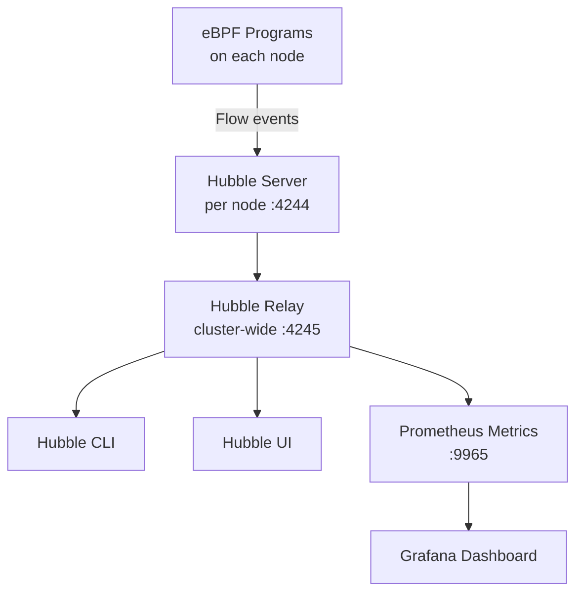

# Hubble Observability in Cilium

Author: [nawazdhandala](https://github.com/nawazdhandala)

Tags: Cilium, Kubernetes, Hubble, Observability, EBPF

Description: Deploy and use Hubble, Cilium's built-in distributed observability platform, to gain deep visibility into network flows, security policy decisions, and service dependencies across your cluster.

---

## Introduction

Hubble is Cilium's built-in observability layer, built on top of eBPF's ability to observe every network packet in the kernel without sampling or packet copying overhead. Unlike traditional network monitoring that captures packets at the NIC level and sends them to a collection system, Hubble observes flows at the eBPF level and generates structured flow events with full Kubernetes context - pod names, namespaces, labels, service names, and policy verdicts.

The architecture of Hubble is a distributed system: each Cilium node runs a Hubble server that exposes a gRPC API for real-time flow queries. A Hubble relay aggregates streams from all nodes into a single API endpoint, and the Hubble CLI and UI connect to the relay for cluster-wide visibility. This design means you can query flows from any node without SSH access, filter by namespace or pod label, and see exactly which network policy allowed or denied each connection.

This guide covers deploying Hubble, using the CLI for real-time flow observation, and setting up the Hubble UI for visual service dependency mapping.

## Prerequisites

- Cilium v1.10+ installed
- Helm v3+
- `kubectl` installed
- `hubble` CLI installed

## Step 1: Enable Hubble

```bash
helm upgrade cilium cilium/cilium \
  --namespace kube-system \
  --reuse-values \
  --set hubble.relay.enabled=true \
  --set hubble.ui.enabled=true \
  --set hubble.metrics.enableOpenMetrics=true \
  --set hubble.metrics.enabled="{dns,drop,tcp,flow,port-distribution,icmp,httpV2}"
```

Verify Hubble is running:

```bash
cilium hubble enable
cilium status | grep Hubble
kubectl get pods -n kube-system -l k8s-app=hubble-relay
```

## Step 2: Install Hubble CLI

```bash
HUBBLE_VERSION=$(curl -s https://raw.githubusercontent.com/cilium/hubble/master/stable.txt)
curl -L --remote-name-all \
  https://github.com/cilium/hubble/releases/download/${HUBBLE_VERSION}/hubble-linux-amd64.tar.gz
tar xzvf hubble-linux-amd64.tar.gz
sudo mv hubble /usr/local/bin/

# Configure Hubble CLI to connect through port-forward
kubectl port-forward -n kube-system svc/hubble-relay 4245:80 &
export HUBBLE_SERVER=localhost:4245
```

## Step 3: Observe Live Flows

```bash
# Observe all flows in the cluster
hubble observe --follow

# Filter by namespace
hubble observe --namespace production --follow

# Filter by verdict
hubble observe --verdict DROPPED --follow

# Filter by source pod
hubble observe --from-pod production/frontend --follow

# Filter by protocol
hubble observe --protocol http --follow
```

## Step 4: Query Historical Flows

```bash
# Last 100 flows from default namespace
hubble observe --namespace default --last 100

# HTTP flows with status codes
hubble observe --protocol http --last 50

# Policy drops in the last 10 minutes
hubble observe --verdict DROPPED --since 10m
```

## Step 5: Access Hubble UI

```bash
# Port-forward the Hubble UI
kubectl port-forward -n kube-system svc/hubble-ui 12000:80

# Open browser at http://localhost:12000
# Navigate to a namespace to see the service dependency map
```

## Hubble Architecture



## Conclusion

Hubble transforms eBPF's kernel-level packet visibility into actionable, Kubernetes-aware network intelligence. The combination of real-time flow filtering with the Hubble UI's service dependency mapping gives you unprecedented visibility into how your services actually communicate. Hubble's policy verdict events are particularly valuable for security - you can see exactly which policy allowed or denied each connection, making policy debugging and compliance auditing dramatically more efficient than analyzing iptables logs or tcpdump captures.
