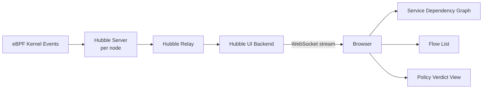

# Hubble UI for Cilium

Author: [nawazdhandala](https://github.com/nawazdhandala)

Tags: Cilium, Kubernetes, Hubble, Observability, Dashboard

Description: Use the Hubble UI to visualize Kubernetes service dependencies, observe network flows in real-time, and investigate security policy decisions through an interactive graphical interface.

---

## Introduction

The Hubble UI is a browser-based graphical interface for Cilium's Hubble observability platform. Where the Hubble CLI excels at real-time flow filtering and command-line automation, the Hubble UI provides something qualitatively different: a visual service dependency graph that shows how your pods and services are communicating right now. This kind of visibility is invaluable for onboarding engineers to an unfamiliar system, investigating unexpected service communications, and validating that network policies are working as intended.

The service graph in Hubble UI is generated from live flow data - not from static configuration. As pods communicate, flows appear as animated edges in the graph. When a connection is denied by policy, a red edge appears instead of green. You can filter the view to a specific namespace, click on a service node to see its incoming and outgoing connections, and drill into individual flow records for full details including HTTP method, URL path, and policy verdict.

This guide covers deploying Hubble UI, accessing it securely, and using its key features for network visualization and troubleshooting.

## Prerequisites

- Cilium with Hubble relay enabled
- `kubectl` installed
- Browser access to the Kubernetes cluster (via port-forward or Ingress)

## Step 1: Enable Hubble UI

```bash
helm upgrade cilium cilium/cilium \
  --namespace kube-system \
  --reuse-values \
  --set hubble.ui.enabled=true \
  --set hubble.relay.enabled=true
```

Verify the UI is running:

```bash
kubectl get pods -n kube-system -l app.kubernetes.io/name=hubble-ui
kubectl get svc -n kube-system hubble-ui
```

## Step 2: Access via Port-Forward

For local access during development and debugging:

```bash
kubectl port-forward -n kube-system svc/hubble-ui 12000:80
# Open: http://localhost:12000
```

## Step 3: Expose via Ingress (Optional)

For team-wide access:

```yaml
apiVersion: networking.k8s.io/v1
kind: Ingress
metadata:
  name: hubble-ui
  namespace: kube-system
  annotations:
    nginx.ingress.kubernetes.io/rewrite-target: /
spec:
  rules:
    - host: hubble.internal.example.com
      http:
        paths:
          - path: /
            pathType: Prefix
            backend:
              service:
                name: hubble-ui
                port:
                  number: 80
```

## Step 4: Navigate the Service Graph

In the Hubble UI:

1. Select a namespace from the dropdown (e.g., `production`)
2. Watch the service graph populate with live traffic flows
3. Green edges = allowed connections
4. Red edges = denied connections (policy drops)
5. Click a service node to see:
   - Incoming connections with source labels
   - Outgoing connections with destination labels
   - HTTP status code distribution (if L7 visibility enabled)
6. Click an edge to see individual flow records

## Step 5: Enable L7 Visibility for Richer UI Data

```bash
# Annotate namespace for L7 HTTP visibility
kubectl annotate namespace production \
  "policy.cilium.io/proxy-visibility"="+ingress:80/TCP/HTTP,+egress:80/TCP/HTTP"

# Now the UI shows HTTP methods and paths on each edge
```

## Step 6: Use Filters in the UI

The Hubble UI supports filtering by:
- Verdict: FORWARDED, DROPPED, ERROR
- Traffic direction: Ingress / Egress
- Protocol: TCP, UDP, HTTP, DNS
- Flow type: L3/L4, L7

## Hubble UI Data Flow



## Conclusion

The Hubble UI turns raw network flow data into an intuitive graphical representation of how your Kubernetes services communicate. The visual policy verdict display - green for allowed, red for denied - makes it immediately obvious when a network policy is misconfigured and blocking legitimate traffic. Combined with L7 visibility annotations, you can see HTTP-level details like method and status code directly in the graph, making the Hubble UI an essential tool for both initial service dependency discovery and ongoing security policy validation.
