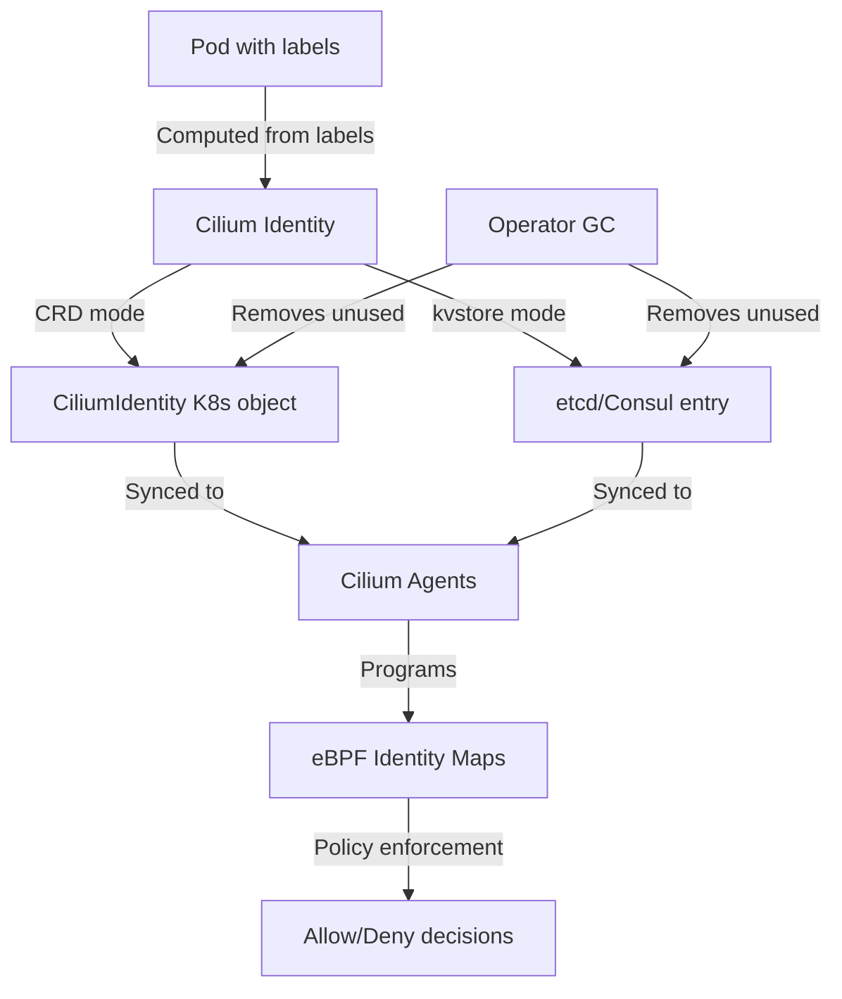

# Cilium Identity Management Mode: Configure, Troubleshoot, Validate, and Monitor

Author: [nawazdhandala](https://github.com/nawazdhandala)

Tags: Cilium, Kubernetes, Identity Management, eBPF, Security

Description: A deep dive into Cilium's identity management modes including CRD-based and kvstore-based allocation, how to configure the right mode for your cluster, and how to troubleshoot identity allocation failures.

---

## Introduction

Cilium's security model is built on the concept of identities — numeric labels assigned to groups of endpoints that share the same security-relevant labels. These identities are used by eBPF programs in the kernel to make fast allow/deny decisions without needing to look up policies for individual IP addresses. The way identities are allocated and stored — the identity management mode — significantly affects how Cilium operates and scales.

Cilium supports two identity allocation modes: **CRD-based** (the default since Cilium 1.9) where identities are stored as `CiliumIdentity` Kubernetes custom resources, and **kvstore-based** where identities are stored in an external etcd or Consul key-value store. The CRD mode is simpler to operate since it reuses the Kubernetes API server, while the kvstore mode provides better performance at very large scales (thousands of nodes) at the cost of additional infrastructure.

This guide covers how to configure identity management modes, troubleshoot identity allocation failures, validate correct identity operation, and monitor identity-related metrics.

## Prerequisites

- Cilium installed in Kubernetes
- `kubectl` with cluster admin access
- Helm 3.x for configuration
- For kvstore mode: external etcd cluster (optional)

## Configure Identity Management

Configure CRD-based identity allocation (default):

```bash
# CRD-based allocation is the default - verify it's enabled
kubectl -n kube-system get configmap cilium-config -o yaml | grep identity-allocation-mode
# Should show: identity-allocation-mode: crd

# Explicitly set CRD mode via Helm
helm upgrade cilium cilium/cilium \
  --namespace kube-system \
  --reuse-values \
  --set identityAllocationMode=crd

# View current identities
kubectl get ciliumidentities
kubectl get ciliumidentities -o json | jq '.items[0] | {id: .metadata.name, labels: .["security-labels"]}'
```

Configure identity GC and allocation settings:

```bash
# Configure identity GC interval (cleanup unused identities)
helm upgrade cilium cilium/cilium \
  --namespace kube-system \
  --reuse-values \
  --set operator.identityGCInterval=15m \
  --set operator.identityHeartbeatTimeout=30m

# Configure identity change queue depth
kubectl -n kube-system get configmap cilium-config -o yaml | grep identity

# Set labels used for identity computation (subset of all K8s labels)
helm upgrade cilium cilium/cilium \
  --namespace kube-system \
  --reuse-values \
  --set "labels=k8s:app k8s:role io.kubernetes.pod.namespace"
```

## Troubleshoot Identity Issues

Diagnose identity allocation failures:

```bash
# Check for identity allocation errors
kubectl -n kube-system logs -l name=cilium-operator | grep -i "identity\|allocation\|error"

# List all identities and check for anomalies
kubectl get ciliumidentities | wc -l
# Very high count may indicate identity leak

# Find identities with no associated pods
kubectl get ciliumidentities -o json | jq -r '.items[] | .metadata.name' | while read id; do
  PODS=$(kubectl get pods -A -l "security.cilium.io/identity=$id" --no-headers 2>/dev/null | wc -l)
  if [ "$PODS" -eq 0 ]; then
    echo "Orphaned identity: $id"
  fi
done

# Check if identity GC is running
kubectl -n kube-system logs -l name=cilium-operator | grep -i "identity gc\|gc interval"

# Investigate a specific identity
kubectl describe ciliumidentity <identity-id>
```

Fix common identity issues:

```bash
# Issue: Too many identities (identity leak)
# Reduce identity GC interval
helm upgrade cilium cilium/cilium \
  --namespace kube-system \
  --reuse-values \
  --set operator.identityGCInterval=5m

# Issue: Identity not created for new pods
kubectl -n kube-system exec ds/cilium -- \
  cilium monitor --type endpoint | grep "created"

# Check endpoint status
kubectl -n kube-system exec ds/cilium -- cilium endpoint list | grep "not-ready"

# Issue: Identity conflicting across namespaces
# Check if labels are namespace-qualified
kubectl -n kube-system exec ds/cilium -- \
  cilium identity list | grep "k8s:app=backend"
# Should show separate identities for different namespaces
```

## Validate Identity Management

Confirm identity management is working correctly:

```bash
# Verify pods get identities
kubectl get pod my-pod -o wide
POD_IP=$(kubectl get pod my-pod -o jsonpath='{.status.podIP}')
kubectl -n kube-system exec ds/cilium -- \
  cilium endpoint list | grep $POD_IP
# Should show endpoint with an identity ID

# Verify identity matches expected labels
ENDPOINT_ID=$(kubectl -n kube-system exec ds/cilium -- \
  cilium endpoint list | grep $POD_IP | awk '{print $1}')
kubectl -n kube-system exec ds/cilium -- \
  cilium endpoint get $ENDPOINT_ID | jq '.status.identity'

# Test that identity-based policy works
kubectl apply -f - <<EOF
apiVersion: cilium.io/v2
kind: CiliumNetworkPolicy
metadata:
  name: identity-test-policy
spec:
  endpointSelector:
    matchLabels:
      app: backend
  ingress:
  - fromEndpoints:
    - matchLabels:
        app: frontend
EOF

# Verify policy trace uses identities
kubectl -n kube-system exec ds/cilium -- \
  cilium policy trace \
  --src-label "app=frontend" \
  --dst-label "app=backend" \
  --dport 8080
```

## Monitor Identity Management



Monitor identity metrics:

```bash
# Watch identity count over time
watch -n30 "kubectl get ciliumidentities --no-headers | wc -l"

# Monitor identity allocation rate
kubectl -n kube-system port-forward svc/cilium-operator 9963:9963 &
curl -s http://localhost:9963/metrics | grep identity

# Key PromQL queries
# rate(cilium_identity_count[5m]) - identity creation rate
# cilium_identity_count - total active identities

# Alert on identity exhaustion (CRD mode supports up to 16M identities)
# Alert on identity leak (count growing without corresponding pod growth)
kubectl apply -f - <<EOF
apiVersion: monitoring.coreos.com/v1
kind: PrometheusRule
metadata:
  name: cilium-identity-alerts
  namespace: kube-system
spec:
  groups:
  - name: cilium-identity
    rules:
    - alert: CiliumIdentityCountHigh
      expr: cilium_identity_count > 10000
      for: 10m
      labels:
        severity: warning
      annotations:
        summary: "High Cilium identity count may indicate a leak"
EOF
```

## Conclusion

Cilium's identity management is the core of its security model, translating Kubernetes labels into numeric identifiers that eBPF programs use for fast policy enforcement. CRD-based allocation is the right choice for most clusters, providing simplicity and reliability by leveraging the Kubernetes API server. Monitor identity counts to detect leaks early, tune the GC interval to clean up stale identities promptly, and validate that new pods receive correct identities by checking their Cilium endpoint status after deployment. The identity trace tool is invaluable for debugging why traffic is unexpectedly allowed or denied between services.
