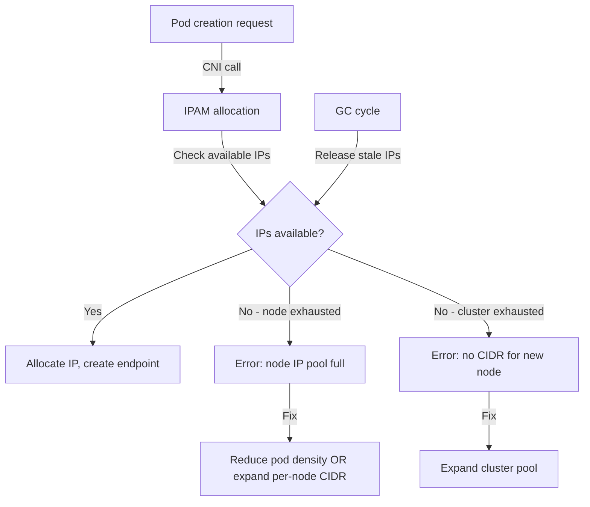

# Cilium IPAM Allocation Errors: Configure, Troubleshoot, Validate, and Monitor

Author: [nawazdhandala](https://github.com/nawazdhandala)

Tags: Cilium, Kubernetes, IPAM, Troubleshooting, Networking

Description: A comprehensive troubleshooting guide for Cilium IPAM allocation errors, covering IP exhaustion, stale allocations, CIDR misconfiguration, and recovery procedures to restore pod IP assignment.

---

## Introduction

IPAM allocation errors in Cilium manifest as pods stuck in `ContainerCreating` or `Pending` state, with events showing "failed to allocate IP" or similar messages. These errors can stem from multiple causes: the IP pool on a specific node is exhausted, the cluster-wide CIDR pool is full, stale allocations from terminated pods are not being released, or IPAM configuration is incorrect. Because IP allocation is on the critical path of pod creation, allocation errors directly impact workload availability.

Understanding the difference between node-level IP exhaustion (all IPs in a node's CIDR are in use) and cluster-level pool exhaustion (the Operator can't allocate a CIDR to a new node) is critical for applying the correct fix. Node-level exhaustion is addressed by scaling down workloads or increasing the per-node CIDR size, while cluster-level exhaustion requires pool expansion. Stale allocations are addressed through Cilium's garbage collection mechanisms.

This guide focuses on diagnosing and resolving IPAM allocation errors of all types, with specific recovery procedures for each scenario.

## Prerequisites

- Cilium with cluster-pool or kubernetes IPAM mode
- `kubectl` with cluster admin access
- Cilium CLI
- Node access for detailed IPAM state inspection

## Configure IPAM to Prevent Allocation Errors

Proactively configure IPAM to minimize allocation errors:

```bash
# Set generously sized per-node CIDRs
# /22 = 1022 usable IPs per node (supports very dense pod deployments)
helm upgrade cilium cilium/cilium \
  --namespace kube-system \
  --reuse-values \
  --set ipam.operator.clusterPoolIPv4MaskSize=22

# Configure generous cluster pool to avoid exhaustion
helm upgrade cilium cilium/cilium \
  --namespace kube-system \
  --reuse-values \
  --set "ipam.operator.clusterPoolIPv4PodCIDRList={10.244.0.0/14}"

# Configure pre-allocation threshold for cloud IPAM modes
# (AWS ENI, Azure) to have IPs ready before pods need them
helm upgrade cilium cilium/cilium \
  --namespace kube-system \
  --reuse-values \
  --set eni.awsEnablePrefixDelegation=true \
  --set ipam.operator.eksDisableNodeGroupTags=false
```

## Troubleshoot IPAM Allocation Errors

**Scenario 1: Node-level IP exhaustion**

```bash
# Identify nodes with zero available IPs
kubectl get ciliumnodes -o json | \
  jq '.items[] | select((.status.ipam.available | length) == 0) | .metadata.name'

# Check IP allocation on the exhausted node
kubectl get ciliumnode <exhausted-node> -o json | \
  jq '{
    allocated: (.status.ipam.allocated | length),
    available: (.status.ipam.available | length),
    pod_cidr: .spec.ipam.podCIDRs
  }'

# Find pods on that node consuming IPs
kubectl get pods -A --field-selector spec.nodeName=<exhausted-node> | wc -l

# Check for stale endpoints consuming IPs
kubectl get cep -A | grep <exhausted-node>
kubectl get pods -A | grep <exhausted-node>
# If CEP count >> pod count, stale endpoints are consuming IPs
```

**Scenario 2: Stale IP allocations**

```bash
# Find IPs that are allocated but have no corresponding pod
NODE="worker-1"
ALLOCATED_IPS=$(kubectl get ciliumnode $NODE \
  -o jsonpath='{.status.ipam.allocated}' | jq -r 'keys[]')

for ip in $ALLOCATED_IPS; do
  POD=$(kubectl get pods -A -o wide | grep $ip | awk '{print $2}')
  if [ -z "$POD" ]; then
    echo "Stale allocation: $ip has no associated pod"
  fi
done

# Force Cilium to release stale allocations
# Restart the Cilium agent on the affected node to trigger endpoint GC
CILIUM_POD=$(kubectl -n kube-system get pods -l k8s-app=cilium \
  --field-selector spec.nodeName=$NODE -o jsonpath='{.items[0].metadata.name}')
kubectl -n kube-system delete pod $CILIUM_POD
```

**Scenario 3: Cluster pool exhaustion**

```bash
# Check how many nodes have CIDR allocations
kubectl get ciliumnodes -o json | \
  jq '[.items[].spec.ipam.podCIDRs[]] | length'

# Check pool capacity
kubectl -n kube-system get configmap cilium-config \
  -o jsonpath='{.data.cluster-pool-ipv4-cidr}'

# Operator error about pool exhaustion
kubectl -n kube-system logs -l name=cilium-operator | grep -i "pool.*exhaust\|no.*cidr\|cannot.*alloc"
```

## Validate IPAM Recovery

After resolving allocation errors, validate recovery:

```bash
# Confirm IPs are now available
kubectl get ciliumnodes -o json | \
  jq '.items[] | {node: .metadata.name, available: (.status.ipam.available | length)}'

# Test pod creation on previously exhausted node
kubectl run recovery-test --image=nginx --restart=Never \
  --overrides='{"spec": {"nodeName": "<previously-exhausted-node>"}}'
kubectl wait pod/recovery-test --for=condition=Ready --timeout=30s
kubectl get pod recovery-test -o jsonpath='{.status.podIP}'
kubectl delete pod recovery-test

# Run full connectivity test
cilium connectivity test
```

## Monitor IPAM Allocation Health



Monitor IPAM allocation metrics:

```bash
# Watch available IPs across all nodes
watch -n30 "kubectl get ciliumnodes -o json | \
  jq '[.items[] | {node: .metadata.name, available: (.status.ipam.available | length), allocated: (.status.ipam.allocated | length)}]'"

# Prometheus queries for IPAM monitoring
# cilium_ipam_available_ips - IPs available for allocation
# cilium_ipam_allocated_ips - IPs currently allocated
# cilium_ipam_capacity - total IPAM capacity

# Alert when available IPs drops below threshold
kubectl apply -f - <<EOF
apiVersion: monitoring.coreos.com/v1
kind: PrometheusRule
metadata:
  name: cilium-ipam-errors
  namespace: kube-system
spec:
  groups:
  - name: ipam-errors
    rules:
    - alert: CiliumNodeIPExhausted
      expr: cilium_ipam_available_ips{instance=~".*"} == 0
      for: 1m
      labels:
        severity: critical
      annotations:
        summary: "Node {{ \$labels.instance }} has exhausted its IP allocation pool"
EOF
```

## Conclusion

IPAM allocation errors are highly impactful because they prevent new pods from starting, but they are also well-understood and recoverable. The key diagnostic steps are: identify whether the exhaustion is at the node level or cluster level, check for stale allocations that are not being cleaned up, and verify the GC mechanisms are running. Prevention through generous IPAM sizing, proactive pool expansion, and early warning alerts is far better than reactive recovery during an outage. Establish IPAM capacity baselines on your clusters and treat pool utilization above 80% as requiring immediate attention.
