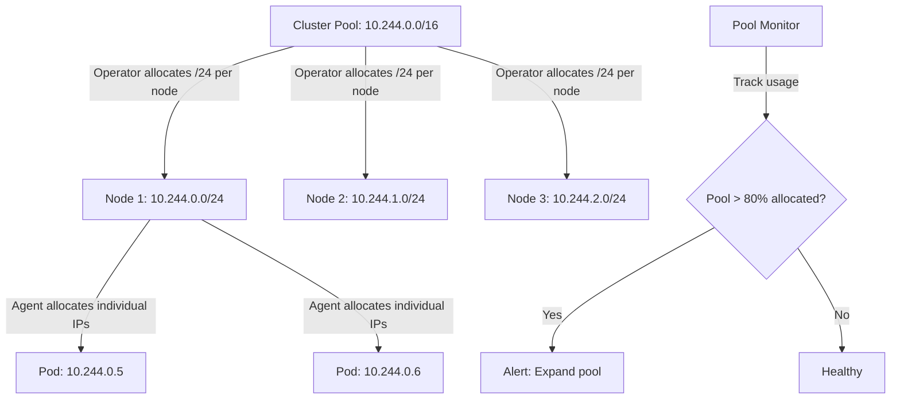

# Cilium IPAM Cluster Scope (Default)

Author: [nawazdhandala](https://github.com/nawazdhandala)

Tags: Cilium, Kubernetes, Networking, EBPF, IPAM

Description: A deep dive into Cilium's default cluster-pool IPAM mode, including how the Operator allocates per-node CIDRs from a cluster-wide pool, configuration options, troubleshooting allocation issues,...

---

## Introduction

Cilium's default IPAM mode, `cluster-pool`, uses a centrally managed IP address pool from which the Cilium Operator allocates per-node CIDRs. When a new node joins the cluster, the Operator assigns it a dedicated CIDR (e.g., `/24` with 254 usable addresses) from the configured cluster pool (e.g., `10.244.0.0/16`). Each Cilium Agent on a node then sub-allocates individual IPs from its node CIDR for pods.

This "cluster scope" IPAM model provides clean separation between cluster-level IP management (handled by the Operator) and node-level allocation (handled by individual agents). The Operator ensures no two nodes receive overlapping CIDRs, preventing IP conflicts at the routing level. Because the entire pool is configured in advance and stored in CiliumNode CRDs, IPAM is fully decoupled from the underlying infrastructure - the same model works on bare metal, VMs, and cloud instances without overlay networking requirements.

This guide covers configuring cluster-pool IPAM, troubleshooting allocation failures, validating correct operation, and monitoring pool health over time.

## Prerequisites

- Cilium installed or being installed on Kubernetes
- `kubectl` with cluster admin access
- Helm 3.x for configuration management
- Network planning: your pod CIDR must not overlap with node IPs or service CIDRs

## Configure Cluster-Pool IPAM

Set up cluster-pool IPAM with appropriate sizing:

```bash
# Calculate pool size:
# - Nodes: 50 maximum
# - Per node: /24 = 254 IPs (supports ~254 pods per node)
# - Total IPs needed: 50 * 254 = 12,700
# - Pool: 10.244.0.0/16 = 65,534 IPs (plenty of room)

# Configure cluster-pool IPAM
helm upgrade cilium cilium/cilium \
  --namespace kube-system \
  --reuse-values \
  --set ipam.mode=cluster-pool \
  --set ipam.operator.clusterPoolIPv4PodCIDRList="{10.244.0.0/16}" \
  --set ipam.operator.clusterPoolIPv4MaskSize=24

# For larger pods-per-node requirements, use smaller mask (/23 = 510 IPs):
helm upgrade cilium cilium/cilium \
  --namespace kube-system \
  --reuse-values \
  --set ipam.mode=cluster-pool \
  --set ipam.operator.clusterPoolIPv4PodCIDRList="{10.244.0.0/14}" \
  --set ipam.operator.clusterPoolIPv4MaskSize=23

# Enable IPv6 dual-stack IPAM
helm upgrade cilium cilium/cilium \
  --namespace kube-system \
  --reuse-values \
  --set ipam.mode=cluster-pool \
  --set "ipam.operator.clusterPoolIPv4PodCIDRList={10.244.0.0/16}" \
  --set ipam.operator.clusterPoolIPv4MaskSize=24 \
  --set "ipam.operator.clusterPoolIPv6PodCIDRList={fd00::/104}" \
  --set ipam.operator.clusterPoolIPv6MaskSize=120 \
  --set enableIPv6=true
```

View current cluster-pool state:

```bash
# View cluster pool configuration
kubectl -n kube-system get configmap cilium-config \
  -o jsonpath='{.data}' | jq '{
    "ipam-mode": .ipam,
    "pool-cidr": .["cluster-pool-ipv4-cidr"],
    "mask-size": .["cluster-pool-ipv4-mask-size"]
  }'

# View per-node CIDR allocations
kubectl get ciliumnodes -o json | \
  jq '.items[] | {node: .metadata.name, cidrs: .spec.ipam.podCIDRs}'

# Check pool utilization
TOTAL_NODES=$(kubectl get nodes --no-headers | wc -l)
POOL_SIZE=$(echo "2^(32-16)" | bc)  # /16 pool = 65536 IPs
NODE_SIZE=$(echo "2^(32-24)" | bc)  # /24 per node = 256 IPs
USED=$((TOTAL_NODES * NODE_SIZE))
echo "Pool: $POOL_SIZE IPs, Used: $USED IPs, Remaining: $((POOL_SIZE - USED)) IPs"
```

## Troubleshoot Cluster-Pool IPAM

Diagnose cluster-pool allocation issues:

```bash
# Node not getting CIDR allocation
kubectl get ciliumnode <node-name> -o json | jq '.spec.ipam'
# If podCIDRs is empty, Operator has not allocated

# Check Operator IPAM allocation logs
kubectl -n kube-system logs -l name=cilium-operator | grep -i "cidr\|alloc\|pool" | tail -30

# Check if pool is exhausted
# Number of nodes × per-node mask size must fit in pool CIDR
kubectl get ciliumnodes -o json | \
  jq '[.items[].spec.ipam.podCIDRs[]] | length'
# If close to pool capacity, expand the pool

# Check for CIDR conflicts
kubectl get ciliumnodes -o json | \
  jq '[.items[].spec.ipam.podCIDRs[]] | sort | . as $cidrs |
  [range(length) as $i | range($i+1; length) | {a: $cidrs[$i], b: $cidrs[.]}]' | \
  head -10
```

Fix cluster-pool issues:

```bash
# Issue: Pool running out of space
# Add additional CIDR ranges to the pool
helm upgrade cilium cilium/cilium \
  --namespace kube-system \
  --reuse-values \
  --set "ipam.operator.clusterPoolIPv4PodCIDRList={10.244.0.0/16,10.245.0.0/16}"

# Issue: Node CIDR mask too small (too few IPs per node)
# Can't shrink existing CIDRs - plan ahead
# For new nodes, you can change the mask size
helm upgrade cilium cilium/cilium \
  --namespace kube-system \
  --reuse-values \
  --set ipam.operator.clusterPoolIPv4MaskSize=22  # 1022 IPs per node

# Issue: Orphaned CIDRs after node removal
kubectl get ciliumnodes
kubectl get nodes
# CiliumNodes for removed K8s nodes should be auto-cleaned by Operator
```

## Validate Cluster-Pool IPAM

Confirm cluster-pool IPAM is operating correctly:

```bash
# Verify all nodes have CIDR allocations
kubectl get ciliumnodes -o json | \
  jq '.items[] | select(.spec.ipam.podCIDRs | length == 0) | .metadata.name'
# Should return nothing

# Verify no CIDR overlaps between nodes
kubectl get ciliumnodes -o json | \
  jq '[.items[] | {node: .metadata.name, cidr: .spec.ipam.podCIDRs[0]}]'

# Test pod creation assigns IP from correct CIDR
kubectl run pool-test --image=nginx --restart=Never
POD_IP=$(kubectl get pod pool-test -o jsonpath='{.status.podIP}')
NODE=$(kubectl get pod pool-test -o jsonpath='{.spec.nodeName}')
NODE_CIDR=$(kubectl get ciliumnode $NODE -o jsonpath='{.spec.ipam.podCIDRs[0]}')

echo "Pod IP: $POD_IP, Node CIDR: $NODE_CIDR"
python3 -c "
import ipaddress
ip = ipaddress.ip_address('$POD_IP')
net = ipaddress.ip_network('$NODE_CIDR')
print('VALID: IP is within node CIDR' if ip in net else 'INVALID: IP outside node CIDR')
"
kubectl delete pod pool-test
```

## Monitor Cluster-Pool Health



Monitor cluster-pool utilization:

```bash
# Calculate pool utilization
POOL_CIDR="10.244.0.0/16"
MASK_SIZE=24
TOTAL_SUBNETS=$(python3 -c "
import ipaddress
pool = ipaddress.ip_network('$POOL_CIDR')
subnets = list(pool.subnets(new_prefix=$MASK_SIZE))
print(len(subnets))
")
USED_SUBNETS=$(kubectl get ciliumnodes -o json | \
  jq '[.items[].spec.ipam.podCIDRs[]] | length')
echo "Pool capacity: $TOTAL_SUBNETS /${MASK_SIZE}s, Used: $USED_SUBNETS"

# Prometheus alert for pool utilization
kubectl apply -f - <<EOF
apiVersion: monitoring.coreos.com/v1
kind: PrometheusRule
metadata:
  name: cilium-ipam-pool
  namespace: kube-system
spec:
  groups:
  - name: ipam
    rules:
    - alert: CiliumIPAMPoolLow
      expr: cilium_ipam_available_ips / cilium_ipam_capacity < 0.2
      for: 10m
      labels:
        severity: warning
      annotations:
        summary: "Cilium IPAM pool is running low (<20% available)"
EOF
```

## Conclusion

Cluster-pool IPAM is Cilium's most versatile and widely used IPAM mode, providing clean centralized management of pod IP address space without requiring cloud provider integration. The key operational considerations are pool sizing (ensure the pool accommodates current and future node counts with your chosen per-node mask size), monitoring for pool exhaustion, and planning CIDR expansion before the pool fills up. The Cilium Operator handles all CIDR allocation and cleanup automatically, making routine IPAM operations hands-off once correctly configured.
