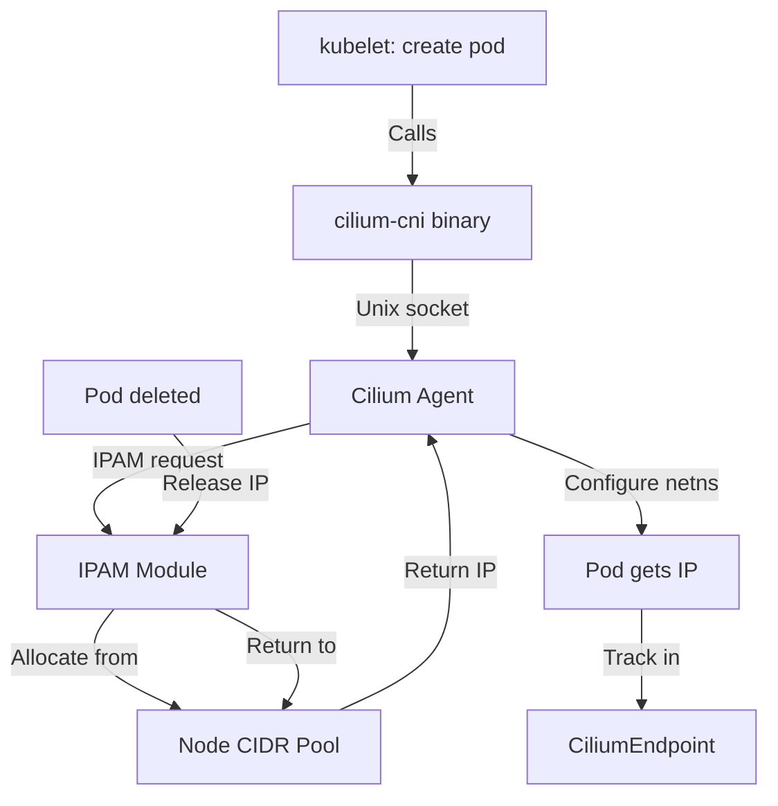

# Cilium CNI Configuration in IPAM: Configure, Troubleshoot, Validate, and Monitor

Author: [nawazdhandala](https://github.com/nawazdhandala)

Tags: Cilium, Kubernetes, Networking, EBPF, IPAM

Description: Understand how Cilium's CNI configuration interacts with its IPAM subsystem, including how to configure IPAM parameters in the CNI config, troubleshoot IPAM-CNI integration issues, and validate...

---

## Introduction

The relationship between Cilium's CNI plugin and its IPAM subsystem determines how IP addresses are assigned to pods at the moment of their creation. When the kubelet calls the Cilium CNI plugin for a new pod, the CNI binary communicates with the Cilium Agent via Unix socket, which then consults the IPAM module to allocate an IP address from the appropriate pool. This IPAM-CNI integration is the critical path for pod IP allocation and must be correctly configured for reliable pod networking.

While the CNI configuration file at `/etc/cni/net.d/05-cilium.conf` is intentionally minimal (deferring all configuration to the Cilium Agent), the IPAM mode and parameters configured in the Cilium Agent's ConfigMap directly affect what the CNI binary does when allocating IPs. The CNI configuration and IPAM configuration must be consistent - for example, configuring AWS ENI IPAM but not granting the necessary IAM permissions will cause the CNI to fail at IP allocation time.

This guide covers the intersection of CNI and IPAM configuration, how they interact, troubleshooting IPAM-CNI integration failures, and validating end-to-end IP allocation through the CNI interface.

## Prerequisites

- Cilium installed with CNI plugin on Kubernetes nodes
- `kubectl` with cluster admin access
- Node access for examining CNI and IPAM state
- Understanding of Cilium's CNI plugin and IPAM modes

## Configure CNI-IPAM Integration

The CNI configuration for different IPAM modes:

```bash
# View current CNI config (minimal - delegates to agent)
kubectl debug node/<node-name> -it --image=ubuntu -- \
  cat /etc/cni/net.d/05-cilium.conf
```

```json
{
  "cniVersion": "0.3.1",
  "name": "cilium",
  "type": "cilium-cni",
  "enable-debug": false
}
```

```bash
# The IPAM configuration lives in the Cilium ConfigMap
kubectl -n kube-system get configmap cilium-config \
  -o jsonpath='{.data}' | jq '{
    ipam: .ipam,
    "cluster-pool-ipv4-cidr": .["cluster-pool-ipv4-cidr"],
    "cluster-pool-ipv4-mask-size": .["cluster-pool-ipv4-mask-size"]
  }'

# Configure CNI with cluster-pool IPAM
helm upgrade cilium cilium/cilium \
  --namespace kube-system \
  --reuse-values \
  --set ipam.mode=cluster-pool \
  --set ipam.operator.clusterPoolIPv4PodCIDRList="{10.244.0.0/16}" \
  --set ipam.operator.clusterPoolIPv4MaskSize=24 \
  --set cni.exclusive=true

# Configure CNI with kubernetes IPAM (no separate pool config needed)
helm upgrade cilium cilium/cilium \
  --namespace kube-system \
  --reuse-values \
  --set ipam.mode=kubernetes \
  --set k8s.requireIPv4PodCIDR=true
```

Enable debug logging for IPAM-CNI interactions:

```bash
# Enable CNI debug logging
helm upgrade cilium cilium/cilium \
  --namespace kube-system \
  --reuse-values \
  --set cni.logFile=/var/run/cilium/cilium-cni.log

# Check CNI logs for IPAM operations
kubectl debug node/<node-name> -it --image=ubuntu -- \
  tail -f /var/run/cilium/cilium-cni.log | grep -i "ipam\|alloc\|ip"
```

## Troubleshoot IPAM-CNI Integration

Diagnose failures in the CNI-IPAM path:

```bash
# Pod creation failing with IPAM error
kubectl describe pod <pending-pod> | grep -A 5 Events
# Look for: "failed to configure netns: failed to allocate IP"

# Check Cilium agent for IPAM errors
kubectl -n kube-system logs ds/cilium | grep -i "ipam\|alloc\|ip" | tail -30

# Check CNI log for specific allocation failure
kubectl debug node/<node-name> -it --image=ubuntu -- \
  cat /var/run/cilium/cilium-cni.log | grep -i "error\|failed\|ipam"

# Verify IPAM pool has available IPs
kubectl get ciliumnode <node-name> -o json | \
  jq '{available: (.status.ipam.available | length), allocated: (.status.ipam.allocated | length)}'

# Check if agent IPAM module is responsive
kubectl -n kube-system exec ds/cilium -- cilium ip list
```

Fix IPAM-CNI integration issues:

```bash
# Issue: CNI cannot connect to agent socket
kubectl debug node/<node-name> -it --image=ubuntu -- \
  ls -la /var/run/cilium/cilium.sock

# Fix: Restart Cilium agent to recreate socket
NODE="worker-1"
CILIUM_POD=$(kubectl -n kube-system get pods -l k8s-app=cilium \
  --field-selector spec.nodeName=$NODE -o jsonpath='{.items[0].metadata.name}')
kubectl -n kube-system delete pod $CILIUM_POD

# Issue: IPAM pool mismatch between CNI call and agent state
# Ensure ConfigMap IPAM settings match actual pod CIDR expectations
kubectl -n kube-system exec ds/cilium -- cilium config view | grep ipam
kubectl get node <node-name> -o jsonpath='{.spec.podCIDR}'
```

## Validate CNI-IPAM Integration

Test the complete CNI-IPAM allocation path:

```bash
# Test 1: Create pod and verify IP allocation
kubectl run ipam-cni-test --image=nginx --restart=Never
kubectl wait pod/ipam-cni-test --for=condition=Ready --timeout=30s

# Verify IP is from expected CIDR
POD_IP=$(kubectl get pod ipam-cni-test -o jsonpath='{.status.podIP}')
NODE=$(kubectl get pod ipam-cni-test -o jsonpath='{.spec.nodeName}')
NODE_CIDR=$(kubectl get ciliumnode $NODE -o jsonpath='{.spec.ipam.podCIDRs[0]}')

echo "Pod IP: $POD_IP"
echo "Node CIDR: $NODE_CIDR"
# Verify IP is within CIDR
python3 -c "import ipaddress; print('Valid' if ipaddress.ip_address('$POD_IP') in ipaddress.ip_network('$NODE_CIDR') else 'INVALID')"

# Test 2: Verify IP released on pod deletion
kubectl delete pod ipam-cni-test

# Check IP is back in available pool
kubectl get ciliumnode $NODE -o json | \
  jq ".status.ipam.available | has(\"$POD_IP\")"
```

## Monitor CNI-IPAM Health



Monitor IPAM metrics:

```bash
# Watch IP allocation rate
kubectl -n kube-system port-forward ds/cilium 9962:9962 &
watch -n10 "curl -s http://localhost:9962/metrics | grep ipam_allocated"

# Track available vs allocated IPs
kubectl get ciliumnodes -o json | jq '[.items[] | {
  node: .metadata.name,
  total: ((.status.ipam.available | length) + (.status.ipam.allocated | length)),
  allocated: (.status.ipam.allocated | length),
  available: (.status.ipam.available | length),
  utilization_pct: ((.status.ipam.allocated | length) / ((.status.ipam.available | length) + (.status.ipam.allocated | length)) * 100 | floor)
}]'

# Alert when node IPAM > 80% utilized
```

## Conclusion

The CNI-IPAM integration in Cilium is the critical path through which every pod receives its IP address. While the CNI configuration file itself is minimal, the IPAM configuration in the Cilium Agent's ConfigMap determines the allocation behavior. Monitoring available IPs per node and the IPAM allocation rate provides early warning of pool exhaustion. Comprehensive debug logging through the CNI log file and Cilium agent logs enables rapid diagnosis of IP allocation failures that cause pods to get stuck in ContainerCreating state.
