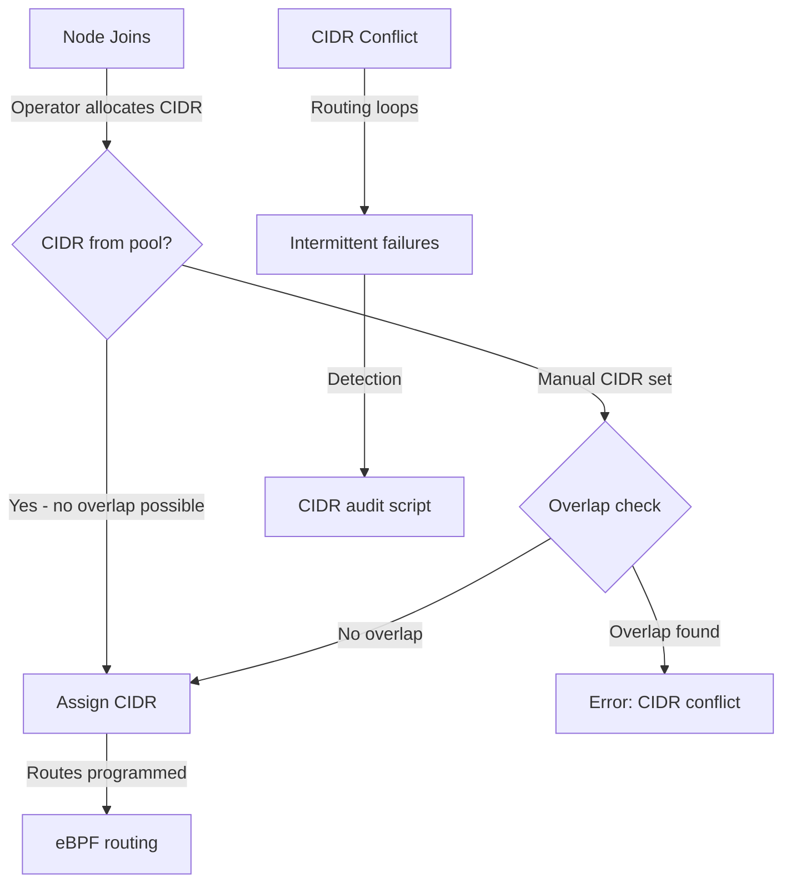

# Conflicting Node CIDRs in Cilium IPAM

Author: [nawazdhandala](https://github.com/nawazdhandala)

Tags: Cilium, Kubernetes, Networking, EBPF, IPAM

Description: Learn how to detect and resolve CIDR conflicts in Cilium IPAM configurations where node pod CIDRs overlap with each other or with other network ranges, causing routing failures and connectivity...

---

## Introduction

CIDR conflicts in Kubernetes networking are among the most impactful and difficult-to-diagnose issues because they cause intermittent connectivity failures rather than clear errors. When two nodes have overlapping pod CIDRs, packets destined for a pod on one node may be incorrectly routed to the other node. This creates scenarios where some pod-to-pod communication works while other paths fail, making the issue appear as an application bug rather than a networking problem.

In Cilium with cluster-pool IPAM, the Operator is responsible for ensuring non-overlapping CIDR allocations. However, conflicts can arise when CIDRs are manually set, when the cluster-pool CIDR itself overlaps with node IP ranges or service CIDRs, during misconfigured migrations from other CNI plugins, or when multiple cluster pools are added with overlapping ranges. In Kubernetes IPAM mode, CIDR assignment is delegated to the kube-controller-manager, which should prevent conflicts but may have bugs in specific versions.

This guide covers how to detect CIDR conflicts, configure IPAM to prevent them, resolve existing conflicts, and monitor for conflict-related routing issues.

## Prerequisites

- Cilium with cluster-pool or kubernetes IPAM mode
- `kubectl` with cluster admin access
- Understanding of IP routing and CIDR notation
- Python 3 available for CIDR overlap calculations

## Configure IPAM to Prevent CIDR Conflicts

Plan non-overlapping CIDR ranges before deployment:

```bash
# Complete CIDR planning checklist:
# 1. Node network CIDR (where node IPs live): e.g., 192.168.0.0/24
# 2. Service CIDR (K8s service VIPs): e.g., 10.96.0.0/12
# 3. Pod CIDR (Cilium cluster pool): e.g., 10.244.0.0/16
# 4. Management/VPN networks: e.g., 10.0.0.0/8

# Verify no overlaps before configuring
python3 - <<'EOF'
import ipaddress

networks = {
    "nodes": "192.168.0.0/24",
    "services": "10.96.0.0/12",
    "pods": "10.244.0.0/16",
}

networks_list = [(name, ipaddress.ip_network(cidr)) for name, cidr in networks.items()]
for i, (name1, net1) in enumerate(networks_list):
    for name2, net2 in networks_list[i+1:]:
        if net1.overlaps(net2):
            print(f"CONFLICT: {name1} ({net1}) overlaps with {name2} ({net2})")
        else:
            print(f"OK: {name1} ({net1}) does not overlap with {name2} ({net2})")
EOF

# Configure Cilium with non-overlapping CIDRs
helm upgrade cilium cilium/cilium \
  --namespace kube-system \
  --reuse-values \
  --set ipam.mode=cluster-pool \
  --set "ipam.operator.clusterPoolIPv4PodCIDRList={10.244.0.0/16}" \
  --set ipam.operator.clusterPoolIPv4MaskSize=24 \
  --set serviceMonitor.enabled=true
```

## Troubleshoot CIDR Conflicts

Detect existing CIDR conflicts:

```bash
# Check for overlapping node CIDRs
kubectl get ciliumnodes -o json | \
  jq '[.items[] | {node: .metadata.name, cidr: .spec.ipam.podCIDRs[0]}]' > /tmp/node-cidrs.json
cat /tmp/node-cidrs.json

# Automated overlap detection script
python3 - <<'EOF'
import json
import ipaddress
import subprocess

result = subprocess.run(
    ["kubectl", "get", "ciliumnodes", "-o", "json"],
    capture_output=True, text=True
)
data = json.loads(result.stdout)

nodes = []
for item in data["items"]:
    name = item["metadata"]["name"]
    cidrs = item.get("spec", {}).get("ipam", {}).get("podCIDRs", [])
    for cidr in cidrs:
        nodes.append((name, ipaddress.ip_network(cidr)))

conflicts = []
for i, (node1, net1) in enumerate(nodes):
    for node2, net2 in nodes[i+1:]:
        if net1.overlaps(net2):
            conflicts.append(f"CONFLICT: {node1} ({net1}) overlaps with {node2} ({net2})")

if conflicts:
    for c in conflicts:
        print(c)
else:
    print("No CIDR conflicts detected between nodes")
EOF

# Check pod CIDR overlaps with service CIDR
SERVICE_CIDR=$(kubectl cluster-info dump | grep service-cluster-ip-range | head -1 | grep -oP '[\d.]+/\d+')
POD_CIDRS=$(kubectl get ciliumnodes -o jsonpath='{.items[*].spec.ipam.podCIDRs[0]}')
echo "Service CIDR: $SERVICE_CIDR"
echo "Pod CIDRs: $POD_CIDRS"
```

Diagnose routing failures caused by CIDR conflicts:

```bash
# Test connectivity between pods on different nodes
kubectl run test-1 --image=nicolaka/netshoot --restart=Never -- sleep 3600
kubectl run test-2 --image=nicolaka/netshoot --restart=Never -- sleep 3600

POD2_IP=$(kubectl get pod test-2 -o jsonpath='{.status.podIP}')
kubectl exec test-1 -- traceroute $POD2_IP

# If traceroute shows unexpected hops, there may be a routing conflict
# Check routing tables on nodes
kubectl debug node/<node-name> -it --image=ubuntu -- \
  ip route show table main | grep 10.244

kubectl delete pod test-1 test-2
```

## Validate CIDR Configuration

Run comprehensive CIDR validation:

```bash
# Full CIDR audit
echo "=== Node IPs ==="
kubectl get nodes -o json | \
  jq '.items[] | {node: .metadata.name, ip: .status.addresses[] | select(.type=="InternalIP") | .address}'

echo "=== Service CIDR ==="
kubectl -n kube-system describe pod -l component=kube-controller-manager | \
  grep service-cluster-ip-range

echo "=== Node Pod CIDRs ==="
kubectl get ciliumnodes -o json | \
  jq '.items[] | {node: .metadata.name, cidr: .spec.ipam.podCIDRs}'

echo "=== Checking for overlaps ==="
python3 - <<'PYEOF'
import json, ipaddress, subprocess

def get_json(cmd): return json.loads(subprocess.run(cmd, capture_output=True, text=True).stdout)

nodes_data = get_json(["kubectl", "get", "nodes", "-o", "json"])
cn_data = get_json(["kubectl", "get", "ciliumnodes", "-o", "json"])

node_ips = [n["status"]["addresses"] for n in nodes_data["items"]]
pod_cidrs = [(i["metadata"]["name"], ipaddress.ip_network(c))
             for i in cn_data["items"]
             for c in i.get("spec", {}).get("ipam", {}).get("podCIDRs", [])]

print(f"Total nodes with CIDRs: {len(pod_cidrs)}")
conflicts = sum(1 for i, (n1, c1) in enumerate(pod_cidrs)
                for n2, c2 in pod_cidrs[i+1:] if c1.overlaps(c2))
print(f"CIDR conflicts: {conflicts}")
PYEOF
```

## Monitor for CIDR Conflicts



Monitor for CIDR conflict symptoms:

```bash
# Watch for routing-related drop events in Hubble
cilium hubble port-forward &
hubble observe --verdict DROPPED --json | \
  jq 'select(.flow.drop_reason_desc | contains("UNKNOWN_CONNECTION"))' -f

# Monitor for unexpected ARP broadcasts (sign of IP conflicts)
kubectl debug node/<node-name> -it --image=ubuntu -- \
  tcpdump -i any arp -n 2>/dev/null | grep -i duplicate

# Check for Cilium routing errors
kubectl -n kube-system exec ds/cilium -- \
  cilium monitor --type drop -f | grep -i "no route\|routing"

# Weekly CIDR audit as a CronJob
kubectl apply -f - <<EOF
apiVersion: batch/v1
kind: CronJob
metadata:
  name: cidr-audit
  namespace: kube-system
spec:
  schedule: "0 8 * * 1"
  jobTemplate:
    spec:
      template:
        spec:
          serviceAccountName: cilium-operator
          containers:
          - name: audit
            image: bitnami/kubectl:latest
            command: ["kubectl", "get", "ciliumnodes", "-o", "json"]
          restartPolicy: Never
EOF
```

## Conclusion

CIDR conflicts are preventable through careful IP address planning before cluster deployment. The key principle is that pod CIDRs, service CIDRs, and node network CIDRs must all be non-overlapping. When using cluster-pool IPAM, the Operator enforces non-overlapping allocations within the pool, but conflicts between the pool CIDR itself and other network ranges must be checked manually. Run CIDR conflict detection scripts as part of your cluster provisioning validation and as a regular audit to catch any configuration drift that could introduce conflicts over time.
