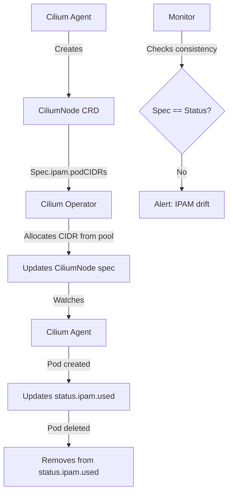

# Cilium CRD-Backed IPAM: Configure, Troubleshoot, Validate, and Monitor

Author: [nawazdhandala](https://github.com/nawazdhandala)

Tags: Cilium, Kubernetes, Networking, EBPF, IPAM

Description: Learn how Cilium's CRD-backed IPAM mode uses Kubernetes Custom Resources to store and manage IP address allocations, with configuration guidance, troubleshooting, and operational monitoring.

---

## Introduction

Cilium's CRD-backed IPAM is an approach where all IP address allocation state is stored in Kubernetes Custom Resource Definitions rather than an external key-value store or node-local files. This mode leverages the Kubernetes API server as the authoritative source for IPAM state, providing consistency, auditability, and seamless integration with Kubernetes tooling for inspecting and debugging IP allocation.

In CRD-backed IPAM, each node's IP allocation state is recorded in the `CiliumNode` CRD. The `spec.ipam` section defines the node's IPAM parameters and requested CIDRs, while `status.ipam` reflects the actual allocations confirmed by the Operator. Individual IP allocations within a node's CIDR are tracked in the `CiliumEndpoint` CRDs, providing a full audit trail of which IP is assigned to which workload.

This guide explains how CRD-backed IPAM works operationally, how to configure it, troubleshoot CRD-specific IPAM issues, and validate that allocation state is consistent between the CRDs and actual pod networking.

## Prerequisites

- Cilium with cluster-pool IPAM mode (default CRD-backed mode)
- `kubectl` with cluster admin access
- Familiarity with Kubernetes CRDs
- Helm 3.x for configuration

## Configure CRD-Backed IPAM

The CRD-backed IPAM is used automatically with cluster-pool mode:

```bash
# Verify CRD-backed IPAM is active (default with cluster-pool)
kubectl -n kube-system get configmap cilium-config \
  -o jsonpath='{.data.ipam}'
# Should return: cluster-pool

# Check CiliumNode CRDs are installed
kubectl get crd ciliumnodes.cilium.io

# View the IPAM spec and status for a node
kubectl get ciliumnode worker-1 -o yaml
```

Example CiliumNode IPAM structure:

```yaml
# CiliumNode IPAM fields
spec:
  ipam:
    podCIDRs:          # CIDRs allocated to this node
      - 10.244.1.0/24
    max-allocate: 250  # Maximum IPs to allocate
    min-allocate: 10   # Minimum IPs to keep available
status:
  ipam:
    used:              # IPs currently allocated to pods
      10.244.1.5:
        owner: default/my-pod
        resource: default/my-pod
    available:         # IPs available for new pods
      10.244.1.6: {}
      10.244.1.7: {}
```

Configure IPAM parameters via CiliumNode annotations:

```bash
# Set per-node IPAM limits via annotation
kubectl annotate ciliumnode worker-1 \
  "ipam.cilium.io/max-allocate=200" \
  "ipam.cilium.io/min-allocate=20"

# Pre-allocate IPs for faster pod startup
kubectl annotate ciliumnode worker-1 \
  "ipam.cilium.io/pre-allocate=30"
```

## Troubleshoot CRD-Backed IPAM

Diagnose CRD-level IPAM issues:

```bash
# Check if CiliumNode exists for each K8s node
for node in $(kubectl get nodes -o jsonpath='{.items[*].metadata.name}'); do
  CN=$(kubectl get ciliumnode $node 2>/dev/null && echo "EXISTS" || echo "MISSING")
  echo "$node: $CN"
done

# Inspect IPAM state inconsistency
NODE="worker-1"
kubectl get ciliumnode $NODE -o json | jq '.status.ipam'

# Find IPs marked as used but with no corresponding pod
kubectl get ciliumnode $NODE -o json | \
  jq '.status.ipam.used | to_entries[] | select(.value.owner != null) | {ip: .key, owner: .value.owner}' | \
  while read -r line; do
    OWNER=$(echo $line | jq -r '.owner')
    NS=$(echo $OWNER | cut -d/ -f1)
    POD=$(echo $OWNER | cut -d/ -f2)
    EXISTS=$(kubectl get pod $POD -n $NS 2>/dev/null && echo "EXISTS" || echo "MISSING")
    echo "$OWNER: $EXISTS"
  done

# Check for CiliumNode CRD drift from actual K8s nodes
kubectl get nodes -o jsonpath='{.items[*].metadata.name}' | tr ' ' '\n' | sort > /tmp/k8s-nodes.txt
kubectl get ciliumnodes -o jsonpath='{.items[*].metadata.name}' | tr ' ' '\n' | sort > /tmp/cilium-nodes.txt
diff /tmp/k8s-nodes.txt /tmp/cilium-nodes.txt
```

Fix CRD-backed IPAM issues:

```bash
# Issue: CiliumNode missing for a K8s node
# Cilium agent creates it on startup - check if agent is running
kubectl -n kube-system get pods -l k8s-app=cilium \
  --field-selector spec.nodeName=<missing-node>

# Issue: Stale IPAM entries in CiliumNode
# Restart Cilium agent to trigger reconciliation
kubectl -n kube-system delete pod -l k8s-app=cilium \
  --field-selector spec.nodeName=<node-name>

# Issue: CiliumNode spec.ipam.podCIDRs empty
# Operator should set this - check Operator logs
kubectl -n kube-system logs -l name=cilium-operator | grep -i "ciliumnode\|cidr\|alloc"
```

## Validate CRD-Backed IPAM

Verify CRD state consistency with actual pod networking:

```bash
# Check every running pod has a corresponding IPAM entry
kubectl get pods -A -o wide | grep Running | while read ns pod rest; do
  POD_IP=$(kubectl get pod $pod -n $ns -o jsonpath='{.status.podIP}' 2>/dev/null)
  NODE=$(kubectl get pod $pod -n $ns -o jsonpath='{.spec.nodeName}' 2>/dev/null)
  if [ -n "$POD_IP" ] && [ -n "$NODE" ]; then
    ENTRY=$(kubectl get ciliumnode $NODE \
      -o jsonpath="{.status.ipam.used[\"$POD_IP\"]}" 2>/dev/null)
    if [ -z "$ENTRY" ]; then
      echo "WARNING: $ns/$pod ($POD_IP) not in CiliumNode IPAM state"
    fi
  fi
done

# Validate CiliumNode spec matches status
for node in $(kubectl get ciliumnodes -o jsonpath='{.items[*].metadata.name}'); do
  SPEC_CIDR=$(kubectl get ciliumnode $node -o jsonpath='{.spec.ipam.podCIDRs[0]}')
  echo "$node: $SPEC_CIDR"
done
```

## Monitor CRD-Backed IPAM



Monitor CRD IPAM consistency:

```bash
# Watch CiliumNode IPAM state
watch -n30 "kubectl get ciliumnodes -o json | \
  jq '[.items[] | {node: .metadata.name, used: (.status.ipam.used | length), available: (.status.ipam.available | length)}]'"

# Alert on IPAM state inconsistency
kubectl -n kube-system port-forward svc/cilium-operator 9963:9963 &
curl -s http://localhost:9963/metrics | grep ipam

# Track CiliumNode CRD changes
kubectl get ciliumnodes --watch -o json | \
  jq -r '"\(.metadata.name): used=\(.status.ipam.used | length) available=\(.status.ipam.available | length)"'
```

## Conclusion

CRD-backed IPAM stores all IP allocation state in Kubernetes CRDs, making the allocation state inspectable and auditable using standard Kubernetes tools. The CiliumNode CRD is the source of truth for each node's IP allocation, with the Operator managing the spec and agents managing the status. Regular audits comparing CRD IPAM state to actual running pods catch state inconsistencies early. When inconsistencies are found, agent restarts typically resolve them by triggering a fresh reconciliation of the IPAM state against actual running containers.
