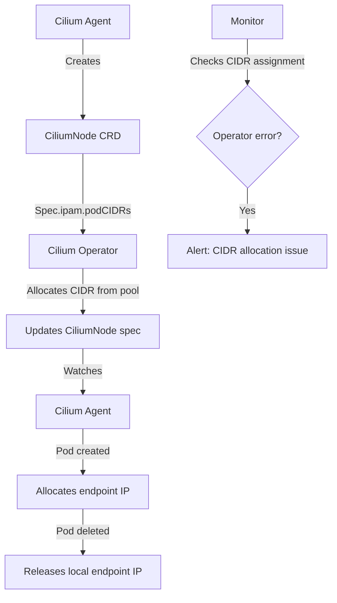

# Cilium CRD-Backed IPAM: Configure, Troubleshoot, Validate, and Monitor

Author: [nawazdhandala](https://github.com/nawazdhandala)

Tags: Cilium, Kubernetes, Networking, eBPF, IPAM

Description: Learn how Cilium's CRD-backed IPAM mode uses Kubernetes Custom Resources to store and manage IP address allocations, with configuration guidance, troubleshooting, and operational monitoring.

---

## Introduction

Cilium's CRD-backed cluster-pool IPAM is an approach where per-node PodCIDR assignment is stored in Kubernetes Custom Resource Definitions rather than relying on Kubernetes to assign PodCIDRs on `Node` objects. This mode leverages the Kubernetes API server as the authoritative source for node CIDR assignment, providing consistency, auditability, and seamless integration with Kubernetes tooling for inspecting and debugging IP allocation.

In cluster-pool IPAM, each node's PodCIDR assignment is recorded in the `CiliumNode` CRD. The `spec.ipam.podCIDRs` section defines the IPv4 and/or IPv6 CIDRs allocated to that node by the Cilium Operator, while the Cilium agent allocates endpoint IPs locally from that range. Individual endpoint addresses can be inspected through `CiliumEndpoint` CRDs or `cilium-dbg`, but `CiliumNode` is the source of truth for the node-level PodCIDR rather than a per-pod allocation ledger.

This guide explains how CRD-backed cluster-pool IPAM works operationally, how to configure it, troubleshoot CRD-specific IPAM issues, and validate that Cilium's CRD state is consistent with actual pod networking.

## Prerequisites

- Cilium with cluster-pool IPAM mode
- `kubectl` with cluster admin access
- Familiarity with Kubernetes CRDs
- Helm 3.x for configuration

## Configure CRD-Backed IPAM

The CRD-backed CiliumNode workflow is used with cluster-pool mode:

```bash
# Verify CRD-backed IPAM is active (default with cluster-pool)

kubectl -n kube-system get configmap cilium-config \
  -o jsonpath='{.data.ipam}'
# Should return: cluster-pool

# Check CiliumNode CRDs are installed
kubectl get crd ciliumnodes.cilium.io

# View the IPAM spec and status for a node
kubectl get ciliumnode worker-1 -o yaml
```

Example CiliumNode IPAM structure:

```yaml
# CiliumNode IPAM fields
spec:
  ipam:
    podCIDRs:          # CIDRs allocated to this node
      - 10.244.1.0/24
status:
  ipam:
    operator-status:
      error: ""
```

Configure the cluster pool through Helm values:

```bash
# Enable cluster-pool IPAM and set the IPv4 pool
helm upgrade cilium cilium/cilium \
  --namespace kube-system \
  --reuse-values \
  --set ipam.mode=cluster-pool \
  --set ipam.operator.clusterPoolIPv4PodCIDRList=10.244.0.0/16 \
  --set ipam.operator.clusterPoolIPv4MaskSize=24
```

## Troubleshoot CRD-Backed IPAM

Diagnose CRD-level IPAM issues:

```bash
# Check if CiliumNode exists for each K8s node
for node in $(kubectl get nodes -o jsonpath='{.items[*].metadata.name}'); do
  CN=$(kubectl get ciliumnode $node >/dev/null 2>&1 && echo "EXISTS" || echo "MISSING")
  echo "$node: $CN"
done

# Inspect operator allocation status
NODE="worker-1"
kubectl get ciliumnode $NODE -o json | jq '.spec.ipam.podCIDRs, .status.ipam."operator-status"'

# Compare pod IPs with CiliumEndpoint IPs
kubectl get ciliumendpoints -A -o json | \
  jq -r '.items[] | [.metadata.namespace, .metadata.name, ([.status.networking.addressing[]? | .ipv4?, .ipv6?] | map(select(. != null and . != "")) | join(","))] | @tsv'

# Check for CiliumNode CRD drift from actual K8s nodes
kubectl get nodes -o jsonpath='{.items[*].metadata.name}' | tr ' ' '\n' | sort > /tmp/k8s-nodes.txt
kubectl get ciliumnodes -o jsonpath='{.items[*].metadata.name}' | tr ' ' '\n' | sort > /tmp/cilium-nodes.txt
diff /tmp/k8s-nodes.txt /tmp/cilium-nodes.txt
```

Fix CRD-backed IPAM issues:

```bash
# Issue: CiliumNode missing for a K8s node
# Cilium agent creates it on startup - check if agent is running
kubectl -n kube-system get pods -l k8s-app=cilium \
  --field-selector spec.nodeName=<missing-node>

# Issue: Endpoint state is stale or missing
# Restart the Cilium agent on the affected node to trigger endpoint restoration
kubectl -n kube-system delete pod -l k8s-app=cilium \
  --field-selector spec.nodeName=<node-name>

# Issue: CiliumNode spec.ipam.podCIDRs empty
# Operator should set this - check Operator logs
kubectl -n kube-system logs -l name=cilium-operator | grep -i "ciliumnode\|cidr\|alloc"
```

## Validate CRD-Backed IPAM

Verify CRD state consistency with actual pod networking:

```bash
# Check every running pod has a matching CiliumEndpoint IP
kubectl get pods -A -o wide | grep Running | while read ns pod rest; do
  POD_IP=$(kubectl get pod $pod -n $ns -o jsonpath='{.status.podIPs[0].ip}' 2>/dev/null)
  CEP_IPS=$(kubectl get ciliumendpoint $pod -n $ns -o json 2>/dev/null | \
    jq -r '[.status.networking.addressing[]? | .ipv4?, .ipv6?] | map(select(. != null and . != "")) | join(" ")')
  if [ -n "$POD_IP" ]; then
    case " $CEP_IPS " in
      *" $POD_IP "*) ;;
      *) echo "WARNING: $ns/$pod podIP=$POD_IP ciliumEndpointIPs=${CEP_IPS:-missing}" ;;
    esac
  fi
done

# Validate CiliumNode PodCIDR assignment and operator status
for node in $(kubectl get ciliumnodes -o jsonpath='{.items[*].metadata.name}'); do
  SPEC_CIDR=$(kubectl get ciliumnode $node -o jsonpath='{.spec.ipam.podCIDRs[0]}')
  STATUS=$(kubectl get ciliumnode $node -o jsonpath='{.status.ipam.operator-status.error}')
  echo "$node: podCIDR=$SPEC_CIDR operatorError=${STATUS:-none}"
done
```

## Monitor CRD-Backed IPAM


```mermaid
graph TD
    A[Cilium Agent] -->|Creates| B[CiliumNode CRD]
    B -->|Spec.ipam.podCIDRs| C[Cilium Operator]
    C -->|Allocates CIDR from pool| D[Updates CiliumNode spec]
    D -->|Watches| E[Cilium Agent]
    E -->|Pod created| F[Allocates endpoint IP]
    F -->|Pod deleted| G[Releases local endpoint IP]
    H[Monitor] -->|Checks CIDR assignment| I{Operator error?}
    I -->|Yes| J[Alert: CIDR allocation issue]
```

Monitor CRD IPAM consistency:

```bash
# Watch CiliumNode IPAM state
watch -n30 "kubectl get ciliumnodes -o json | \
  jq '[.items[] | {node: .metadata.name, podCIDRs: .spec.ipam.podCIDRs, operatorStatus: .status.ipam.\"operator-status\"}]'"

# Inspect IPAM metrics when Prometheus metrics are enabled
kubectl -n kube-system port-forward svc/cilium-operator 9963:9963 &
curl -s http://localhost:9963/metrics | grep ipam

# Track CiliumNode CRD changes
kubectl get ciliumnodes --watch -o json | \
  jq -r '"\(.metadata.name): podCIDRs=\(.spec.ipam.podCIDRs | join(",")) operatorError=\(.status.ipam."operator-status".error // "")"'
```

## Conclusion

CRD-backed cluster-pool IPAM stores node PodCIDR assignment in Kubernetes CRDs, making that allocation state inspectable and auditable using standard Kubernetes tools. The CiliumNode CRD is the source of truth for each node's PodCIDR, with the Operator managing `spec.ipam.podCIDRs` and agents allocating endpoint IPs from the assigned range. Regular audits comparing CiliumNode PodCIDRs, CiliumEndpoint addresses, and actual running pods catch state inconsistencies early. When endpoint inconsistencies are found, agent restarts typically resolve them by triggering endpoint restoration against actual running containers.
