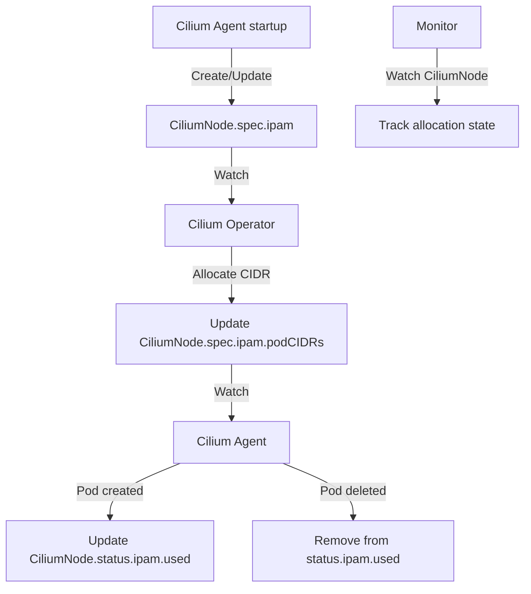

# Cilium IPAM CRD Definition: Configure, Troubleshoot, Validate, and Monitor

Author: [nawazdhandala](https://github.com/nawazdhandala)

Tags: Cilium, Kubernetes, Networking, EBPF, IPAM

Description: A detailed reference guide to the CiliumNode CRD structure used for IPAM, including the spec and status fields, how to configure them, interpret IPAM state from CRDs, and troubleshoot CRD-level...

---

## Introduction

The `CiliumNode` Custom Resource Definition is the central data structure through which Cilium's IPAM subsystem communicates node-level networking configuration and IP allocation state. Every Kubernetes node managed by Cilium has a corresponding `CiliumNode` object that records its networking capabilities, IPAM parameters, allocated CIDRs, and individual IP allocation state. Understanding the CRD schema helps you inspect, debug, and manually intervene in IPAM operations when necessary.

The `CiliumNode` CRD has two main sections relevant to IPAM: `spec.ipam` which defines what IPAM parameters the node requests (set by the Cilium Agent), and `status.ipam` which reflects the actual allocation state (managed jointly by the Agent and Operator). Additional sections in the CRD record network interfaces, health status, and node metadata used for routing decisions.

This guide covers the complete CRD structure for IPAM-relevant fields, how to configure and manipulate CRD fields, troubleshoot CRD state issues, and validate CRD consistency.

## Prerequisites

- Cilium installed with CRD-backed IPAM (cluster-pool mode)
- `kubectl` with cluster admin access
- `jq` for JSON processing
- Familiarity with Kubernetes CRD concepts

## Configure CiliumNode CRD

View and understand the CRD structure:

```bash
# View the CiliumNode CRD schema
kubectl get crd ciliumnodes.cilium.io \
  -o jsonpath='{.spec.versions[0].schema.openAPIV3Schema.properties.spec.properties.ipam}' | jq '.'

# View all CiliumNode objects
kubectl get ciliumnodes

# Inspect a specific CiliumNode
kubectl describe ciliumnode worker-1

# View raw YAML for a CiliumNode
kubectl get ciliumnode worker-1 -o yaml
```

Key IPAM fields in the CiliumNode CRD:

```yaml
# Full CiliumNode structure (IPAM-relevant fields)
apiVersion: cilium.io/v2
kind: CiliumNode
metadata:
  name: worker-1
spec:
  ipam:
    # CIDRs this node can use for pod IP allocation (set by Operator)
    podCIDRs:
      - 10.244.1.0/24

    # Min/max IP pools for cloud IPAM modes (aws-eni, azure)
    min-allocate: 10
    max-allocate: 30
    pre-allocate: 8
    max-above-watermark: 5

    # Node-specific pool for multi-pool IPAM
    pool: {}

status:
  ipam:
    # Currently allocated IPs and their owners
    used:
      "10.244.1.5":
        owner: "default/frontend-pod-abc123"
        resource: "default/frontend-pod-abc123"
      "10.244.1.6":
        owner: "kube-system/coredns-xyz"
        resource: "kube-system/coredns-xyz"

    # IPs available for new pod allocation
    available:
      "10.244.1.7": {}
      "10.244.1.8": {}
      "10.244.1.9": {}

    # CIDR allocation status (reflects CIDRs in spec.ipam.podCIDRs)
    operator-status: {}
```

Annotate CiliumNode to influence IPAM behavior:

```bash
# Set IPAM allocation limits for a specific node
kubectl annotate ciliumnode worker-1 \
  "ipam.cilium.io/max-allocate=200" \
  "ipam.cilium.io/min-allocate=20" \
  "ipam.cilium.io/pre-allocate=30" \
  --overwrite

# Verify annotations are applied
kubectl get ciliumnode worker-1 \
  -o jsonpath='{.metadata.annotations}' | jq '.'
```

## Troubleshoot CRD Definition Issues

Diagnose CRD structure and state problems:

```bash
# Check if CRD schema is valid
kubectl get crd ciliumnodes.cilium.io \
  -o jsonpath='{.status.conditions}' | jq '.[] | select(.type == "NonStructuralSchema")'
# Should return nothing (no non-structural schema issues)

# Check CiliumNode CRD version
kubectl get crd ciliumnodes.cilium.io \
  -o jsonpath='{.spec.versions[*].name}'

# Find CiliumNodes with inconsistent IPAM state
kubectl get ciliumnodes -o json | \
  jq '.items[] | select(
    (.spec.ipam.podCIDRs | length) == 0
    or (.status.ipam == null)
  ) | .metadata.name'

# Identify CiliumNodes where spec and status disagree on CIDR
kubectl get ciliumnodes -o json | jq '.items[] | {
  node: .metadata.name,
  spec_cidrs: .spec.ipam.podCIDRs,
  status_cidrs: [.status.ipam | to_entries[] | select(.key == "operator-status") | .value]
}'
```

Fix CRD state issues:

```bash
# Issue: CiliumNode missing spec.ipam.podCIDRs
# Trigger Operator to re-allocate by patching the annotation
kubectl annotate ciliumnode <node-name> \
  "ipam.cilium.io/force-realloc=$(date +%s)" --overwrite

# Issue: Stale entries in status.ipam.used
# Restart Cilium agent to reconcile
kubectl -n kube-system delete pod -l k8s-app=cilium \
  --field-selector spec.nodeName=<node-name>

# Issue: CiliumNode CRD schema outdated after Cilium upgrade
# CRDs are updated by Helm upgrade
helm upgrade cilium cilium/cilium \
  --namespace kube-system \
  --reuse-values
```

## Validate CRD State

Verify CiliumNode CRDs accurately reflect cluster state:

```bash
# Validate all K8s nodes have corresponding CiliumNode CRDs
DIFF=$(diff \
  <(kubectl get nodes -o jsonpath='{.items[*].metadata.name}' | tr ' ' '\n' | sort) \
  <(kubectl get ciliumnodes -o jsonpath='{.items[*].metadata.name}' | tr ' ' '\n' | sort))
if [ -z "$DIFF" ]; then
  echo "OK: All K8s nodes have CiliumNode CRDs"
else
  echo "MISMATCH: $DIFF"
fi

# Validate IPAM used entries correspond to real pods
kubectl get ciliumnodes -o json | jq -r '
  .items[] | .metadata.name as $node |
  .status.ipam.used // {} | to_entries[] |
  "\($node) \(.key) \(.value.owner)"
' | while read node ip owner; do
  NS=$(echo $owner | cut -d/ -f1)
  POD=$(echo $owner | cut -d/ -f2)
  EXISTS=$(kubectl get pod $POD -n $NS --no-headers 2>/dev/null | wc -l)
  [ "$EXISTS" -eq 0 ] && echo "STALE: $node $ip owner=$owner"
done
```

## Monitor CRD-Based IPAM



Monitor CiliumNode CRD changes:

```bash
# Watch CiliumNode CRD for IPAM state changes
kubectl get ciliumnodes --watch -o json | \
  jq -r '"\(.metadata.name): used=\(.status.ipam.used | length // 0)"'

# Monitor IPAM utilization across all nodes
kubectl get ciliumnodes -o json | jq '[.items[] | {
  node: .metadata.name,
  total_allocated: (.status.ipam.used | length),
  available: (.status.ipam.available | length),
  cidr: .spec.ipam.podCIDRs[0]
}]'

# Alert on CiliumNode IPAM anomalies
watch -n60 "kubectl get ciliumnodes -o json | \
  jq '.items[] | select((.spec.ipam.podCIDRs | length) == 0) | .metadata.name'"
```

## Conclusion

The CiliumNode CRD is the authoritative record of IPAM state for each node in a Cilium-managed cluster. Understanding its schema - particularly the distinction between `spec.ipam` (requested/configured parameters) and `status.ipam` (actual allocation state) - enables effective IPAM troubleshooting and monitoring. Regular validation that CRD state reflects actual pod networking state is a valuable operational check. When CRD state and actual state diverge, agent restarts are the standard recovery mechanism, triggering full reconciliation between the CRD state and running containers.
