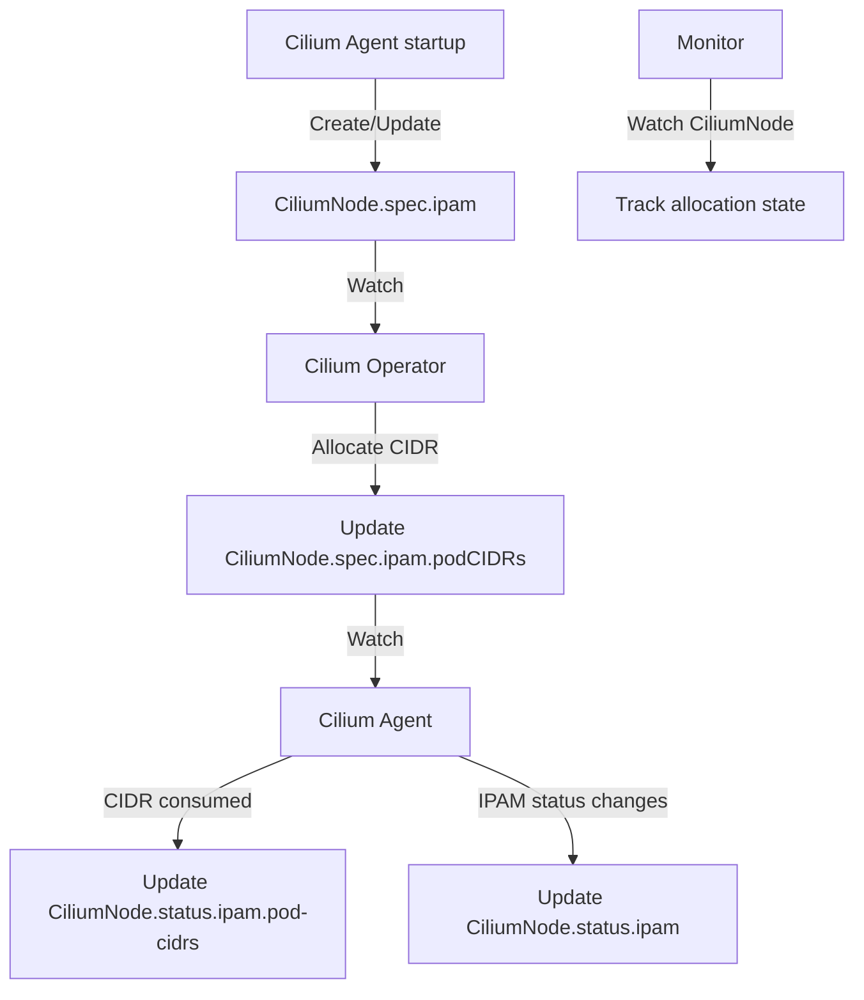

# Cilium IPAM CRD Definition: Configure, Troubleshoot, Validate, and Monitor

Author: [nawazdhandala](https://github.com/nawazdhandala)

Tags: Cilium, Kubernetes, Networking, eBPF, IPAM

Description: A detailed reference guide to the CiliumNode CRD structure used for IPAM, including the spec and status fields, how to configure them, interpret IPAM state from CRDs, and troubleshoot CRD-level...

---

## Introduction

The `CiliumNode` Custom Resource Definition is the central data structure through which Cilium's IPAM subsystem communicates node-level networking configuration and IP allocation state. Every Kubernetes node managed by Cilium has a corresponding `CiliumNode` object that records its networking capabilities, IPAM parameters, allocated CIDRs, and individual IP allocation state. Understanding the CRD schema helps you inspect, debug, and manually intervene in IPAM operations when necessary.

The `CiliumNode` CRD has two main sections relevant to IPAM: `spec.ipam` which defines the IPAM parameters for the node, and `status.ipam` which reflects allocation status reported by Cilium components. In cluster-pool mode, the Cilium operator allocates node PodCIDRs in `spec.ipam.podCIDRs`; other IPAM modes use additional fields such as per-IP pools and cloud allocation watermarks. Additional sections in the CRD record network interfaces, health status, and node metadata used for routing decisions.

This guide covers the main CRD structure for IPAM-relevant fields, how to configure and manipulate CRD fields, troubleshoot CRD state issues, and validate CRD consistency.

## Prerequisites

- Cilium installed with CRD-backed IPAM (cluster-pool mode)
- `kubectl` with cluster admin access
- `jq` for JSON processing
- Familiarity with Kubernetes CRD concepts

## Configure CiliumNode CRD

View and understand the CRD structure:

```bash
# View the CiliumNode CRD schema

kubectl get crd ciliumnodes.cilium.io \
  -o json | jq '.spec.versions[0].schema.openAPIV3Schema.properties.spec.properties.ipam'

# View all CiliumNode objects
kubectl get ciliumnodes

# Inspect a specific CiliumNode
kubectl describe ciliumnode worker-1

# View raw YAML for a CiliumNode
kubectl get ciliumnode worker-1 -o yaml
```

Key IPAM fields in the CiliumNode CRD:

```yaml
# Full CiliumNode structure (IPAM-relevant fields)
apiVersion: cilium.io/v2
kind: CiliumNode
metadata:
  name: worker-1
spec:
  ipam:
    # CIDRs this node can use for pod IP allocation (set by Operator)
    podCIDRs:
      - 10.244.1.0/24

    # IP allocation watermarks for cloud IPAM modes (aws-eni, azure)
    min-allocate: 10
    max-allocate: 30
    pre-allocate: 8
    max-above-watermark: 5

    # Per-IP pool used by CRD-backed IPAM mode
    pool:
      "192.168.1.10": {}
      "192.168.1.11": {}

    # Pool requests and allocations used by multi-pool IPAM mode
    pools:
      requested:
        - pool: default
          needed:
            ipv4-addrs: 8
      allocated:
        - pool: default
          cidrs:
            - 10.244.1.0/24

status:
  ipam:
    # Currently allocated IPs and their owners in CRD-backed and cloud IPAM modes
    used:
      "192.168.1.10":
        owner: "default/frontend-pod-abc123"
        resource: "default/frontend-pod-abc123"
      "192.168.1.11":
        owner: "kube-system/coredns-xyz"
        resource: "kube-system/coredns-xyz"

    # Per-CIDR state for PodCIDRs assigned to this node
    pod-cidrs:
      "10.244.1.0/24":
        status: in-use

    # CIDR allocation status (reflects CIDRs in spec.ipam.podCIDRs)
    operator-status:
      error: ""
```

Patch CiliumNode to adjust cloud IPAM allocation limits:

```bash
# Set IPAM allocation limits for a specific node
kubectl patch ciliumnode worker-1 --type merge -p '{
  "spec": {
    "ipam": {
      "max-allocate": 200,
      "min-allocate": 20,
      "pre-allocate": 30
    }
  }
}'

# Verify fields are applied
kubectl get ciliumnode worker-1 -o json | jq '.spec.ipam'
```

## Troubleshoot CRD Definition Issues

Diagnose CRD structure and state problems:

```bash
# Check if CRD schema is valid
kubectl get crd ciliumnodes.cilium.io \
  -o json | jq '.status.conditions[] | select(.type == "NonStructuralSchema")'
# Should return nothing (no non-structural schema issues)

# Check CiliumNode CRD version
kubectl get crd ciliumnodes.cilium.io \
  -o jsonpath='{.spec.versions[*].name}'

# Find CiliumNodes with inconsistent IPAM state
kubectl get ciliumnodes -o json | \
  jq '.items[] | select(
    (.spec.ipam.podCIDRs | length) == 0
    or (.status.ipam == null)
  ) | .metadata.name'

# Identify CiliumNodes where spec and status disagree on CIDR
kubectl get ciliumnodes -o json | jq '.items[] | {
  node: .metadata.name,
  spec_cidrs: .spec.ipam.podCIDRs,
  status_cidrs: (.status.ipam."pod-cidrs" // {}),
  operator_error: (.status.ipam."operator-status".error // "")
}'
```

Fix CRD state issues:

```bash
# Issue: CiliumNode missing spec.ipam.podCIDRs
# Restart Cilium agent on the node so it recreates/reconciles the CiliumNode
kubectl -n kube-system delete pod -l k8s-app=cilium \
  --field-selector spec.nodeName=<node-name>

# Issue: Stale entries in status.ipam.used
# Restart Cilium agent to reconcile CRD-backed or cloud IPAM state
kubectl -n kube-system delete pod -l k8s-app=cilium \
  --field-selector spec.nodeName=<node-name>

# Issue: CiliumNode CRD schema outdated after Cilium upgrade
# CRDs are updated by Helm upgrade
helm upgrade cilium cilium/cilium \
  --namespace kube-system \
  --reuse-values
```

## Validate CRD State

Verify CiliumNode CRDs accurately reflect cluster state:

```bash
# Validate all K8s nodes have corresponding CiliumNode CRDs
DIFF=$(diff \
  <(kubectl get nodes -o jsonpath='{.items[*].metadata.name}' | tr ' ' '\n' | sort) \
  <(kubectl get ciliumnodes -o jsonpath='{.items[*].metadata.name}' | tr ' ' '\n' | sort))
if [ -z "$DIFF" ]; then
  echo "OK: All K8s nodes have CiliumNode CRDs"
else
  echo "MISMATCH: $DIFF"
fi

# Validate IPAM used entries correspond to real pods in CRD-backed and cloud IPAM modes
kubectl get ciliumnodes -o json | jq -r '
  .items[] | .metadata.name as $node |
  .status.ipam.used // {} | to_entries[] |
  "\($node) \(.key) \(.value.owner)"
' | while read node ip owner; do
  NS=$(echo $owner | cut -d/ -f1)
  POD=$(echo $owner | cut -d/ -f2)
  EXISTS=$(kubectl get pod $POD -n $NS --no-headers 2>/dev/null | wc -l)
  [ "$EXISTS" -eq 0 ] && echo "STALE: $node $ip owner=$owner"
done
```

## Monitor CRD-Based IPAM


```mermaid
graph TD
    A[Cilium Agent startup] -->|Create/Update| B[CiliumNode.spec.ipam]
    B -->|Watch| C[Cilium Operator]
    C -->|Allocate CIDR| D[Update CiliumNode.spec.ipam.podCIDRs]
    D -->|Watch| E[Cilium Agent]
    E -->|CIDR consumed| F[Update CiliumNode.status.ipam.pod-cidrs]
    E -->|IPAM status changes| G[Update CiliumNode.status.ipam]
    H[Monitor] -->|Watch CiliumNode| I[Track allocation state]
```

Monitor CiliumNode CRD changes:

```bash
# Watch CiliumNode CRD for IPAM state changes
kubectl get ciliumnodes --watch -o json | \
  jq -r '(.object // .) | select(.kind == "CiliumNode") | "\(.metadata.name): cidrs=\(.spec.ipam.podCIDRs // []) operator_error=\(.status.ipam."operator-status".error // "")"'

# Monitor IPAM utilization across all nodes
kubectl get ciliumnodes -o json | jq '[.items[] | {
  node: .metadata.name,
  cidrs: (.spec.ipam.podCIDRs // []),
  cidr_status: (.status.ipam."pod-cidrs" // {}),
  operator_error: (.status.ipam."operator-status".error // "")
}]'

# Alert on CiliumNode IPAM anomalies
watch -n60 "kubectl get ciliumnodes -o json | \
  jq '.items[] | select((.spec.ipam.podCIDRs | length) == 0) | .metadata.name'"
```

## Conclusion

The CiliumNode CRD is the authoritative record of node-level IPAM configuration and status in a Cilium-managed cluster. Understanding its schema - particularly the distinction between `spec.ipam` (configured parameters such as PodCIDRs or address pools) and `status.ipam` (reported allocation status) - enables effective IPAM troubleshooting and monitoring. Regular validation that CRD state reflects actual pod networking state is a valuable operational check. When CRD state and actual state diverge, agent restarts are a common recovery mechanism, triggering reconciliation between the CRD state and running containers.
