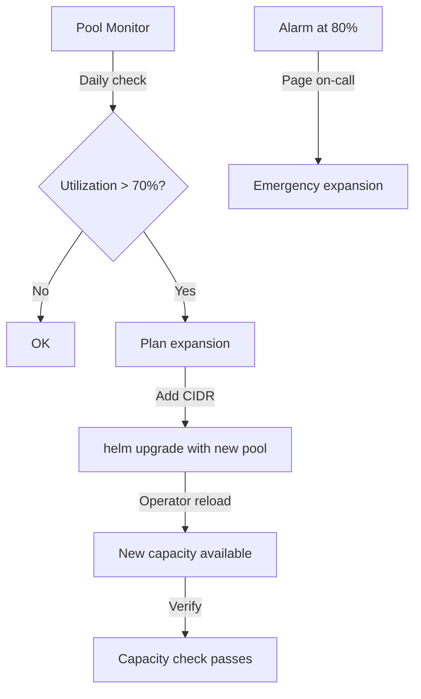

# Expanding the Cilium Cluster Pool: Configure, Troubleshoot, Validate, and Monitor

Author: [nawazdhandala](https://github.com/nawazdhandala)

Tags: Cilium, Kubernetes, IPAM, Cluster-Pool, Scaling

Description: Learn how to safely expand Cilium's cluster-pool IPAM when the pod IP address space is running low, including step-by-step expansion procedures, validation, and ongoing capacity monitoring.

---

## Introduction

As your Kubernetes cluster grows, the pod IP address pool configured in Cilium's cluster-pool IPAM will eventually approach exhaustion. When the pool fills up, the Cilium Operator cannot allocate CIDRs to new nodes, preventing them from hosting pods. Planning for and executing pool expansion before this happens is a critical operational task for cluster administrators.

Expanding the cluster pool in Cilium is non-disruptive to existing workloads — the new CIDR ranges are simply added to the pool configuration, and the Operator begins using them for new node allocations. Existing node CIDRs remain unchanged. The expansion can be performed at any time without a maintenance window, making it one of the more operationally friendly scaling tasks in Cilium management.

This guide covers how to detect pool exhaustion risk early, perform the expansion safely, troubleshoot expansion-related issues, and validate that the expanded pool is being used correctly.

## Prerequisites

- Cilium running with cluster-pool IPAM mode
- `kubectl` with cluster admin access
- Helm 3.x for configuration management
- New CIDR ranges planned that do not overlap existing infrastructure

## Configure Pool Expansion

Check current pool usage before expanding:

```bash
# Check current pool configuration
kubectl -n kube-system get configmap cilium-config \
  -o jsonpath='{.data.cluster-pool-ipv4-cidr}'

# Count current CIDR allocations
kubectl get ciliumnodes -o json | \
  jq '[.items[].spec.ipam.podCIDRs[]] | length'

# Calculate remaining pool capacity
POOL="10.244.0.0/16"
MASK=24
TOTAL=$(python3 -c "
import ipaddress
net = ipaddress.ip_network('$POOL')
print(len(list(net.subnets(new_prefix=$MASK))))
")
USED=$(kubectl get ciliumnodes -o json | jq '[.items[].spec.ipam.podCIDRs[]] | length')
echo "Total /${MASK} subnets in pool: $TOTAL, Used: $USED, Remaining: $((TOTAL - USED))"
```

Perform non-disruptive pool expansion:

```bash
# Method 1: Add an additional CIDR range to the existing pool
helm upgrade cilium cilium/cilium \
  --namespace kube-system \
  --reuse-values \
  --set "ipam.operator.clusterPoolIPv4PodCIDRList={10.244.0.0/16,10.245.0.0/16}"

# Verify ConfigMap was updated
kubectl -n kube-system get configmap cilium-config \
  -o jsonpath='{.data.cluster-pool-ipv4-cidr}'

# Method 2: Replace with a larger supernet (if ranges are contiguous)
# Original: 10.244.0.0/16
# Expanded: 10.244.0.0/15 (covers 10.244.0.0/16 and 10.245.0.0/16)
helm upgrade cilium cilium/cilium \
  --namespace kube-system \
  --reuse-values \
  --set "ipam.operator.clusterPoolIPv4PodCIDRList={10.244.0.0/15}"

# Wait for Operator to reload configuration
kubectl -n kube-system rollout restart deploy/cilium-operator
kubectl -n kube-system rollout status deploy/cilium-operator
```

Verify new CIDRs don't overlap with existing infrastructure:

```bash
# Check node IPs
kubectl get nodes -o jsonpath='{range .items[*]}{.status.addresses[?(@.type=="InternalIP")].address}{"\n"}{end}'

# Check service CIDRs
kubectl get svc -A | grep ClusterIP | awk '{print $3}' | grep -v None | sort -u

# Check existing pod CIDRs
kubectl get ciliumnodes -o json | jq '[.items[].spec.ipam.podCIDRs[]]'

# Verify new CIDR doesn't overlap
python3 - <<'EOF'
import ipaddress

new_cidr = ipaddress.ip_network("10.245.0.0/16")
existing = [
    "10.244.0.0/16",    # existing pod CIDR
    "10.96.0.0/12",     # service CIDR
    "192.168.0.0/24",   # node IPs
]

for existing_cidr in existing:
    net = ipaddress.ip_network(existing_cidr)
    if new_cidr.overlaps(net):
        print(f"CONFLICT: {new_cidr} overlaps with {net}")
    else:
        print(f"OK: {new_cidr} does not overlap with {net}")
EOF
```

## Troubleshoot Pool Expansion Issues

Diagnose expansion-related problems:

```bash
# Pool expansion not taking effect
kubectl -n kube-system get configmap cilium-config \
  -o jsonpath='{.data.cluster-pool-ipv4-cidr}'
# Should show both CIDRs after upgrade

# Check Operator is using new CIDR ranges
kubectl -n kube-system logs -l name=cilium-operator | grep -i "cidr\|pool\|expand"

# New nodes still getting old CIDR range only
# Check if Operator reloaded configuration
kubectl -n kube-system get pods -l name=cilium-operator
kubectl -n kube-system rollout status deploy/cilium-operator

# Overlap detected after expansion
kubectl get ciliumnodes -o json | jq '[.items[] | {node: .metadata.name, cidr: .spec.ipam.podCIDRs[0]}]'
# Check for any nodes with CIDRs from the new range that conflict
```

Fix common expansion issues:

```bash
# Issue: New CIDR overlaps with existing node IPs
# Must use a different CIDR range
# Check which ranges are used:
kubectl get nodes -o json | jq '.items[].status.addresses[] | select(.type == "InternalIP") | .address'

# Issue: Operator not picking up new pool after ConfigMap update
kubectl -n kube-system rollout restart deploy/cilium-operator

# Issue: Insufficient new IPs (chose too small expansion)
# Check how many new nodes you can support:
NEW_CIDR="10.245.0.0/16"
MASK=24
python3 -c "
import ipaddress
net = ipaddress.ip_network('$NEW_CIDR')
print(f'New pool provides {len(list(net.subnets(new_prefix=$MASK)))} /${MASK} subnets')
"
```

## Validate Pool Expansion

Confirm the expanded pool is operational:

```bash
# Verify new CIDR is in the configuration
kubectl -n kube-system get configmap cilium-config \
  -o jsonpath='{.data.cluster-pool-ipv4-cidr}'
# Should show: "10.244.0.0/16,10.245.0.0/16" or similar

# Add a new node and verify it gets a CIDR from the new pool
# (or test by simulating with a test node if available)

# Check total pool capacity after expansion
POOL1="10.244.0.0/16"
POOL2="10.245.0.0/16"
MASK=24
TOTAL=$(python3 -c "
import ipaddress
total = 0
for pool in ['$POOL1', '$POOL2']:
    net = ipaddress.ip_network(pool)
    total += len(list(net.subnets(new_prefix=$MASK)))
print(total)
")
USED=$(kubectl get ciliumnodes -o json | jq '[.items[].spec.ipam.podCIDRs[]] | length')
echo "Total capacity: $TOTAL, Used: $USED, Available: $((TOTAL - USED))"

# Run connectivity test to ensure existing pods are unaffected
cilium connectivity test
```

## Monitor Pool Utilization



Set up pool capacity monitoring:

```bash
# Prometheus alert for IPAM pool capacity
kubectl apply -f - <<EOF
apiVersion: monitoring.coreos.com/v1
kind: PrometheusRule
metadata:
  name: cilium-ipam-capacity
  namespace: kube-system
spec:
  groups:
  - name: ipam-capacity
    rules:
    - alert: CiliumIPAMPoolWarning
      expr: (count(kube_node_info) * 256) / (256 * 254) > 0.7
      for: 5m
      labels:
        severity: warning
      annotations:
        summary: "Cilium IPAM pool utilization exceeding 70%"
    - alert: CiliumIPAMPoolCritical
      expr: (count(kube_node_info) * 256) / (256 * 254) > 0.85
      for: 5m
      labels:
        severity: critical
      annotations:
        summary: "Cilium IPAM pool utilization critical - expand immediately"
EOF
```

## Conclusion

Expanding Cilium's cluster-pool IPAM is a routine operational task that should be performed proactively at 70-80% pool utilization rather than reactively during an outage. The non-disruptive nature of pool expansion — simply adding CIDRs to the existing list — makes it safe to execute at any time. Establish monitoring thresholds that trigger alerts well before pool exhaustion and document your CIDR expansion procedure in your runbooks. Planning your IPAM address space with growth headroom from the beginning reduces how often expansions are needed.
