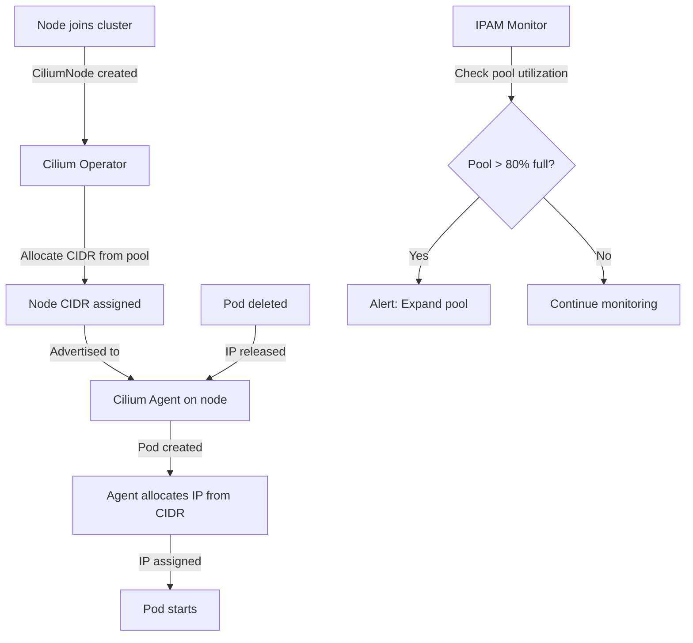

# Cilium IPAM Overview: Configure, Troubleshoot, Validate, and Monitor

Author: [nawazdhandala](https://github.com/nawazdhandala)

Tags: Cilium, Kubernetes, Networking, EBPF, IPAM

Description: A comprehensive introduction to Cilium's IP Address Management (IPAM) modes, how to select the right IPAM mode for your environment, and how to configure, troubleshoot, and monitor IPAM in...

---

## Introduction

IP Address Management (IPAM) is the subsystem responsible for allocating IP addresses to pods when they are created and releasing them when pods are deleted. Cilium supports multiple IPAM modes designed for different deployment environments: from simple cluster-wide pools for bare metal clusters to cloud-provider-native integrations that leverage AWS ENI, Azure VNET, and GKE networking primitives.

The choice of IPAM mode has significant implications for your cluster's networking architecture, scalability, and cloud provider integration. Cluster-pool mode assigns a CIDR per node from a pre-configured pool, providing simple and predictable addressing. Kubernetes mode delegates IPAM to the Kubernetes controller manager. Cloud provider modes (aws-eni, azure, gke) use the cloud's native networking APIs to assign addresses, enabling direct routing without overlay networks.

Understanding IPAM is fundamental to Cilium operations because IP exhaustion, CIDR conflicts, and IPAM misconfiguration are among the most impactful networking failures. This overview covers all IPAM modes, selection criteria, configuration, troubleshooting, and monitoring.

## Prerequisites

- Cilium installed or being planned for installation
- `kubectl` with cluster admin access
- Helm 3.x for configuration
- Knowledge of your target environment (cloud provider, bare metal, etc.)

## Configure Cilium IPAM

Select and configure the appropriate IPAM mode:

```bash
# Available IPAM modes:
# cluster-pool: Default for bare metal/on-prem, Cilium manages per-node CIDRs
# kubernetes: Delegate to kube-controller-manager
# aws-eni: AWS Elastic Network Interfaces (native routing)
# azure: Azure VNET integration
# gke: Google Kubernetes Engine native addressing

# Configure cluster-pool IPAM (most common for bare metal)
helm upgrade cilium cilium/cilium \
  --namespace kube-system \
  --reuse-values \
  --set ipam.mode=cluster-pool \
  --set ipam.operator.clusterPoolIPv4PodCIDRList="{10.244.0.0/16}" \
  --set ipam.operator.clusterPoolIPv4MaskSize=24

# Configure kubernetes IPAM (uses K8s node.spec.podCIDR)
helm upgrade cilium cilium/cilium \
  --namespace kube-system \
  --reuse-values \
  --set ipam.mode=kubernetes

# Configure AWS ENI IPAM
helm upgrade cilium cilium/cilium \
  --namespace kube-system \
  --reuse-values \
  --set ipam.mode=eni \
  --set eni.enabled=true \
  --set eni.awsEnablePrefixDelegation=true
```

View current IPAM configuration and allocations:

```bash
# Check IPAM mode
kubectl -n kube-system get configmap cilium-config -o yaml | grep ipam

# View node IPAM allocations
kubectl get ciliumnodes -o json | \
  jq '.items[] | {node: .metadata.name, podCIDR: .spec.ipam.podCIDRs}'

# Check IPAM pool utilization
kubectl -n kube-system exec ds/cilium -- cilium ip list
```

## Troubleshoot IPAM Issues

Diagnose IP allocation failures:

```bash
# Pods stuck in Pending due to IP allocation failure
kubectl describe pod <pending-pod>
# Look for: "0/3 nodes are available: insufficient IPs"

# Check IPAM status on a specific node
NODE="worker-1"
kubectl get ciliumnode $NODE -o json | jq '.status.ipam'

# Check IPAM pool availability
kubectl get ciliumnode -o json | \
  jq '.items[] | {node: .metadata.name, available: .status.ipam.available | length}'

# Check Operator IPAM logs
kubectl -n kube-system logs -l name=cilium-operator | grep -i "ipam\|cidr\|alloc"

# Check for CIDR exhaustion
kubectl -n kube-system exec ds/cilium -- cilium ip list | \
  grep -c "used"
```

Fix IPAM configuration errors:

```bash
# Issue: Pod CIDR pool exhausted
# Expand the cluster pool (see separate guide)
helm upgrade cilium cilium/cilium \
  --namespace kube-system \
  --reuse-values \
  --set "ipam.operator.clusterPoolIPv4PodCIDRList={10.244.0.0/16,10.245.0.0/16}"

# Issue: Node CIDR mask too large (too few IPs per node)
helm upgrade cilium cilium/cilium \
  --namespace kube-system \
  --reuse-values \
  --set ipam.operator.clusterPoolIPv4MaskSize=22  # 1022 IPs per node

# Issue: IP leak (IPs allocated but not released)
# Check for stale CiliumEndpoints
kubectl get cep -A | wc -l
kubectl get pods -A | wc -l
# If CEP count >> pod count, stale endpoints are present
```

## Validate IPAM Configuration

Verify IPAM is working correctly:

```bash
# Check all nodes have CIDR allocations
kubectl get ciliumnodes -o json | \
  jq '.items[] | select(.spec.ipam.podCIDRs == null) | .metadata.name'
# Should return nothing

# Verify pod IP is within node CIDR
NODE="worker-1"
NODE_CIDR=$(kubectl get ciliumnode $NODE \
  -o jsonpath='{.spec.ipam.podCIDRs[0]}')
POD_IPS=$(kubectl get pods --field-selector spec.nodeName=$NODE \
  -A -o jsonpath='{.items[*].status.podIP}')
echo "Node CIDR: $NODE_CIDR"
echo "Pod IPs: $POD_IPS"

# Run IPAM validation test
kubectl run ipam-test --image=nginx --restart=Never
kubectl wait pod/ipam-test --for=condition=Ready --timeout=30s
kubectl get pod ipam-test -o jsonpath='{.status.podIP}'
kubectl delete pod ipam-test
```

## Monitor IPAM Health



Monitor IPAM utilization:

```bash
# IPAM utilization per node
kubectl get ciliumnodes -o json | \
  jq '.items[] | {
    node: .metadata.name,
    allocated: (.status.ipam.allocated | length),
    available: (.status.ipam.available | length)
  }'

# Prometheus metrics for IPAM
kubectl -n kube-system port-forward svc/cilium-operator 9963:9963 &
curl -s http://localhost:9963/metrics | grep -E "ipam|cidr"

# Key IPAM metrics
# cilium_ipam_allocated_ips - total allocated IPs
# cilium_ipam_available_ips - total available IPs
# cilium_ipam_capacity - total IPAM capacity

# Alert on IPAM pool running low
# PromQL: cilium_ipam_available_ips / cilium_ipam_capacity < 0.2
```

## Conclusion

Cilium's IPAM subsystem is flexible enough to work across bare metal, on-premises, and all major cloud providers. The choice between cluster-pool, kubernetes, and cloud-native IPAM modes depends on your environment and networking requirements. Cluster-pool is the most portable option and works with overlay networks, while cloud-native modes enable direct routing and integration with cloud security groups. Monitor IPAM pool utilization proactively - IP exhaustion causes pod creation failures that are difficult to recover from in production without planned expansion procedures.
