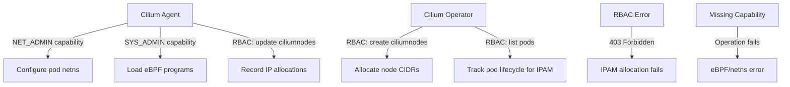

# Cilium IPAM Privileges: Configure, Troubleshoot, Validate, and Monitor

Author: [nawazdhandala](https://github.com/nawazdhandala)

Tags: Cilium, Kubernetes, IPAM, RBAC, Security

Description: Understand the Linux capabilities, Kubernetes RBAC permissions, and security context settings required for Cilium's IPAM subsystem to function correctly, and how to troubleshoot privilege-related IPAM failures.

---

## Introduction

Cilium's IPAM subsystem requires specific privileges at both the Linux system level and the Kubernetes RBAC level to function correctly. At the system level, Cilium agents need Linux capabilities to manipulate network namespaces, load eBPF programs, and configure network interfaces. At the Kubernetes level, the Cilium Operator needs RBAC permissions to create, update, and delete CiliumNode CRDs, manage namespaces, and watch pod events for IPAM-related decisions.

Insufficient privileges manifest in specific and often confusing ways: pods may start but have incorrect IP configurations, IPAM state may not be updated after pod deletion causing IP leaks, or the Operator may silently fail to allocate CIDRs to new nodes. Security hardening efforts that remove capabilities or restrict RBAC permissions can inadvertently break IPAM without obvious error messages.

This guide covers the complete privilege requirements for Cilium IPAM, how to diagnose privilege-related IPAM failures, how to validate permissions are correctly configured, and how to monitor for privilege issues.

## Prerequisites

- Cilium installed or being deployed on Kubernetes
- `kubectl` with cluster admin access
- Understanding of Linux capabilities and Kubernetes RBAC

## Configure Cilium IPAM Privileges

Required Linux capabilities for Cilium agents:

```yaml
# Cilium requires these Linux capabilities for IPAM:
# NET_ADMIN    - Configure network interfaces and routing
# SYS_MODULE   - Load kernel modules (optional, for some features)
# NET_RAW      - Create raw sockets for network operations
# IPC_LOCK     - Lock memory pages (for eBPF maps)
# SYS_ADMIN    - Various kernel operations for eBPF

# These are automatically configured by the Helm chart
# Verify they are present:
kubectl -n kube-system get ds cilium -o yaml | grep -A 20 "securityContext"
```

Review and configure Kubernetes RBAC:

```bash
# View Cilium agent RBAC permissions
kubectl get clusterrole cilium -o yaml

# Key permissions required for IPAM:
# - ciliumnodes: get, list, watch, create, update, patch, delete
# - ciliumendpoints: get, list, watch, create, update, patch, delete
# - pods: get, list, watch (for IP allocation tracking)
# - nodes: get, list, watch (for node CIDR management)

# View Cilium Operator RBAC
kubectl get clusterrole cilium-operator -o yaml | grep -A 3 "ciliumnodes"

# Verify service accounts are correct
kubectl -n kube-system get serviceaccount cilium -o yaml
kubectl -n kube-system get serviceaccount cilium-operator -o yaml
```

Configure security context for Cilium pods:

```yaml
# This is managed by Helm - verify it's correct
# cilium-values.yaml snippet
securityContext:
  capabilities:
    add:
      - NET_ADMIN
      - NET_RAW
      - IPC_LOCK
      - SYS_ADMIN
  privileged: false  # Should NOT be fully privileged for security
```

## Troubleshoot Privilege Issues

Diagnose RBAC and capability-related failures:

```bash
# Check for RBAC permission errors
kubectl -n kube-system logs ds/cilium | grep -i "forbidden\|rbac\|cannot\|permission"
kubectl -n kube-system logs -l name=cilium-operator | grep -i "forbidden\|rbac\|cannot"

# Test specific RBAC permissions
kubectl auth can-i get ciliumnodes --as=system:serviceaccount:kube-system:cilium
kubectl auth can-i update ciliumnodes --as=system:serviceaccount:kube-system:cilium
kubectl auth can-i list pods --as=system:serviceaccount:kube-system:cilium-operator

# Check if Cilium agent has required capabilities
kubectl -n kube-system exec ds/cilium -- capsh --print | grep "cap_net_admin"

# Diagnose eBPF permission issues (related to capabilities)
kubectl -n kube-system logs ds/cilium | grep -i "bpf\|ebpf\|permission\|cap"
```

Fix common privilege issues:

```bash
# Issue: ClusterRole missing IPAM-required permissions
# Reinstall with correct RBAC
helm upgrade cilium cilium/cilium \
  --namespace kube-system \
  --reuse-values

# Issue: ServiceAccount not bound to ClusterRole
kubectl get clusterrolebinding cilium -o yaml
kubectl get clusterrolebinding cilium-operator -o yaml

# Fix missing binding
kubectl create clusterrolebinding cilium \
  --clusterrole=cilium \
  --serviceaccount=kube-system:cilium \
  --dry-run=client -o yaml | kubectl apply -f -

# Issue: PSP (Pod Security Policy) blocking capabilities
# Check if PSP is blocking Cilium
kubectl get psp | grep cilium
kubectl describe psp cilium

# Issue: Pod Security Standards blocking privileged init containers
kubectl -n kube-system describe pod <cilium-pod> | grep -i "violat\|secur\|block"
```

## Validate IPAM Privileges

Verify all required privileges are in place:

```bash
# Comprehensive RBAC check for IPAM operations
PERMISSIONS=(
  "get ciliumnodes"
  "update ciliumnodes"
  "create ciliumnodes"
  "delete ciliumnodes"
  "list pods"
  "watch pods"
  "get nodes"
)

echo "=== Cilium Agent RBAC ==="
for perm in "${PERMISSIONS[@]}"; do
  VERB=$(echo $perm | awk '{print $1}')
  RESOURCE=$(echo $perm | awk '{print $2}')
  RESULT=$(kubectl auth can-i $VERB $RESOURCE \
    --as=system:serviceaccount:kube-system:cilium 2>&1)
  echo "$VERB $RESOURCE: $RESULT"
done

echo ""
echo "=== Cilium Operator RBAC ==="
for perm in "${PERMISSIONS[@]}"; do
  VERB=$(echo $perm | awk '{print $1}')
  RESOURCE=$(echo $perm | awk '{print $2}')
  RESULT=$(kubectl auth can-i $VERB $RESOURCE \
    --as=system:serviceaccount:kube-system:cilium-operator 2>&1)
  echo "$VERB $RESOURCE: $RESULT"
done

# Test IPAM operations work
cilium status | grep -i ipam
kubectl -n kube-system exec ds/cilium -- cilium ip list
```

## Monitor Privilege Health



Monitor for privilege-related failures:

```bash
# Watch for RBAC errors
kubectl -n kube-system logs ds/cilium -f | grep -i "forbidden\|401\|403" &
kubectl -n kube-system logs -l name=cilium-operator -f | grep -i "forbidden\|401\|403" &

# Monitor for capability-related errors
kubectl -n kube-system logs ds/cilium | grep -i "operation not permitted\|EPERM\|capability"

# Audit RBAC changes that might affect Cilium
kubectl get events -A | grep -E "clusterrole|rolebinding|serviceaccount" | grep cilium

# Alert on RBAC failure patterns
kubectl apply -f - <<EOF
apiVersion: monitoring.coreos.com/v1
kind: PrometheusRule
metadata:
  name: cilium-rbac-monitor
  namespace: kube-system
spec:
  groups:
  - name: cilium-rbac
    rules:
    - alert: CiliumRBACError
      expr: increase(cilium_k8s_client_api_calls_total{method=~"GET|POST|PUT|DELETE", status="403"}[5m]) > 0
      for: 1m
      labels:
        severity: critical
      annotations:
        summary: "Cilium is receiving RBAC forbidden errors from Kubernetes API"
EOF
```

## Conclusion

Cilium's IPAM subsystem depends on a specific set of Linux capabilities and Kubernetes RBAC permissions to function correctly. These are automatically configured by the Helm chart, but can be inadvertently broken by security hardening changes, PSP/PSS policies, or manual RBAC modifications. The `kubectl auth can-i` tool is your primary diagnostic for RBAC issues, while `capsh --print` on the Cilium agent pod confirms Linux capabilities. Always validate IPAM privileges after any security policy changes and include RBAC auditing as part of your cluster security review process.
