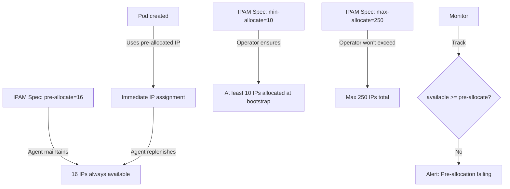

# Cilium IPAM Specification: Configure, Troubleshoot, Validate, and Monitor

Author: [nawazdhandala](https://github.com/nawazdhandala)

Tags: Cilium, Kubernetes, Networking, eBPF, IPAM

Description: A complete reference to the Cilium IPAM specification including all configuration parameters, pre-allocation settings, cloud provider-specific options, and how to tune IPAM behavior for different...

---

## Introduction

The Cilium IPAM specification encompasses the parameters that control how IP addresses are allocated, pre-allocated, and managed across different deployment environments. These parameters exist at multiple levels: the cluster-wide IPAM mode configuration in the Cilium ConfigMap, the per-node IPAM spec in CiliumNode CRDs, and the cloud-provider-specific parameters for ENI, Azure, and GKE integrations.

Understanding the IPAM specification is essential for tuning Cilium to your specific workload patterns. Clusters with highly dynamic workloads (frequent pod churn) benefit from higher pre-allocation settings that reduce pod startup latency. Clusters running on cloud providers can leverage prefix delegation and interface-level optimizations to maximize available IPs per node. The specification also covers multi-pool IPAM, which enables different parts of the cluster to use different IP pools.

This guide provides a practical reference to common IPAM specification parameters, how to configure them, troubleshoot configuration-related issues, and validate that the specified behavior matches actual IPAM operation.

## Prerequisites

- Cilium installed in Kubernetes
- `kubectl` with cluster admin access
- Helm 3.x for configuration management
- Understanding of your deployment environment (cloud provider, bare metal, etc.)

## Configure IPAM Specification

Example IPAM configuration for cluster-pool mode:

```bash
# Cluster-pool IPAM specification
helm upgrade cilium cilium/cilium \
  --namespace kube-system \
  --reuse-values \
  --set ipam.mode=cluster-pool \
  --set "ipam.operator.clusterPoolIPv4PodCIDRList={10.244.0.0/16}" \
  --set ipam.operator.clusterPoolIPv4MaskSize=24
```

Per-node IPAM specification in CiliumNode:

```yaml
# CiliumNode spec.ipam fields
spec:
  ipam:
    # (Set by Operator based on cluster pool)
    podCIDRs:
      - 10.244.1.0/24

    # Minimum number of IPs that must be allocated on bootstrap
    # Relevant for cloud IPAM modes such as AWS ENI and Azure IPAM
    min-allocate: 10

    # Maximum number of IPs the agent can allocate for this node
    # Prevents unbounded IP consumption (relevant for cloud IPAM)
    max-allocate: 250

    # Number of IPs to pre-allocate beyond current demand
    # Higher values = faster pod startup, more IP consumption
    pre-allocate: 16

    # Maximum IPs to keep available above the pre-allocate watermark
    max-above-watermark: 8
```

Cloud-specific IPAM specification (AWS ENI):

```bash
# AWS ENI IPAM specification
helm upgrade cilium cilium/cilium \
  --namespace kube-system \
  --reuse-values \
  --set ipam.mode=eni \
  --set eni.enabled=true \
  --set eni.awsEnablePrefixDelegation=true \
  --set ipam.nodeSpec.ipamMinAllocate=8 \
  --set ipam.nodeSpec.ipamPreAllocate=16 \
  --set ipam.nodeSpec.ipamMaxAllocate=30 \
  --set-string eni.eniTags.cilium=true
```

## Troubleshoot IPAM Specification Issues

Diagnose misconfiguration in IPAM spec:

```bash
# Check effective IPAM specification
kubectl -n kube-system get configmap cilium-config \
  -o json | jq '.data | {
    ipam: .ipam,
    "cluster-pool-cidr": .["cluster-pool-ipv4-cidr"],
    "mask-size": .["cluster-pool-ipv4-mask-size"]
  }'

# Check per-node IPAM spec
kubectl get ciliumnode worker-1 \
  -o json | jq '.spec.ipam'

# Identify nodes with incorrect pre-allocation
kubectl get ciliumnodes -o json | \
  jq '.items[] |
  ((.spec.ipam.pool // {} | length) - (.status.ipam.used // {} | length)) as $available |
  select($available < 5) |
  {node: .metadata.name, available: $available}'

# Check if pre-allocation is working
kubectl get ciliumnode worker-1 -o json | \
  jq '{
    used: (.status.ipam.used // {} | length),
    available: ((.spec.ipam.pool // {} | length) - (.status.ipam.used // {} | length))
  }'
```

Fix IPAM specification issues:

```bash
# Issue: Insufficient pre-allocation causing pod startup latency
# Increase pre-allocate value
kubectl patch ciliumnode worker-1 --type merge -p \
  '{"spec": {"ipam": {"pre-allocate": 32}}}'

# Issue: max-allocate too low causing IP exhaustion
kubectl patch ciliumnode worker-1 --type merge -p \
  '{"spec": {"ipam": {"max-allocate": 500}}}'

# Issue: IPAM mode mismatch between ConfigMap and CiliumNode
# Do not change IPAM mode in place on an existing cluster; install a fresh
# cluster with the target IPAM mode to avoid workload connectivity disruption.
```

## Validate IPAM Specification

Verify IPAM spec is correctly applied:

```bash
# Validate pre-allocation is working
for node in $(kubectl get ciliumnodes -o jsonpath='{.items[*].metadata.name}'); do
  AVAILABLE=$(kubectl get ciliumnode "$node" -o json | \
    jq '(.spec.ipam.pool // {} | length) - (.status.ipam.used // {} | length)')
  PRE_ALLOC=$(kubectl get ciliumnode "$node" \
    -o json | jq -r '.spec.ipam."pre-allocate" // "default"')
  echo "$node: available=$AVAILABLE, pre-allocate=$PRE_ALLOC"
done

# Test that pod startup does not wait for IP allocation
TIME_START=$(date +%s%N)
kubectl run spec-test --image=nginx --restart=Never
kubectl wait pod/spec-test --for=condition=Ready --timeout=30s
TIME_END=$(date +%s%N)
ELAPSED=$(((TIME_END - TIME_START) / 1000000))
echo "Pod ready in ${ELAPSED}ms"
kubectl delete pod spec-test

# Validate cloud IPAM settings (AWS ENI)
if kubectl -n kube-system get configmap cilium-config \
  -o jsonpath='{.data.ipam}' | grep -q eni; then
  kubectl get ciliumnodes -o json | \
    jq '.items[] | {node: .metadata.name, eni_count: (.status.eni.enis // {} | length)}'
fi
```

## Monitor IPAM Specification Effectiveness


```mermaid
graph TD
    A[IPAM Spec: pre-allocate=16] -->|Agent maintains| B[16 IPs always available]
    C[Pod created] -->|Uses pre-allocated IP| D[Immediate IP assignment]
    D -->|Agent replenishes| B
    E[IPAM Spec: min-allocate=10] -->|Operator ensures| F[At least 10 IPs allocated at bootstrap]
    G[IPAM Spec: max-allocate=250] -->|Operator won't exceed| H[Max 250 IPs total]
    I[Monitor] -->|Track| J{available >= pre-allocate?}
    J -->|No| K[Alert: Pre-allocation failing]
```

Monitor IPAM specification adherence:

```bash
# Check pre-allocation is meeting the pre-allocate requirement
kubectl get ciliumnodes -o json | jq '[.items[] | {
  node: .metadata.name,
  min_allocate: (.spec.ipam."min-allocate" // "default"),
  available: ((.spec.ipam.pool // {} | length) - (.status.ipam.used // {} | length)),
  meeting_minimum: (
    ((.spec.ipam.pool // {} | length) - (.status.ipam.used // {} | length)) >= (.spec.ipam."pre-allocate" // 8)
  )
}]'

# Monitor IPAM pre-allocation efficiency
kubectl -n kube-system port-forward deployment/cilium-operator 9963:9963 &
curl -s http://localhost:9963/metrics | grep -E "cilium_operator_ipam_(available|used|needed)_ips"

# Alert when available IPs below minimum
kubectl apply -f - <<EOF
apiVersion: monitoring.coreos.com/v1
kind: PrometheusRule
metadata:
  name: cilium-ipam-spec
  namespace: kube-system
spec:
  groups:
  - name: ipam-spec
    rules:
    - alert: CiliumIPAMPreAllocationLow
      expr: cilium_operator_ipam_available_ips < 5
      for: 2m
      labels:
        severity: warning
      annotations:
        summary: "Cilium IPAM has fewer than 5 pre-allocated IPs available"
EOF
```

## Conclusion

The Cilium IPAM specification provides extensive tunability for different deployment scenarios and workload patterns. Pre-allocation settings directly impact pod startup latency - higher values reduce latency at the cost of temporarily reserving more IPs. The min-allocate, pre-allocate, and max-allocate thresholds help control bootstrap allocation, steady-state spare IP capacity, and runaway consumption. Cloud provider IPAM modes have additional specification options that leverage platform-specific capabilities like AWS prefix delegation for dramatic increases in IPs per node. Validate that your IPAM specification settings are reflected in actual CiliumNode status to ensure the configuration is taking effect.
