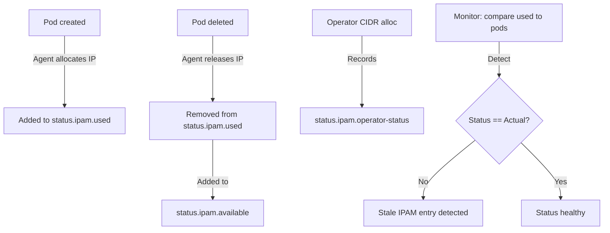

# Cilium IPAM Status: Configure, Troubleshoot, Validate, and Monitor

Author: [nawazdhandala](https://github.com/nawazdhandala)

Tags: Cilium, Kubernetes, IPAM, Status, Networking

Description: Learn how to read and interpret Cilium's IPAM status fields in CiliumNode objects, diagnose status inconsistencies, and use IPAM status information for operational monitoring and capacity planning.

---

## Introduction

The IPAM status in Cilium's CiliumNode CRD is the real-time record of IP address allocation state on each node. While the IPAM spec describes what IPAM parameters are requested, the IPAM status reflects what is actually happening: which IPs are allocated to which pods, how many IPs are available for new pods, and what the current CIDR allocation state is. Correctly interpreting IPAM status is essential for capacity planning, troubleshooting IP allocation failures, and auditing IP assignment.

The `status.ipam` section of a CiliumNode is primarily written by the Cilium Agent running on that node. As pods are created and deleted, the Agent updates the `used` and `available` maps. The Cilium Operator also interacts with status to record the outcome of CIDR allocation requests. For cloud IPAM modes (aws-eni, azure), additional status fields track ENI/interface assignments and cloud-specific allocation state.

This guide covers how to read and interpret all IPAM status fields, configure alerting based on status, troubleshoot status inconsistencies, and validate that status accurately reflects the actual networking state.

## Prerequisites

- Cilium with CRD-backed IPAM installed
- `kubectl` with cluster admin access
- `jq` for JSON processing
- Understanding of CiliumNode CRD structure

## Configure IPAM Status Reporting

IPAM status is automatically managed but can be influenced:

```bash
# View full IPAM status for all nodes
kubectl get ciliumnodes -o json | \
  jq '.items[] | {
    node: .metadata.name,
    ipam_status: .status.ipam
  }'

# View status for a specific node (cleaner format)
NODE="worker-1"
kubectl get ciliumnode $NODE -o json | jq '.status.ipam | {
  used_count: (.used | length),
  available_count: (.available | length),
  sample_used: (.used | to_entries[:3] | map({ip: .key, pod: .value.owner}))
}'

# Enable verbose IPAM logging for detailed status updates
kubectl -n kube-system exec ds/cilium -- \
  cilium config set debug true
kubectl -n kube-system logs ds/cilium -f | grep -i "ipam\|alloc\|status"
```

Understanding IPAM status fields:

```yaml
# CiliumNode status.ipam structure
status:
  ipam:
    # Map of allocated IPs to their owners
    used:
      "10.244.1.5":
        owner: "default/frontend-5d9b4d7f9-xk2lp"  # namespace/pod-name
        resource: "default/frontend-5d9b4d7f9-xk2lp"
      "10.244.1.6":
        owner: "kube-system/coredns-74ff55c5b-qr8s2"
        resource: "kube-system/coredns-74ff55c5b-qr8s2"

    # Map of available IPs (empty value = available)
    available:
      "10.244.1.7": {}
      "10.244.1.8": {}

    # Operator-managed status (CIDR allocation outcome)
    operator-status:
      "10.244.1.0/24": "allocated"

    # For cloud IPAM modes (aws-eni): ENI allocation status
    # enis:
    #   eni-abc123:
    #     id: eni-abc123
    #     ip: 10.0.1.5 (primary)
    #     ips: [10.0.1.6, 10.0.1.7, ...]
```

## Troubleshoot IPAM Status Issues

Diagnose status inconsistencies:

```bash
# Find nodes with no available IPs in status
kubectl get ciliumnodes -o json | \
  jq '.items[] | select((.status.ipam.available | length) == 0) | .metadata.name'

# Find used IPs with no corresponding running pod
kubectl get ciliumnodes -o json | \
  jq -r '.items[] | .metadata.name as $node | .status.ipam.used // {} | to_entries[] |
  "\($node) \(.key) \(.value.owner // "unknown")"' | \
  while IFS=' ' read -r node ip owner; do
    if [ "$owner" != "unknown" ]; then
      NS="${owner%%/*}"
      POD="${owner##*/}"
      RUNNING=$(kubectl get pod "$POD" -n "$NS" --no-headers 2>/dev/null | grep Running | wc -l)
      if [ "$RUNNING" -eq 0 ]; then
        echo "STALE: $node $ip owner=$owner"
      fi
    fi
  done

# Check for operator-status showing allocation failures
kubectl get ciliumnodes -o json | \
  jq '.items[] | .metadata.name as $node |
  .status.ipam."operator-status" // {} | to_entries[] |
  select(.value != "allocated") |
  "\($node): CIDR \(.key) status=\(.value)"'
```

Fix status issues:

```bash
# Issue: Stale used entries not being cleaned up
# Trigger agent reconciliation
kubectl -n kube-system delete pod -l k8s-app=cilium \
  --field-selector spec.nodeName=<node-with-stale-status>

# Issue: Available IPs not replenished after pod deletion
# Check agent logs for release errors
kubectl -n kube-system logs ds/cilium | grep -i "release\|available\|ipam"

# Issue: operator-status showing "released" instead of "allocated"
# Re-trigger Operator CIDR allocation
kubectl annotate ciliumnode <node-name> \
  "cilium.io/ipam-refresh=$(date +%s)" --overwrite
```

## Validate IPAM Status Accuracy

Verify IPAM status matches actual cluster state:

```bash
# Comprehensive status validation script
echo "=== IPAM Status Validation ==="

for node in $(kubectl get ciliumnodes -o jsonpath='{.items[*].metadata.name}'); do
  echo "--- Node: $node ---"

  # Get IPAM status
  STATUS=$(kubectl get ciliumnode $node -o json | jq '.status.ipam')
  USED_COUNT=$(echo $STATUS | jq '.used | length')
  AVAIL_COUNT=$(echo $STATUS | jq '.available | length')

  # Get actual pod count on node
  POD_COUNT=$(kubectl get pods -A \
    --field-selector spec.nodeName=$node \
    --no-headers 2>/dev/null | grep -v "hostNetwork" | wc -l)

  echo "  IPAM used: $USED_COUNT, IPAM available: $AVAIL_COUNT"
  echo "  Running pods: $POD_COUNT"

  if [ "$USED_COUNT" -ne "$POD_COUNT" ]; then
    echo "  WARNING: IPAM used ($USED_COUNT) != running pods ($POD_COUNT)"
  else
    echo "  OK: IPAM status consistent with running pods"
  fi
done
```

## Monitor IPAM Status



Set up IPAM status monitoring:

```bash
# Dashboard query: IPAM utilization per node
kubectl get ciliumnodes -o json | jq '[.items[] | {
  node: .metadata.name,
  cidr: .spec.ipam.podCIDRs[0],
  used: (.status.ipam.used | length),
  available: (.status.ipam.available | length),
  utilization_pct: (
    if ((.status.ipam.used | length) + (.status.ipam.available | length)) > 0
    then ((.status.ipam.used | length) /
      ((.status.ipam.used | length) + (.status.ipam.available | length)) * 100 | floor)
    else 0
    end
  )
}]'

# Prometheus metrics
# cilium_ipam_allocated_ips{node="worker-1"}
# cilium_ipam_available_ips{node="worker-1"}

# Alert on IPAM status inconsistency
watch -n60 "kubectl get ciliumnodes -o json | \
  jq '.items[] | {node: .metadata.name, available: (.status.ipam.available | length)}'"
```

## Conclusion

Cilium's IPAM status provides a real-time view of IP allocation state that is essential for capacity planning and operational troubleshooting. The `used` map shows exactly which IP is assigned to which pod, making IP assignment auditing straightforward. Regular validation that the `used` count matches the actual running pod count catches stale IPAM entries that consume IPs without corresponding workloads. Monitor the `available` count per node as your primary IPAM capacity metric, and ensure pre-allocation settings keep it at a healthy level to support pod startup without latency.
