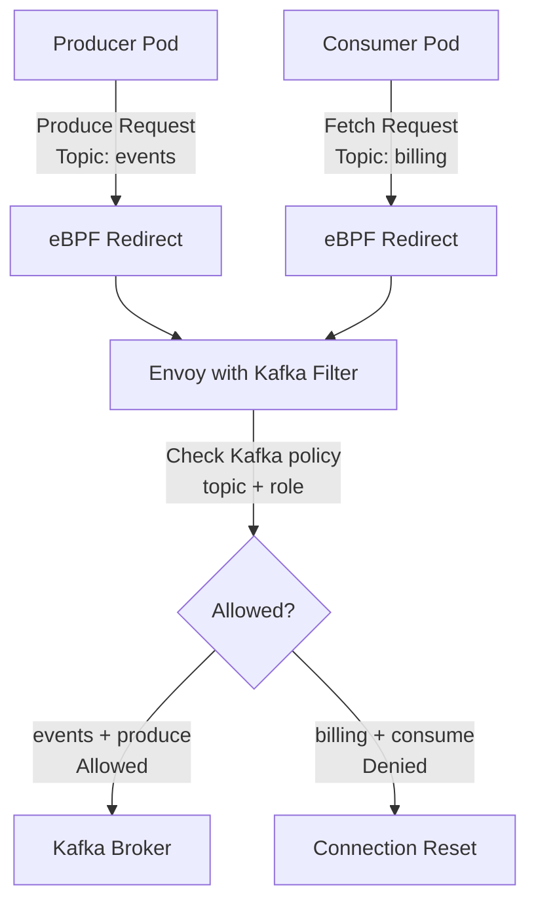

# Kafka Policies with Cilium

Author: [nawazdhandala](https://github.com/nawazdhandala)

Tags: Cilium, Kubernetes, Network Policy, Kafka, EBPF

Description: Enforce topic-level access control for Kafka using Cilium network policies that allow or deny produce and consume operations per-topic without Kafka ACLs.

---

## Introduction

Kafka security traditionally relies on Kafka's own ACL system, which requires configuring Kafka brokers with SASL/SSL authentication and managing ACLs through `kafka-acls.sh`. In Kubernetes environments, this adds operational complexity - you need to manage Kafka credentials, configure authentication on both brokers and clients, and keep ACLs synchronized as services scale. Cilium offers a network-layer alternative using its L7 Kafka policy support.

Cilium can parse the Kafka protocol and enforce access control based on Kafka API calls. This means you can allow specific pods to produce to topic A but not topic B, allow consumers of topic B but not producers, and block Kafka admin operations entirely - all at the network layer without modifying Kafka configuration. The enforcement is transparent to both Kafka clients and brokers.

This guide covers writing Cilium Kafka policies, configuring topic-level allow and deny rules, and validating enforcement in a running Kafka cluster.

## Prerequisites

- Cilium v1.10+ with Kafka L7 support
- Apache Kafka deployed in Kubernetes
- `kafka-console-producer.sh` and `kafka-console-consumer.sh` for testing
- `hubble` CLI for observability

## Step 1: Allow Producer Access to Specific Topics

Allow a producer service to write only to the `events` topic:

```yaml
apiVersion: cilium.io/v2
kind: CiliumNetworkPolicy
metadata:
  name: kafka-producer-policy
  namespace: data-pipeline
spec:
  endpointSelector:
    matchLabels:
      app: kafka-broker
  ingress:
    - fromEndpoints:
        - matchLabels:
            role: event-producer
      toPorts:
        - ports:
            - port: "9092"
              protocol: TCP
          rules:
            kafka:
              - role: produce
                topic: "events"
              - role: produce
                topic: "events-dlq"
```

## Step 2: Allow Consumer Access

Allow a consumer service to read from specific topics:

```yaml
apiVersion: cilium.io/v2
kind: CiliumNetworkPolicy
metadata:
  name: kafka-consumer-policy
  namespace: data-pipeline
spec:
  endpointSelector:
    matchLabels:
      app: kafka-broker
  ingress:
    - fromEndpoints:
        - matchLabels:
            role: event-consumer
      toPorts:
        - ports:
            - port: "9092"
              protocol: TCP
          rules:
            kafka:
              - role: consume
                topic: "events"
```

## Step 3: Admin Operations Policy

Restrict Kafka admin operations to authorized services only:

```yaml
apiVersion: cilium.io/v2
kind: CiliumNetworkPolicy
metadata:
  name: kafka-admin-policy
  namespace: data-pipeline
spec:
  endpointSelector:
    matchLabels:
      app: kafka-broker
  ingress:
    - fromEndpoints:
        - matchLabels:
            role: kafka-admin
      toPorts:
        - ports:
            - port: "9092"
              protocol: TCP
          rules:
            kafka:
              - apiKey: 3   # Metadata
              - apiKey: 19  # CreateTopics
              - apiKey: 20  # DeleteTopics
```

## Step 4: Validate Kafka Policy Enforcement

```bash
# Test allowed production
kubectl exec -n data-pipeline producer-pod -- \
  kafka-console-producer.sh \
  --bootstrap-server kafka:9092 \
  --topic events

# Test blocked production to unauthorized topic
kubectl exec -n data-pipeline producer-pod -- \
  kafka-console-producer.sh \
  --bootstrap-server kafka:9092 \
  --topic billing
# Expected: Network error - connection reset by Cilium

# Observe Kafka policy enforcement in Hubble
hubble observe --namespace data-pipeline \
  --protocol kafka \
  --verdict DROPPED \
  --follow
```

## Step 5: Monitor Kafka Policy Activity

```bash
# Check which Kafka API calls are being made
hubble observe --namespace data-pipeline \
  --protocol kafka \
  --follow

# Look for policy violations
hubble observe --namespace data-pipeline \
  --verdict DROPPED \
  --type l7
```

## Kafka Policy Architecture



## Conclusion

Cilium Kafka policies provide network-layer topic-level access control without requiring Kafka ACL configuration or authentication setup. By declaring which pods can produce or consume which topics directly in Kubernetes network policy, you bring Kafka access control into the same declarative GitOps workflow as the rest of your security policy. This is especially valuable during early development when Kafka ACLs may not be configured yet, or in environments where operational simplicity is more important than Kafka's native ACL granularity.
