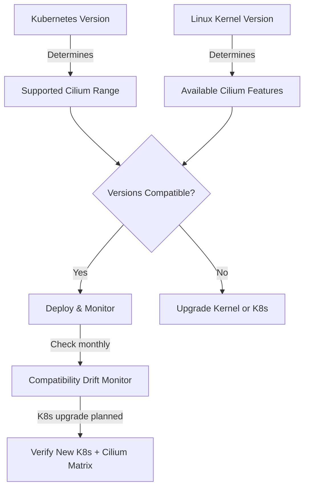

# Cilium Kubernetes Compatibility: Configure, Troubleshoot, Validate, and Monitor

Author: [nawazdhandala](https://github.com/nawazdhandala)

Tags: Cilium, Kubernetes, Networking, eBPF, IPAM

Description: Understand Cilium's Kubernetes version compatibility requirements, how to configure your cluster for supported versions, troubleshoot compatibility issues, and validate correct operation across...

---

## Introduction

Cilium's tight integration with the Kubernetes API and its use of eBPF kernel features means that specific Cilium versions are compatible with specific Kubernetes and Linux kernel versions. Using incompatible versions can result in silent failures, degraded networking performance, or complete loss of connectivity. Understanding the compatibility matrix before installing or upgrading Cilium is critical for cluster stability.

Cilium follows a support policy where each release supports the three most recent Kubernetes minor versions. Kernel support requirements vary by feature: basic connectivity may work on kernel 4.9, while features like kube-proxy replacement, WireGuard encryption, and bandwidth management require 5.3 or later. The Cilium documentation maintains an up-to-date compatibility table that must be consulted before any deployment.

This guide explains how to check and configure compatibility requirements, diagnose version-related issues, validate that your environment meets all requirements, and monitor for compatibility drift over time.

## Prerequisites

- Access to the Cilium compatibility table at https://docs.cilium.io/en/stable/network/kubernetes/compatibility/
- `kubectl` with cluster admin access
- Node access for kernel version verification
- Target Cilium version identified

## Configure for Kubernetes Compatibility

Verify Kubernetes version against Cilium support matrix:

```bash
# Check current Kubernetes version
kubectl version --short
# Server Version: v1.29.x

# Check current Cilium version
cilium version

# Cilium 1.15.x supports:
# - Kubernetes 1.27, 1.28, 1.29, 1.30
# - Linux kernel 4.19.57+ (minimum)
# - Linux kernel 5.10+ (recommended)
# - Linux kernel 5.15+ (for all features)

# Check kernel versions across all nodes
kubectl get nodes -o jsonpath='{range .items[*]}{.metadata.name}{"\t"}{.status.nodeInfo.kernelVersion}{"\n"}{end}'
```

Install Cilium matching your Kubernetes version:

```bash
# For Kubernetes 1.29
helm install cilium cilium/cilium \
  --version 1.15.6 \
  --namespace kube-system \
  --set kubeProxyReplacement=true \
  --set k8sServiceHost=$(kubectl get endpoints kubernetes -o jsonpath='{.subsets[0].addresses[0].ip}') \
  --set k8sServicePort=6443

# For older Kubernetes 1.27 (use older Cilium)
helm install cilium cilium/cilium \
  --version 1.14.7 \
  --namespace kube-system

# Verify feature availability for your kernel
kubectl -n kube-system exec ds/cilium -- cilium features list
```

## Troubleshoot Compatibility Issues

Identify and resolve version incompatibilities:

```bash
# Check for Kubernetes API compatibility errors
kubectl -n kube-system logs ds/cilium | grep -i "kubernetes\|k8s\|api\|version\|deprecated"

# Identify deprecated API usage
kubectl -n kube-system exec ds/cilium -- cilium status | grep -i warning

# Check if Cilium is using removed APIs
kubectl get events -n kube-system | grep -i "deprecated\|removed"

# Verify feature gates are compatible
kubectl -n kube-system get configmap cilium-config -o yaml | grep -i feature
```

Resolve Kubernetes version-related errors:

```bash
# Issue: EndpointSlice API not available (pre-1.21)
kubectl api-versions | grep discovery
# If discovery.k8s.io/v1 is missing, disable EndpointSlice in Cilium
helm upgrade cilium cilium/cilium \
  --namespace kube-system \
  --reuse-values \
  --set endpointSlice.enabled=false

# Issue: CRD version incompatibility
kubectl get crd ciliumnetworkpolicies.cilium.io -o jsonpath='{.spec.versions[*].name}'

# Issue: Kernel feature not supported
kubectl -n kube-system logs ds/cilium | grep "not supported\|fallback"
# Disable unsupported features explicitly
helm upgrade cilium cilium/cilium \
  --namespace kube-system \
  --reuse-values \
  --set kubeProxyReplacement=false  # If kernel too old for full replacement
```

## Validate Compatibility

Run comprehensive compatibility validation:

```bash
# Use Cilium's built-in compatibility check
kubectl -n kube-system exec ds/cilium -- cilium status --verbose

# Check all nodes report compatible kernel
kubectl get nodes -o json | jq -r '.items[] | "\(.metadata.name): \(.status.nodeInfo.kernelVersion)"'

# Verify all Cilium features available for your kernel
kubectl -n kube-system exec ds/cilium -- cilium features list | grep -E "enabled|disabled"

# Run connectivity test to validate end-to-end
cilium connectivity test

# Validate CRD schema versions
kubectl get crd -o json | jq '.items[] | select(.metadata.name | contains("cilium")) | {name: .metadata.name, versions: [.spec.versions[].name]}'
```

Check feature-specific kernel requirements:

```bash
# BPF NodePort requires kernel >= 4.17
# WireGuard requires kernel >= 5.6
# Bandwidth Manager requires kernel >= 5.1
# Socket LB requires kernel >= 4.17

NODE_KERNEL=$(kubectl get nodes -o jsonpath='{.items[0].status.nodeInfo.kernelVersion}' | grep -oP '^\d+\.\d+')
echo "Your kernel: $NODE_KERNEL"
echo "Feature support:"
echo "- BPF NodePort: $(awk -v k=$NODE_KERNEL 'BEGIN{print (k >= 4.17) ? "Supported" : "Not supported"}')"
echo "- WireGuard: $(awk -v k=$NODE_KERNEL 'BEGIN{print (k >= 5.6) ? "Supported" : "Not supported"}')"
```

## Monitor Compatibility Health



Set up ongoing compatibility monitoring:

```bash
# Monitor for Kubernetes API deprecation warnings
kubectl -n kube-system logs -l k8s-app=cilium | grep -i deprecat | sort -u

# Watch for kernel-related capability warnings
kubectl -n kube-system logs -l k8s-app=cilium --since=24h | grep -i "kernel\|fallback\|unavailable"

# Create a CronJob to check compatibility weekly
kubectl apply -f - <<EOF
apiVersion: batch/v1
kind: CronJob
metadata:
  name: cilium-compat-check
  namespace: kube-system
spec:
  schedule: "0 9 * * 1"
  jobTemplate:
    spec:
      template:
        spec:
          serviceAccountName: cilium
          containers:
          - name: check
            image: cilium/cilium:latest
            command: ["cilium", "status", "--verbose"]
          restartPolicy: Never
EOF
```

## Conclusion

Cilium's compatibility with Kubernetes and Linux kernel versions is well-documented and must be verified before any installation or upgrade. Each Cilium minor version supports the three most recent Kubernetes minor versions, and kernel support requirements are feature-dependent. Regular compatibility audits, especially before Kubernetes upgrades, prevent unexpected networking failures. The Cilium preflight check is your best tool for automated readiness validation before any major change.
