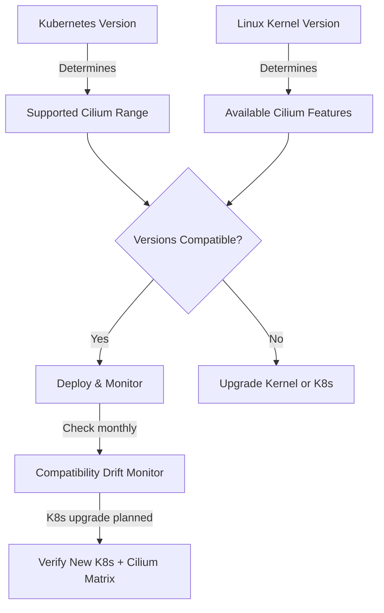

# Cilium Kubernetes Compatibility: Configure, Troubleshoot, Validate, and Monitor

Author: [nawazdhandala](https://github.com/nawazdhandala)

Tags: Cilium, Kubernetes, Networking, eBPF, IPAM

Description: Understand Cilium's Kubernetes version compatibility requirements, how to configure your cluster for supported versions, troubleshoot compatibility issues, and validate correct operation across...

---

## Introduction

Cilium's tight integration with the Kubernetes API and its use of eBPF kernel features means that specific Cilium versions are compatible with specific Kubernetes and Linux kernel versions. Using incompatible versions can result in silent failures, degraded networking performance, or complete loss of connectivity. Understanding the compatibility matrix before installing or upgrading Cilium is critical for cluster stability.

Cilium publishes the Kubernetes minor versions that are tested and guaranteed for each release. Kernel support requirements vary by feature: Cilium 1.15 requires Linux kernel 4.19.57 or equivalent, while features such as WireGuard encryption, bandwidth management, and BPF host routing require newer kernels. The Cilium documentation maintains an up-to-date compatibility table that must be consulted before any deployment.

This guide explains how to check and configure compatibility requirements, diagnose version-related issues, validate that your environment meets all requirements, and monitor for compatibility drift over time.

## Prerequisites

- Access to the Cilium compatibility table at https://docs.cilium.io/en/stable/network/kubernetes/compatibility/
- `kubectl` with cluster admin access
- Node access for kernel version verification
- Target Cilium version identified

## Configure for Kubernetes Compatibility

Verify Kubernetes version against Cilium support matrix:

```bash
# Check current Kubernetes version

kubectl version -o json | jq -r '.serverVersion.gitVersion'
# Server Version: v1.29.x

# Check current Cilium version
cilium version

# Cilium 1.15.x supports:
# - Kubernetes 1.26, 1.27, 1.28, 1.29
# - Linux kernel 4.19.57+ or equivalent, such as 4.18 on RHEL 8

# Check kernel versions across all nodes
kubectl get nodes -o jsonpath='{range .items[*]}{.metadata.name}{"\t"}{.status.nodeInfo.kernelVersion}{"\n"}{end}'
```

Install Cilium matching your Kubernetes version:

```bash
# For Kubernetes 1.29
helm install cilium cilium/cilium \
  --version 1.15.19 \
  --namespace kube-system \
  --set kubeProxyReplacement=true \
  --set k8sServiceHost=$(kubectl get endpoints kubernetes -o jsonpath='{.subsets[0].addresses[0].ip}') \
  --set k8sServicePort=6443

# For Kubernetes 1.27, Cilium 1.15 is also in the tested compatibility range
helm install cilium cilium/cilium \
  --version 1.15.19 \
  --namespace kube-system

# Verify Cilium status from the Cilium CLI
cilium status --verbose
```

## Troubleshoot Compatibility Issues

Identify and resolve version incompatibilities:

```bash
# Check for Kubernetes API compatibility errors
kubectl -n kube-system logs ds/cilium | grep -i "kubernetes\|k8s\|api\|version\|deprecated"

# Identify warnings from Cilium's cluster status
cilium status --verbose | grep -i warning

# Check if Cilium is using removed APIs
kubectl get events -n kube-system | grep -i "deprecated\|removed"

# Verify feature gates are compatible
kubectl -n kube-system get configmap cilium-config -o yaml | grep -i feature
```

Resolve Kubernetes version-related errors:

```bash
# Issue: Required Kubernetes APIs are not available
kubectl api-versions | grep -E 'discovery.k8s.io/v1|networking.k8s.io/v1|cilium.io/v2'
# If required APIs are missing, use a Kubernetes version listed in Cilium's compatibility matrix

# Issue: CRD version incompatibility
kubectl get crd ciliumnetworkpolicies.cilium.io -o jsonpath='{.spec.versions[*].name}'

# Issue: Kernel feature not supported
kubectl -n kube-system logs ds/cilium | grep "not supported\|fallback"
# Disable unsupported features explicitly, or leave kube-proxy installed
helm upgrade cilium cilium/cilium \
  --namespace kube-system \
  --reuse-values \
  --set kubeProxyReplacement=false
```

## Validate Compatibility

Run comprehensive compatibility validation:

```bash
# Check cluster status with the Cilium CLI
cilium status --verbose

# Check agent status from a Cilium pod
kubectl -n kube-system exec ds/cilium -- cilium-dbg status --verbose

# Check all nodes report compatible kernel
kubectl get nodes -o json | jq -r '.items[] | "\(.metadata.name): \(.status.nodeInfo.kernelVersion)"'

# Verify enabled features reported by the Cilium CLI
cilium features status

# Run connectivity test to validate end-to-end
cilium connectivity test

# Validate CRD schema versions
kubectl get crd -o json | jq '.items[] | select(.metadata.name | contains("cilium")) | {name: .metadata.name, versions: [.spec.versions[].name]}'
```

Check feature-specific kernel requirements:

```bash
# WireGuard requires kernel >= 5.6
# Bandwidth Manager requires kernel >= 5.1
# Socket-level LB bypass in pod netns requires kernel >= 5.7
# BPF-based host routing requires kernel >= 5.10

NODE_KERNEL=$(kubectl get nodes -o jsonpath='{.items[0].status.nodeInfo.kernelVersion}' | grep -oP '^\d+\.\d+')
kernel_at_least() {
  local required_major=$1
  local required_minor=$2
  local kernel_major=${NODE_KERNEL%%.*}
  local kernel_minor=${NODE_KERNEL#*.}

  [ "$kernel_major" -gt "$required_major" ] || \
    { [ "$kernel_major" -eq "$required_major" ] && [ "$kernel_minor" -ge "$required_minor" ]; }
}

echo "Your kernel: $NODE_KERNEL"
echo "Feature support:"
echo "- WireGuard: $(kernel_at_least 5 6 && echo "Supported" || echo "Not supported")"
echo "- Bandwidth Manager: $(kernel_at_least 5 1 && echo "Supported" || echo "Not supported")"
echo "- Socket-level LB bypass in pod netns: $(kernel_at_least 5 7 && echo "Supported" || echo "Not supported")"
echo "- BPF-based host routing: $(kernel_at_least 5 10 && echo "Supported" || echo "Not supported")"
```

## Monitor Compatibility Health


```mermaid
graph TD
    A[Kubernetes Version] -->|Determines| B[Supported Cilium Range]
    C[Linux Kernel Version] -->|Determines| D[Available Cilium Features]
    B --> E{Versions Compatible?}
    D --> E
    E -->|Yes| F[Deploy & Monitor]
    E -->|No| G[Upgrade Kernel or K8s]
    F -->|Check monthly| H[Compatibility Drift Monitor]
    H -->|K8s upgrade planned| I[Verify New K8s + Cilium Matrix]
```

Set up ongoing compatibility monitoring:

```bash
# Monitor for Kubernetes API deprecation warnings
kubectl -n kube-system logs -l k8s-app=cilium | grep -i deprecat | sort -u

# Watch for kernel-related capability warnings
kubectl -n kube-system logs -l k8s-app=cilium --since=24h | grep -i "kernel\|fallback\|unavailable"

# Create a CronJob to check compatibility weekly
kubectl apply -f - <<EOF
apiVersion: batch/v1
kind: CronJob
metadata:
  name: cilium-compat-check
  namespace: kube-system
spec:
  schedule: "0 9 * * 1"
  jobTemplate:
    spec:
      template:
        spec:
          serviceAccountName: cilium
          containers:
          - name: check
            image: quay.io/cilium/cilium-cli-ci:v0.16.24
            command: ["cilium", "status", "--verbose"]
          restartPolicy: Never
EOF
```

## Conclusion

Cilium's compatibility with Kubernetes and Linux kernel versions is well-documented and must be verified before any installation or upgrade. Each Cilium minor version publishes its tested Kubernetes compatibility range, and kernel support requirements are feature-dependent. Regular compatibility audits, especially before Kubernetes upgrades, prevent unexpected networking failures. The Cilium preflight check is your best tool for automated readiness validation before any major change.
