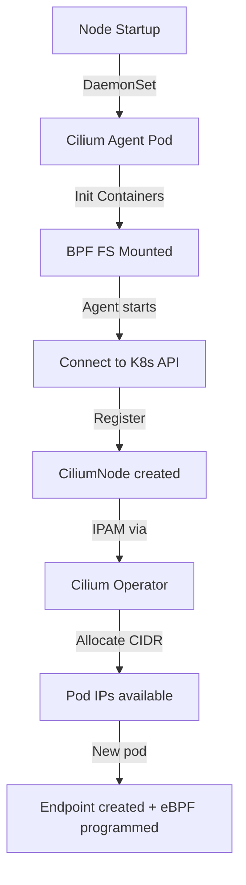

# Deployment in Cilium Kubernetes Networking

Author: [nawazdhandala](https://github.com/nawazdhandala)

Tags: Cilium, Kubernetes, Networking, eBPF, IPAM

Description: A complete guide to deploying Cilium in Kubernetes clusters covering installation methods, deployment topologies, common deployment issues, validation procedures, and production monitoring.

---

## Introduction

Deploying Cilium in Kubernetes involves more than simply running `helm install`. The deployment topology, component configuration, and integration with the underlying infrastructure all significantly affect how Cilium operates at scale. Cilium deploys as a DaemonSet (the `cilium` agent) and a Deployment (the `cilium-operator`), with optional components including Hubble Relay, Hubble UI, and the Cilium Node Init container.

The deployment must account for the cluster's networking environment: whether you're on bare metal, a managed cloud provider, using overlays or native routing, and whether you're replacing kube-proxy. Each environment has specific configuration requirements. The Cilium Operator manages cluster-wide state like IPAM pools, node CIDRs, and Cilium identity garbage collection. Without a healthy Operator, new pods may fail to receive IP addresses.

This guide covers deploying Cilium across different environments, resolving deployment failures, validating a successful deployment, and monitoring ongoing deployment health.

## Prerequisites

- Kubernetes cluster with cluster admin access
- Helm 3.x installed
- `kubectl` configured
- Linux kernel 4.19.57+ on all nodes (5.10+ recommended)
- BPF filesystem available on nodes

## Configure Cilium Deployment

Deploy Cilium for different environments:

```bash
# Add Cilium Helm repository
helm repo add cilium https://helm.cilium.io/
helm repo update

# Basic deployment for managed Kubernetes (GKE, EKS, AKS)
helm install cilium cilium/cilium \
  --version 1.15.6 \
  --namespace kube-system \
  --set ipam.mode=kubernetes

# Deployment for bare-metal with kube-proxy replacement
helm install cilium cilium/cilium \
  --version 1.15.6 \
  --namespace kube-system \
  --set kubeProxyReplacement=true \
  --set k8sServiceHost=<control-plane-ip> \
  --set k8sServicePort=6443 \
  --set ipam.mode=cluster-pool \
  --set ipam.operator.clusterPoolIPv4PodCIDRList="{10.244.0.0/16}" \
  --set ipam.operator.clusterPoolIPv4MaskSize=24

# Production deployment with full observability
helm install cilium cilium/cilium \
  --version 1.15.6 \
  --namespace kube-system \
  --set hubble.relay.enabled=true \
  --set hubble.ui.enabled=true \
  --set hubble.metrics.enabled="{dns,drop,tcp,flow,icmp,http}" \
  --set prometheus.enabled=true \
  --set operator.prometheus.enabled=true
```

Verify deployment components:

```bash
# Check all Cilium pods are running
kubectl -n kube-system get pods -l k8s-app=cilium
kubectl -n kube-system get pods -l name=cilium-operator
kubectl -n kube-system get pods -l k8s-app=hubble-relay
kubectl -n kube-system get pods -l k8s-app=hubble-ui

# Verify DaemonSet coverage (all nodes should have a Cilium pod)
kubectl -n kube-system get ds cilium
NODE_COUNT=$(kubectl get nodes --no-headers | wc -l)
CILIUM_COUNT=$(kubectl -n kube-system get pods -l k8s-app=cilium --no-headers | grep Running | wc -l)
echo "Nodes: $NODE_COUNT, Cilium pods: $CILIUM_COUNT"
```

## Troubleshoot Deployment Issues

Diagnose common deployment failures:

```bash
# Cilium pods stuck in Init state
kubectl -n kube-system describe pod <cilium-pod>
# Check init containers: config, mount-cgroup, apply-sysctl, mount-bpf-fs

# Check BPF filesystem mount
kubectl -n kube-system logs <cilium-pod> -c mount-bpf-fs
# Error: "failed to mount BPF filesystem" means BPF not available

# Cilium Operator not starting
kubectl -n kube-system logs -l name=cilium-operator
# Common: RBAC permissions missing, etcd connectivity issues

# Node not getting CIDR assigned
kubectl get ciliumnodes
kubectl -n kube-system logs -l name=cilium-operator | grep -i "cidr\|ipam\|allocat"

# Pods stuck in ContainerCreating (CNI failure)
kubectl describe pod <stuck-pod>
# Look for: "network: failed to configure netns"
kubectl -n kube-system logs <cilium-pod-on-node> | grep -i "cni\|endpoint\|error"
```

Fix deployment-level issues:

```bash
# Fix: BPF filesystem not mounted
# Add to node startup or DaemonSet init container
mount bpffs /sys/fs/bpf -t bpf

# Fix: RBAC permissions missing
kubectl get clusterrolebinding cilium -o yaml
helm upgrade cilium cilium/cilium --namespace kube-system --reuse-values

# Fix: Operator not connecting to K8s API
kubectl -n kube-system exec -it <operator-pod> -- \
  curl -k https://kubernetes.default.svc.cluster.local/healthz
```

## Validate Deployment

Comprehensive deployment validation:

```bash
# Official Cilium health check
cilium status

# Check all components report healthy
cilium status --output json | jq '{
  cilium: .cilium.state,
  controllers: (.controllers | map(select(.status.last_failure_msg != "")) | length),
  endpoints: .cilium.endpoint_count
}'

# Validate CNI is active
kubectl get pods -A | grep ContainerCreating
# Should be empty or resolve quickly

# Run full connectivity test
cilium connectivity test

# Verify eBPF programs loaded
kubectl -n kube-system exec ds/cilium -- cilium bpf perf list
```

## Monitor Deployment Health



Set up deployment monitoring:

```bash
# Monitor Cilium pod restarts (indicates instability)
kubectl -n kube-system get pods -l k8s-app=cilium -o wide
watch -n30 "kubectl -n kube-system get pods -l k8s-app=cilium --no-headers | awk '{print \$1, \$3, \$4}'"

# Key Prometheus metrics for deployment health
# up{job="cilium-agent"} - agent availability
# up{job="cilium-operator"} - operator availability
# cilium_endpoint_count - total managed endpoints
# process_resident_memory_bytes{job="cilium-agent"} - memory usage

# Alert on Cilium agent down
kubectl apply -f - <<EOF
apiVersion: monitoring.coreos.com/v1
kind: PrometheusRule
metadata:
  name: cilium-deployment-alerts
  namespace: kube-system
spec:
  groups:
  - name: cilium
    rules:
    - alert: CiliumAgentDown
      expr: up{job="cilium-agent"} == 0
      for: 2m
      labels:
        severity: critical
      annotations:
        summary: "Cilium agent is down on {{ \$labels.instance }}"
EOF
```

## Conclusion

Successful Cilium deployment requires careful attention to node prerequisites, environment-specific configuration, and component health validation. The Cilium DaemonSet and Operator work together to provide networking for every pod in your cluster, making their health critical to overall cluster operation. Use `cilium status` and `cilium connectivity test` as your primary validation tools after deployment, and set up Prometheus alerts on agent availability to catch issues before they impact workloads.
