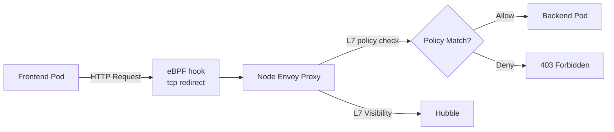

# Cilium L7 Network Policies

Author: [nawazdhandala](https://github.com/nawazdhandala)

Tags: Cilium, Kubernetes, Network Policy, L7, eBPF

Description: Implement application-layer network policies in Cilium that filter traffic based on HTTP methods, paths, headers, and gRPC methods rather than just IP addresses and ports.

---

## Introduction

Standard Kubernetes NetworkPolicy operates at L3/L4, meaning it can only allow or deny traffic based on IP addresses, pod selectors, and port numbers. This leaves a significant security gap: once you allow traffic on port 80 to a backend service, any HTTP method to any path is permitted. A compromised frontend can make DELETE requests, access admin endpoints, or probe internal APIs.

Cilium's L7 network policies close this gap by extending policy enforcement to the application layer. Using its Envoy integration, Cilium can inspect HTTP request headers, match on URL paths and methods, parse gRPC service and method names, and even decode Kafka topic access. L7 policies are expressed in the same `CiliumNetworkPolicy` CRD as L3/L4 policies, making them part of a unified, declarative policy model.

This guide covers configuring HTTP, gRPC, and header-based L7 policies, and explains how Cilium intercepts L7 traffic transparently without requiring application changes.

## Prerequisites

- Cilium v1.12+ with L7 proxy support
- `kubectl` installed
- Sample HTTP backend and frontend deployments

## Step 1: HTTP Path and Method Filtering

Allow only GET requests to the `/api/` path:

```yaml
apiVersion: cilium.io/v2
kind: CiliumNetworkPolicy
metadata:
  name: http-l7-policy
  namespace: production
spec:
  endpointSelector:
    matchLabels:
      app: api-backend
  ingress:
    - fromEndpoints:
        - matchLabels:
            app: frontend
      toPorts:
        - ports:
            - port: "8080"
              protocol: TCP
          rules:
            http:
              - method: "GET"
                path: "/api/.*"
              - method: "POST"
                path: "/api/v1/data"
```

## Step 2: HTTP Header-Based Policy

Enforce that requests include a specific header:

```yaml
toPorts:
  - ports:
      - port: "8080"
        protocol: TCP
    rules:
      http:
        - method: "GET"
          path: "/internal/.*"
          headers:
            - "X-Internal-Token: .*"
```

## Step 3: gRPC Method-Level Policies

Allow only specific gRPC service methods:

```yaml
apiVersion: cilium.io/v2
kind: CiliumNetworkPolicy
metadata:
  name: grpc-method-policy
  namespace: production
spec:
  endpointSelector:
    matchLabels:
      app: grpc-server
  ingress:
    - fromEndpoints:
        - matchLabels:
            role: grpc-client
      toPorts:
        - ports:
            - port: "50051"
              protocol: TCP
          rules:
            http:
              - method: POST
                path: "/com.example.UserService/GetUser"
              - method: POST
                path: "/com.example.UserService/ListUsers"
              # Deny: /com.example.UserService/DeleteUser
```

## Step 4: Validate L7 Policy Enforcement

```bash
# Test allowed path
kubectl exec frontend -- curl http://api-backend:8080/api/users

# Test denied path (should return 403)
kubectl exec frontend -- curl -X DELETE http://api-backend:8080/api/users/1

# Observe L7 policy drops in Hubble
hubble observe --namespace production --verdict DROPPED --type l7
```

## Step 5: Enable L7 Visibility for Debugging

```bash
# Add visibility annotation to see all L7 traffic
kubectl annotate pod api-backend-xxx \
  "policy.cilium.io/proxy-visibility"="+ingress:8080/TCP/HTTP"

# Watch L7 flows
hubble observe --pod production/api-backend-xxx --type l7
```

## L7 Policy Enforcement Architecture



## Conclusion

Cilium L7 network policies extend Kubernetes security from the network layer to the application layer, enabling fine-grained access control based on HTTP methods, URL paths, headers, and gRPC methods. The enforcement is transparent to applications — no code changes, no sidecar injection per pod, just eBPF hooks that redirect L7 traffic through a shared Envoy proxy. Combining L3/L4 and L7 policies in a single `CiliumNetworkPolicy` gives you a complete, unified security model from IP routing to API access control.
