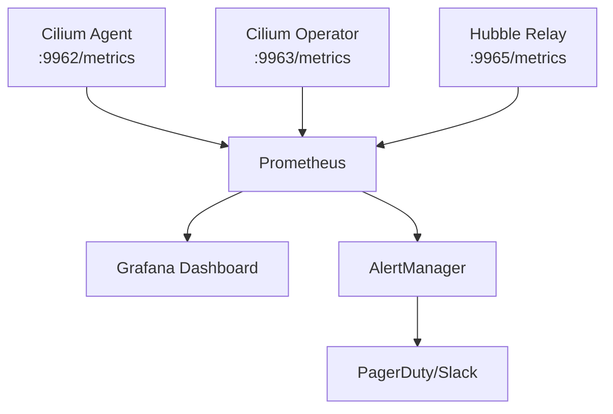

# Cilium Metrics with Prometheus

Author: [nawazdhandala](https://github.com/nawazdhandala)

Tags: Cilium, Kubernetes, Prometheus, Metrics, Observability

Description: Configure Prometheus to scrape Cilium and Hubble metrics, understand the key metrics for cluster health monitoring, and set up alerting rules for critical Cilium conditions.

---

## Introduction

Cilium exposes a comprehensive set of Prometheus metrics covering data plane performance (packet throughput, drop rates, conntrack usage), control plane health (endpoint policy calculation latency, BGP session state, Kubernetes API sync status), and Hubble flow statistics (flow rates per protocol, policy verdict distributions). These metrics give you quantitative visibility into both the health of Cilium itself and the network behavior of your cluster workloads.

Unlike application metrics that tell you about business logic, Cilium metrics tell you about the network infrastructure that all your applications depend on. A spike in `cilium_drop_count_total` might indicate a network policy misconfiguration causing application errors. High `cilium_endpoint_regenerations_total` latency might explain slow pod startup times. Understanding these metrics and setting appropriate alerts is as important as monitoring your application SLIs.

This guide covers enabling Cilium's Prometheus metrics endpoint, configuring Prometheus scraping, and defining alerting rules for the most important Cilium health indicators.

## Prerequisites

- Cilium v1.10+ installed
- Prometheus Operator or standalone Prometheus running in the cluster
- Grafana (optional) for dashboards
- `kubectl` installed

## Step 1: Enable Prometheus Metrics in Cilium

```bash
helm upgrade cilium cilium/cilium \
  --namespace kube-system \
  --reuse-values \
  --set prometheus.enabled=true \
  --set prometheus.port=9962 \
  --set operator.prometheus.enabled=true \
  --set operator.prometheus.port=9963 \
  --set hubble.metrics.enableOpenMetrics=true \
  --set hubble.metrics.enabled="{dns,drop,tcp,flow,port-distribution,icmp,httpV2:exemplars=true;labelsContext=source_ip\,source_namespace\,source_workload\,destination_ip\,destination_namespace\,destination_workload\,traffic_direction}"
```

## Step 2: Configure Prometheus Scraping

With Prometheus Operator, create a ServiceMonitor:

```yaml
apiVersion: monitoring.coreos.com/v1
kind: ServiceMonitor
metadata:
  name: cilium-agent
  namespace: monitoring
  labels:
    app: cilium
spec:
  namespaceSelector:
    matchNames:
      - kube-system
  selector:
    matchLabels:
      k8s-app: cilium
  endpoints:
    - port: prometheus
      interval: 30s
      path: /metrics
---
apiVersion: monitoring.coreos.com/v1
kind: ServiceMonitor
metadata:
  name: cilium-operator
  namespace: monitoring
spec:
  namespaceSelector:
    matchNames:
      - kube-system
  selector:
    matchLabels:
      name: cilium-operator
  endpoints:
    - port: prometheus
      interval: 30s
```

## Step 3: Key Metrics to Monitor

```bash
# Drop rate (policy violations or dataplane issues)
cilium_drop_count_total

# Endpoint policy calculation time
cilium_policy_regeneration_time_stats_seconds

# Number of active endpoints
cilium_endpoint_state

# BPF map pressure (approaching capacity)
cilium_bpf_map_ops_total

# Hubble flow processing rate
hubble_flows_processed_total

# BGP session state
cilium_bgp_session_state

# Policy import errors
cilium_policy_import_errors_total
```

## Step 4: Prometheus Alerting Rules

```yaml
apiVersion: monitoring.coreos.com/v1
kind: PrometheusRule
metadata:
  name: cilium-alerts
  namespace: monitoring
spec:
  groups:
    - name: cilium
      rules:
        - alert: CiliumDropsHigh
          expr: |
            rate(cilium_drop_count_total[5m]) > 100
          for: 2m
          labels:
            severity: warning
          annotations:
            summary: "High drop rate on {{ $labels.node }}"
            description: "Cilium drop rate is {{ $value }} drops/sec on {{ $labels.node }}"

        - alert: CiliumEndpointNotReady
          expr: |
            cilium_endpoint_state{state!="ready"} > 0
          for: 5m
          labels:
            severity: critical
          annotations:
            summary: "Cilium endpoint not ready"

        - alert: CiliumPolicyImportErrors
          expr: |
            increase(cilium_policy_import_errors_total[5m]) > 0
          labels:
            severity: critical
          annotations:
            summary: "Cilium policy import error detected"
```

## Step 5: Verify Metrics are Scraped

```bash
# Port-forward to Cilium agent metrics
kubectl port-forward -n kube-system ds/cilium 9962:9962

# Check raw metrics
curl -s http://localhost:9962/metrics | grep cilium_drop

# Query in Prometheus
# http://prometheus:9090/graph?g0.expr=rate(cilium_drop_count_total[5m])
```

## Metrics Architecture



## Conclusion

Cilium's Prometheus metrics provide quantitative visibility into your Kubernetes network infrastructure. The drop rate metrics (`cilium_drop_count_total`) are the most critical to alert on - unexpected drops indicate security policy changes affecting legitimate traffic or data plane errors. Endpoint regeneration metrics help diagnose slow policy propagation during deployments, while BPF map operation metrics warn about capacity limits before they become service-affecting. Integrate Cilium metrics into the same Prometheus and Grafana setup as your application metrics for a unified observability platform.
