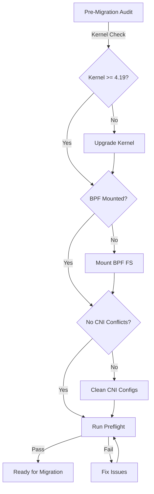

# Cilium CNI Migration Pre-Requisites: Configure, Troubleshoot, Validate, and Monitor

Author: [nawazdhandala](https://github.com/nawazdhandala)

Tags: Cilium, Kubernetes, Networking, CNI, Migration

Description: A comprehensive guide to the prerequisites needed before migrating your Kubernetes cluster's CNI plugin to Cilium, covering configuration, troubleshooting, validation, and monitoring steps.

---

## Introduction

Migrating your Kubernetes cluster's CNI to Cilium is a significant infrastructure change that requires careful preparation. Before any migration begins, you must audit your current networking configuration, verify compatibility, and ensure your cluster meets Cilium's requirements. Rushing into a migration without fulfilling prerequisites is the leading cause of networking outages.

Cilium requires specific kernel versions, Linux capabilities, and filesystem mounts to leverage its eBPF-based dataplane. Additionally, the current CNI plugin must be properly quiesced and its IPAM state reconciled before Cilium takes over. Understanding these prerequisites in depth reduces migration risk and ensures a smooth transition.

This guide covers all prerequisites needed before initiating a Cilium CNI migration: what to configure, how to diagnose missing requirements, how to validate readiness, and how to monitor your cluster's health during the pre-migration phase.

## Prerequisites

- Kubernetes cluster running version 1.21 or later
- Linux kernel 4.19.57 or later (5.10+ recommended for full feature set)
- `kubectl` with cluster admin permissions
- SSH or node access for kernel and filesystem checks
- Current CNI plugin documentation for proper teardown procedures

## Configure Pre-Migration Requirements

Ensure your nodes meet the kernel and system requirements:

```bash
# Check kernel version on all nodes
kubectl get nodes -o wide
kubectl debug node/<node-name> -it --image=ubuntu -- uname -r

# Verify BPF filesystem is mountable
kubectl debug node/<node-name> -it --image=ubuntu -- \
  bash -c "mount | grep bpf || echo 'BPF filesystem not mounted'"

# Check required kernel modules
kubectl debug node/<node-name> -it --image=ubuntu -- \
  bash -c "lsmod | grep -E 'ip_tables|xt_'"

# Verify ip_forward is enabled
kubectl debug node/<node-name> -it --image=ubuntu -- \
  sysctl net.ipv4.ip_forward
```

Configure nodes to meet requirements:

```bash
# Enable BPF filesystem (run on each node)
mount bpffs /sys/fs/bpf -t bpf

# Make it persistent via /etc/fstab
echo "none /sys/fs/bpf bpf rw,nosuid,nodev,noexec,relatime,mode=700 0 0" >> /etc/fstab

# Enable IP forwarding
sysctl -w net.ipv4.ip_forward=1
echo "net.ipv4.ip_forward = 1" >> /etc/sysctl.d/99-cilium.conf
```

Prepare Helm configuration for the migration:

```bash
# Add Cilium Helm repo
helm repo add cilium https://helm.cilium.io/
helm repo update

# Generate migration-specific values
cat > cilium-migration-values.yaml <<EOF
# Match existing cluster CIDR
ipam:
  mode: "cluster-pool"
  operator:
    clusterPoolIPv4PodCIDRList:
      - "10.244.0.0/16"
    clusterPoolIPv4MaskSize: 24

# Enable during migration to coexist with existing CNI
tunnel: "vxlan"
policyEnforcementMode: "never"

# Required for migration
nodeinit:
  enabled: true
EOF
```

## Troubleshoot Pre-Migration Issues

Diagnose common pre-migration blocking issues:

```bash
# Issue: Kernel version too old
kubectl get nodes -o jsonpath='{range .items[*]}{.metadata.name}{"\t"}{.status.nodeInfo.kernelVersion}{"\n"}{end}'

# Issue: Missing privileges for eBPF
# Check if containers can use eBPF
kubectl -n kube-system exec ds/cilium -- cilium status 2>&1 | grep -i "error\|failed"

# Issue: Conflicting CNI configurations
ls /etc/cni/net.d/
# Multiple CNI configs can cause issues - ensure only one active config

# Issue: Existing pod IPs that will conflict
kubectl get pods -A -o wide | awk '{print $7}' | sort | uniq -c | sort -rn | head
```

Resolve common pre-migration blockers:

```bash
# Remove conflicting CNI configs
# (Do this only during planned maintenance)
ls /etc/cni/net.d/
# Keep only the current active CNI, remove others

# Verify no port conflicts with Cilium
# Cilium uses ports: 4240 (health), 4244 (Hubble), 4245 (Hubble Relay)
ss -tlnp | grep -E "4240|4244|4245"

# Check for existing Cilium remnants from previous installs
kubectl get crd | grep cilium
kubectl get ns | grep cilium
```

## Validate Pre-Migration Readiness

Run a comprehensive readiness check:

```bash
# Use Cilium's preflight check
helm install cilium-preflight cilium/cilium \
  --namespace kube-system \
  --set preflight.enabled=true \
  --set agent=false \
  --set operator.enabled=false

# Check preflight results
kubectl -n kube-system get pods -l k8s-app=cilium-pre-flight-check
kubectl -n kube-system logs -l k8s-app=cilium-pre-flight-check

# Remove preflight after check
helm uninstall cilium-preflight -n kube-system
```

Validate cluster networking inventory:

```bash
# Document current pod CIDRs
kubectl get nodes -o jsonpath='{range .items[*]}{.metadata.name}{"\t"}{.spec.podCIDR}{"\n"}{end}'

# Document current services
kubectl get svc -A -o wide

# Check for NodePort conflicts
kubectl get svc -A | grep NodePort

# Verify etcd connectivity (critical for CNI state)
kubectl -n kube-system get pods | grep etcd
```

## Monitor Pre-Migration State



Establish baseline metrics before migration:

```bash
# Capture baseline network performance
kubectl run baseline-test --image=nicolaka/netshoot -it --rm -- \
  iperf3 -c <target-ip> -t 30

# Document DNS resolution times
kubectl run dns-test --image=curlimages/curl -it --rm -- \
  time nslookup kubernetes.default.svc.cluster.local

# Record current CNI resource usage
kubectl top pods -n kube-system -l k8s-app=<current-cni>
kubectl top nodes
```

## Conclusion

Thorough pre-migration preparation is the foundation of a successful Cilium CNI migration. By verifying kernel versions, mounting the BPF filesystem, resolving configuration conflicts, and running Cilium's preflight checks, you eliminate the most common migration failure modes. Document your baseline state carefully so you have a clear comparison point after migration completes. Only proceed to the migration procedure once all prerequisite checks pass cleanly.
