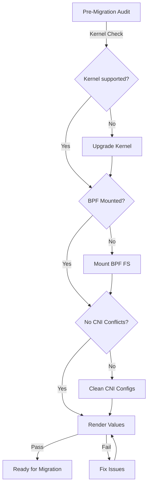

# Cilium CNI Migration Prerequisites

Author: [nawazdhandala](https://github.com/nawazdhandala)

Tags: Cilium, Kubernetes, Networking, CNI, Migration

Description: A comprehensive guide to the prerequisites needed before migrating your Kubernetes cluster's CNI plugin to Cilium, covering configuration, troubleshooting, validation, and monitoring steps.

---

## Introduction

Migrating your Kubernetes cluster's CNI to Cilium is a significant infrastructure change that requires careful preparation. Before any migration begins, you must audit your current networking configuration, verify compatibility, and ensure your cluster meets Cilium's requirements. Rushing into a migration without fulfilling prerequisites is the leading cause of networking outages.

Cilium requires specific kernel versions, Linux capabilities, and filesystem mounts to leverage its eBPF-based dataplane. Additionally, the current CNI plugin must be properly quiesced and a separate Cilium pod CIDR selected before Cilium takes over. Understanding these prerequisites in depth reduces migration risk and ensures a smooth transition.

This guide covers the core prerequisites needed before initiating a Cilium CNI migration: what to configure, how to diagnose missing requirements, how to validate readiness, and how to monitor your cluster's health during the pre-migration phase.

## Prerequisites

- Kubernetes cluster running a version supported by your target Cilium release (for Cilium 1.19, Kubernetes 1.31 through 1.34 are tested and supported)
- Linux kernel 5.10 or later, or a documented distribution-equivalent kernel such as RHEL 8.10's 4.18 kernel
- `kubectl` with cluster admin permissions
- SSH or node access for kernel and filesystem checks
- Current CNI plugin documentation for proper teardown procedures

## Configure Pre-Migration Requirements

Ensure your nodes meet the kernel and system requirements:

```bash
# Check kernel version on all nodes

kubectl get nodes -o wide
kubectl debug node/<node-name> -it --image=ubuntu -- uname -r

# Verify BPF filesystem is mounted
kubectl debug node/<node-name> -it --image=ubuntu -- \
  bash -c "mount | grep bpf || echo 'BPF filesystem not mounted'"

# Check key kernel configuration options
kubectl debug node/<node-name> -it --image=ubuntu -- \
  bash -c 'zgrep -E "CONFIG_BPF=|CONFIG_BPF_SYSCALL=|CONFIG_CGROUP_BPF=|CONFIG_VXLAN=|CONFIG_GENEVE=|CONFIG_FIB_RULES=" /proc/config.gz 2>/dev/null || grep -E "CONFIG_BPF=|CONFIG_BPF_SYSCALL=|CONFIG_CGROUP_BPF=|CONFIG_VXLAN=|CONFIG_GENEVE=|CONFIG_FIB_RULES=" /host/boot/config-$(uname -r)'

# Verify ip_forward is enabled
kubectl debug node/<node-name> -it --image=ubuntu -- \
  sysctl net.ipv4.ip_forward
```

Configure nodes to meet requirements:

```bash
# Enable BPF filesystem (run on each node)
mount bpffs /sys/fs/bpf -t bpf

# Make it persistent via /etc/fstab
echo "bpffs /sys/fs/bpf bpf defaults 0 0" >> /etc/fstab

# Enable IP forwarding
sysctl -w net.ipv4.ip_forward=1
echo "net.ipv4.ip_forward = 1" >> /etc/sysctl.d/99-cilium.conf
```

Prepare Helm configuration for the migration:

```bash
# Add Cilium Helm repo
helm repo add cilium https://helm.cilium.io/
helm repo update

# Generate migration-specific values
cat > cilium-migration-values.yaml <<EOF
# Use a new, distinct cluster CIDR
ipam:
  mode: "cluster-pool"
  operator:
    clusterPoolIPv4PodCIDRList:
      - "10.245.0.0/16"
    clusterPoolIPv4MaskSize: 24

# Enable during migration to coexist with existing CNI.
# Choose a distinct tunnel protocol or port if the existing CNI also uses VXLAN.
routingMode: "tunnel"
tunnelProtocol: "vxlan"
tunnelPort: 8473
policyEnforcementMode: "never"
bpf:
  hostLegacyRouting: true
cni:
  customConf: true
  uninstall: false
operator:
  unmanagedPodWatcher:
    restart: false

# Optional: run node initialization tasks before Cilium starts on each node
nodeinit:
  enabled: true
EOF
```

## Troubleshoot Pre-Migration Issues

Diagnose common pre-migration blocking issues:

```bash
# Issue: Kernel version too old
kubectl get nodes -o jsonpath='{range .items[*]}{.metadata.name}{"\t"}{.status.nodeInfo.kernelVersion}{"\n"}{end}'

# Issue: Cilium agent cannot use eBPF
# Check Cilium status after the preflight or initial migration install exists
kubectl -n kube-system exec ds/cilium -- cilium status 2>&1 | grep -i "error\|failed"

# Issue: Conflicting CNI configurations
kubectl debug node/<node-name> -it --image=ubuntu -- ls /host/etc/cni/net.d/
# Multiple CNI configs can cause issues - ensure only one active config

# Issue: Existing pod IPs that will conflict
kubectl get pods -A -o wide | awk '{print $7}' | sort | uniq -c | sort -rn | head
```

Resolve common pre-migration blockers:

```bash
# Remove conflicting CNI configs
# (Do this only during planned maintenance)
kubectl debug node/<node-name> -it --image=ubuntu -- ls /host/etc/cni/net.d/
# Keep only the current active CNI, remove others

# Verify no port conflicts with Cilium
# Cilium uses ports: 4240 (health), 4244 (Hubble), 4245 (Hubble Relay)
ss -tlnp | grep -E "4240|4244|4245"

# Check for existing Cilium remnants from previous installs
kubectl get crd | grep cilium
kubectl get ns | grep cilium
```

## Validate Pre-Migration Readiness

Render and review the migration Helm values:

```bash
# Let the Cilium CLI auto-detect additional Helm values
cilium install --version <target-cilium-version> \
  --values cilium-migration-values.yaml \
  --dry-run-helm-values > values-initial.yaml

# Render the target manifests without applying them
helm template cilium cilium/cilium \
  --version <target-cilium-version> \
  --namespace kube-system \
  --values values-initial.yaml > cilium-rendered.yaml
```

Validate cluster networking inventory:

```bash
# Document current pod CIDRs
kubectl get nodes -o jsonpath='{range .items[*]}{.metadata.name}{"\t"}{.spec.podCIDR}{"\n"}{end}'

# Document current services
kubectl get svc -A -o wide

# Check for NodePort conflicts
kubectl get svc -A | grep NodePort

# Verify Kubernetes API readiness
kubectl get --raw=/readyz
```

## Monitor Pre-Migration State


```mermaid
graph TD
    A[Pre-Migration Audit] -->|Kernel Check| B{Kernel supported?}
    B -->|No| C[Upgrade Kernel]
    B -->|Yes| D{BPF Mounted?}
    D -->|No| E[Mount BPF FS]
    D -->|Yes| F{No CNI Conflicts?}
    F -->|No| G[Clean CNI Configs]
    F -->|Yes| H[Render Values]
    H -->|Pass| I[Ready for Migration]
    H -->|Fail| J[Fix Issues]
    C --> D
    E --> F
    G --> H
    J --> H
```

Establish baseline metrics before migration:

```bash
# Capture baseline network performance
kubectl run baseline-test --image=ghcr.io/nicolaka/netshoot:v0.8 -it --rm --restart=Never -- \
  iperf3 -c <target-ip> -t 30

# Document DNS resolution times
kubectl run dns-test --image=ghcr.io/nicolaka/netshoot:v0.8 -it --rm --restart=Never -- \
  /bin/sh -c 'time nslookup kubernetes.default.svc.cluster.local'

# Record current CNI resource usage
kubectl top pods -n kube-system -l k8s-app=<current-cni>
kubectl top nodes
```

## Conclusion

Thorough pre-migration preparation is the foundation of a successful Cilium CNI migration. By verifying kernel versions, checking the BPF filesystem, resolving configuration conflicts, and rendering Cilium's migration values before applying them, you eliminate the most common migration failure modes. Document your baseline state carefully so you have a clear comparison point after migration completes. Only proceed to the migration procedure once all prerequisite checks pass cleanly.
