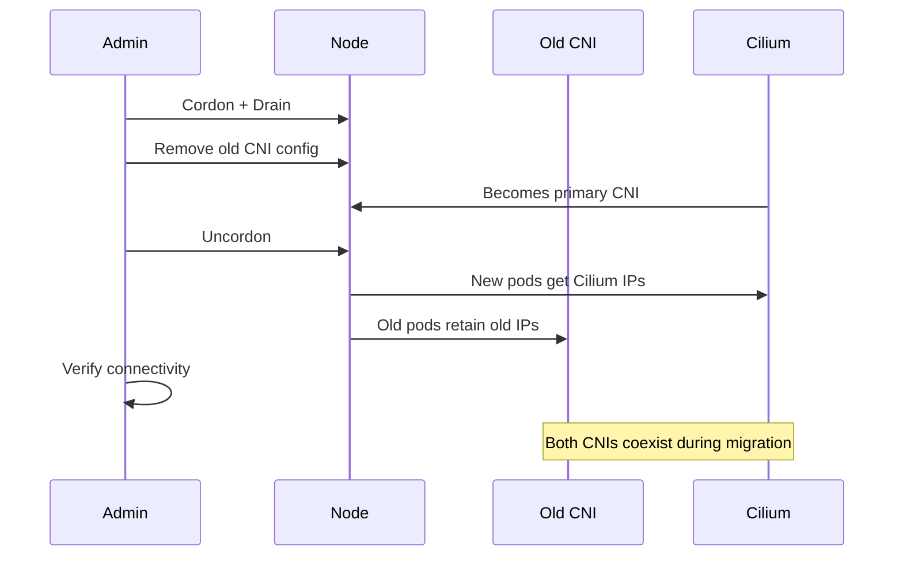

# Cilium CNI Migration Procedure: Configure, Troubleshoot, Validate, and Monitor

Author: [nawazdhandala](https://github.com/nawazdhandala)

Tags: Cilium, Kubernetes, Networking, CNI, Migration

Description: Step-by-step procedure for migrating a live Kubernetes cluster from an existing CNI plugin to Cilium with minimal disruption to running workloads.

---

## Introduction

Migrating a production Kubernetes cluster's CNI plugin to Cilium requires a well-defined procedure that minimizes downtime and preserves workload connectivity. Unlike initial cluster installations, in-place migrations must handle running pods with IPs assigned by the old CNI, services with established endpoints, and potentially active user traffic. Cilium's migration support accommodates these constraints through a phased approach.

The recommended migration approach uses Cilium's `--set cni.exclusive=false` mode to deploy Cilium alongside the existing CNI in a chained configuration during the transition. This allows nodes to be migrated one at a time while the rest of the cluster continues operating normally under the old CNI.

This guide covers the complete migration procedure from deploying Cilium in migration mode through final cutover and cleanup.

## Prerequisites

- All pre-migration prerequisites satisfied (see Cilium Pre-Requisites for Migration)
- Maintenance window scheduled for node-by-node migration
- Current CNI plugin backup and rollback plan prepared
- `cilium` CLI and `helm` 3.x available
- kubectl cluster admin access

## Configure Migration Mode

Install Cilium in per-node migration mode:

```bash
# Install Cilium in migration mode alongside existing CNI
helm install cilium cilium/cilium \
  --namespace kube-system \
  --set cni.exclusive=false \
  --set tunnel=vxlan \
  --set ipam.mode=cluster-pool \
  --set ipam.operator.clusterPoolIPv4PodCIDRList="{10.244.0.0/16}" \
  --set ipam.operator.clusterPoolIPv4MaskSize=24 \
  --set nodeinit.enabled=true \
  --set policyEnforcementMode=never

# Verify Cilium pods are running but not yet primary CNI
kubectl -n kube-system get pods -l k8s-app=cilium
cilium status
```

Migrate nodes one at a time:

```bash
# Cordon and drain a node
kubectl cordon <node-name>
kubectl drain <node-name> --ignore-daemonsets --delete-emptydir-data

# On the node: remove old CNI configuration
# (SSH to node or use kubectl debug)
kubectl debug node/<node-name> -it --image=ubuntu -- \
  bash -c "rm /etc/cni/net.d/10-<old-cni>.conf"

# Make Cilium the primary CNI on this node
kubectl debug node/<node-name> -it --image=ubuntu -- \
  bash -c "ls /etc/cni/net.d/"

# Uncordon to allow pods to be scheduled with Cilium networking
kubectl uncordon <node-name>
```

## Troubleshoot Migration Issues

Diagnose issues during migration:

```bash
# Check Cilium agent status on a specific node
kubectl -n kube-system exec -it <cilium-pod-on-node> -- cilium status

# View migration-related errors
kubectl -n kube-system logs <cilium-pod-on-node> --tail=200 | grep -i "error\|failed\|migration"

# Check if old CNI pods are still running on migrated nodes
kubectl -n kube-system get pods -o wide | grep <old-cni-name>

# Diagnose connectivity between old-CNI and Cilium pods
kubectl exec -it <old-cni-pod> -- ping <cilium-pod-ip>
```

Handle common migration errors:

```bash
# Issue: Pods on migrated nodes can't reach pods on unmigrated nodes
# Check tunnel/overlay configuration matches
kubectl -n kube-system exec ds/cilium -- cilium config view | grep tunnel

# Issue: IP address conflicts during migration
kubectl get cep -A -o wide
kubectl get pods -A -o wide | awk 'NR>1 {print $7}' | sort | uniq -d

# Issue: DNS broken after node migration
kubectl -n kube-system exec ds/cilium -- cilium endpoint list | grep kube-dns
# Ensure CoreDNS pods are rescheduled after drain
kubectl -n kube-system get pods -l k8s-app=kube-dns -o wide
```

## Validate Migration Progress

Verify each node migrates successfully:

```bash
# Confirm node is using Cilium CNI
kubectl get node <node-name> -o jsonpath='{.metadata.annotations}'

# Check all pods on migrated node have Cilium endpoints
NODE="<node-name>"
POD_COUNT=$(kubectl get pods -A --field-selector spec.nodeName=$NODE --no-headers | wc -l)
CEP_COUNT=$(kubectl get cep -A -o wide | grep $NODE | wc -l)
echo "Pods: $POD_COUNT, Cilium Endpoints: $CEP_COUNT"

# Run connectivity test targeting the migrated node
cilium connectivity test --test-namespace cilium-test

# Verify cross-node communication
kubectl exec -it <pod-on-cilium-node> -- ping <pod-ip-on-old-cni-node>
```

Complete migration validation:

```bash
# After all nodes migrated: remove old CNI
helm uninstall <old-cni-release> -n kube-system

# Enable Cilium network policy enforcement
helm upgrade cilium cilium/cilium \
  --namespace kube-system \
  --reuse-values \
  --set policyEnforcementMode=default \
  --set cni.exclusive=true

# Final connectivity test
cilium connectivity test
```

## Monitor Migration



Monitor migration progress:

```bash
# Track how many nodes have migrated
TOTAL=$(kubectl get nodes --no-headers | wc -l)
CILIUM=$(kubectl -n kube-system get pods -l k8s-app=cilium -o wide | grep Running | wc -l)
echo "Migration progress: $CILIUM/$TOTAL nodes"

# Monitor endpoint registration rate
watch -n5 "kubectl get cep -A --no-headers | wc -l"

# Watch for error events during migration
kubectl get events -A --watch | grep -i "cilium\|cni\|network"

# Monitor node connectivity
watch -n10 "cilium status --brief"
```

## Conclusion

A phased Cilium migration using non-exclusive CNI mode allows you to migrate production clusters with minimal risk. By migrating one node at a time, testing connectivity at each step, and deferring policy enforcement until migration completes, you maintain cluster stability throughout the transition. Always validate connectivity between pods on migrated and unmigrated nodes before proceeding to the next node, and run the full Cilium connectivity test suite after migration completes.
